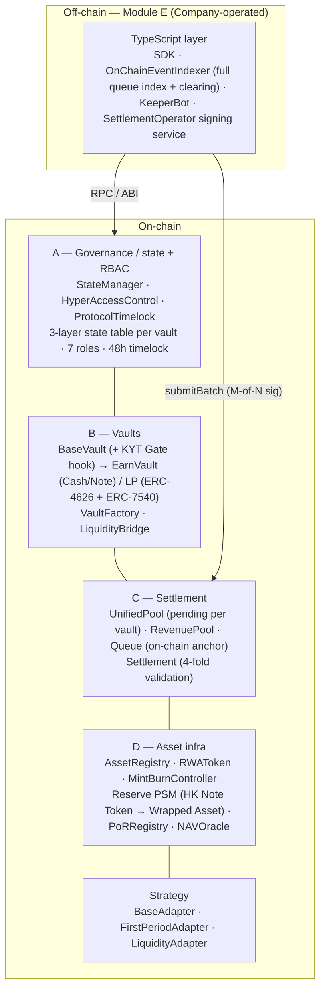

# HyperTessera Earn — Development Plan (Phase 1 & Phase 2)

**Status:** Draft for Company review · **Date:** 2026-06-12 (revised; incorporates client feedback + meeting 2026-06-12) · **Owner:** Developer
**Authority:** `docs/hypertessera_tech_doc_v3_2.pdf` (v3.2) + `docs/formula.pdf` (technical source of truth); `docs/(Final) SCHEDULE 1 – DEVELOPMENT SERVICES.pdf` (SOW — contractual scope & phasing). Where this plan and the source documents disagree, the source documents govern. Where client feedback (2026-06-12) diverges from v3.2, the client feedback governs.

> **Note on markers.** **[PROPOSAL]** marks Developer-proposed designs where the spec does not prescribe the exact implementation. Each requires Company confirmation before the relevant week's development begins; the full list with required-by dates is in §7.

---

## 0. How to read this document

This is the technical development plan for HyperTessera Earn — a cyclic, three-tranche RWA yield product settled in USDT on BNB Chain. It covers two things: (1) **what the Developer builds**, in which phase, and to what technical specification (§3–§4); and (2) **the technical work the Company owns** — the off-chain systems they build/operate and the on-chain interface contracts each must satisfy (§5).

- **Phase split** — defined in the v3.2 technical document (§3.5, §4.11, §4.14, §4.15) and mirrored in the SOW. §1 reproduces the split in scope terms: Phase 1 = W1–W6+ (USDT product, complete); Phase 2 = deferred (§4).
- **Document structure:**
  - **Narrative** (§1–§2, §6–§7) — scope and division of responsibilities; readable without Solidity knowledge.
  - **Week-by-week specs** (§3 — W1–W6+) — organized by delivery week. Each week has three sub-sections: *(1) On-chain contracts* (Solidity storage, function signatures, access control, events, errors); *(2) Off-chain interface* (TypeScript SDK methods, event subscriptions, data types for that week's contracts); *(3) Unit test paths* (the test cases that gate the weekly integration checkpoint).
  - **Phase 2 scope** (§4) — deferred items with brief spec.
  - **Company-side spec** (§5) — what the Company builds/operates and the on-chain interfaces each must satisfy.
- **Naming** — the lettered **Module A–E** grouping is used in §2 for the system overview and source mapping. §3 is organized by week (W1–W5), which cuts across modules. §2's module-to-source table maps every module to v3.2 section and SOW deliverable numbers.

---

## 1. Phase split (as defined in v3.2 + SOW, updated by client feedback 2026-06-12)

| Area                 | Phase 1 (**USDT series only**)                                                                                                                             | Phase 2 (deferred)                                                                                                          | Source                                |
| -------------------- | ---------------------------------------------------------------------------------------------------------------------------------------------------------- | --------------------------------------------------------------------------------------------------------------------------- | ------------------------------------- |
| Tranche vaults       | Cash / Note / LP vaults, USDT-denominated; contracts parameterized for USDC forward compatibility                                                          | **USDC series** vaults (second deploy with USDC address; separate `UnifiedPool` + `RevenuePool` instance required)          | v3.2 §4.14                            |
| Asset infra          | AssetRegistry, RWAToken, MintBurnController, **Reserve PSM** (HK Note Token lock → Wrapped Asset mint/burn bridge), PoRRegistry, NAVOracle (issuer-signed) | **M-of-N NAVOracle** hardening; **NAV auto-signing module** (KSM-like, issuer-authorized automated signing)                 | v3.2 §4.4; client feedback 2026-06-12 |
| Settlement           | UnifiedPool, RevenuePool, Settlement (M-of-N batch), Queue (on-chain validation anchor + per-order proof)                                                  | —                                                                                                                           | v3.2 §5.7; client feedback 2026-06-12 |
| Claims               | ClaimRegistry **on-chain record contract only** — ✅ delivered, see §8                                                                                      | Off-chain **KYC application / manual review / payout**; ClaimRegistry state machine (PENDING→APPROVED→PAID), indexed search | v3.2 §3.5, §4.15                      |
| LP incentive         | Permissionless redeem-incentive **interface reserved**, not implemented                                                                                    | LP incentive mechanism implementation                                                                                       | v3.2 §4.11                            |
| Compliance           | KYT Gate **interface reserved** on `BaseVault` (no-op by default, zero address = open)                                                                     | KYT Gate live connection to Company KYT provider                                                                            | Client feedback 2026-06-12            |
| Off-chain (Module E) | TypeScript **SDK**, **OnChainEventIndexer** (full queue index + clearing calc), **KeeperBot**, **SettlementOperator** signing service                      | — (operated by Company after delivery)                                                                                      | v3.2 §3.3 / SOW §2c                   |
| Engineering          | Unit suite, fork tests, Slither/Mythril, audit coordination, mainnet deploy scripts, ops manual                                                            | Ongoing hardening; USDC-series re-test                                                                                      | v3.2 §3.4 / SOW §2d                   |
| Timelock             | 48h `ProtocolTimelock` (v3.2 marks it optional/deferrable)                                                                                                 | —                                                                                                                           | v3.2 §5.2                             |

**One-line summary.** *Phase 1 delivers the complete USDT product — on-chain contracts plus the off-chain layer that operates them — through audit and mainnet-deploy readiness. Phase 2 adds the USDC series, the off-chain KYC/payout workflow behind ClaimRegistry, M-of-N oracle hardening, and the NAV auto-signing module.*

**Changelog**

- **2026-06-22 (client feedback).** Four spec revisions incorporated: (1) `AssetRegistry` permissions opened to permissionless / asset-owner model; (2) `RWAToken` upgraded to ERC-1400 security token (ERC-1594 + ERC-1644 + transfer path restriction) — pending design confirmation (§7); (3) `Queue` clearing priority updated to LP-first; (4) `RevenuePool` fee intake generalized to multi-source whitelist. `ReservePSM.confirmLock` manual-operator model confirmed as preferred (cross-chain compatibility). `D Asset Infra` module noted as independently deployable. See §7 for new open items.
- **2026-07-01 (client feedback).** Role definitions canonical PDF added (`HyperTessera_Vault_角色定位与职能说明.pdf`). Key role clarifications: Curator is an expanded fund manager (subscription/cycle/maturity params, investment strategy, buy/sell/rebalance orders, appoints Allocator) — not just a Morpho-style CURATOR; Allocator executes trades *only through Adapters*, never directly to PSM/LiquidityBridge/inter-vault transfers; Guardian gets freezeAllocator and circuit-breaker powers. LiquidityBridge redesigned as a **generic** utility: `bridgeDeposit(assets, fromVault, toVault)` deposits USDT from `fromVault` into `toVault` and sends resulting shares directly back to `fromVault`; no `cashSharesHeld` custody; no `bridgeRedeem`. LP Vault redesigned to hold Cash Tokens directly in its own balance; on LP exit the LP Vault distributes Cash Tokens + LP rewards directly to investors; investors then optionally redeem via CashVault's standard async flow. SettlementOperator-driven forced redemption removed. RevenuePool Phase 1: `yieldStrategy` address slot reserved (default `address(0)`), no DeFi integration.
- **2026-06-25 (client meeting 2026-06-24).** Several design updates from client meeting: (1) `RWAToken` redesigned as one contract per `assetId` (deployed by `AssetRegistry.registerAsset()`, no separate factory); `AssetRegistry` stores `token` address in `AssetInfo`; `MintBurnController` now holds `mapping(assetId => address) rwaTokens` instead of a single `rwaToken`; `RWAToken` constructor takes `name`, `symbol`, `decimals`; (2) `ReservePSM` redemption formula revised to `usdtRequired = wrappedAmount × currentNAV` (previous formula with interest subtraction was incorrect); (3) `ReservePSM` partial redemption now emits `PartialRedemption` event to notify Curator; (4) `ReservePSM` RWA Token locking now requires actual on-chain minting to `reserveAddress`, plus auto-detection path added (TBD); (5) `MintBurnController` extended with three TOKEN_AGENT approval modes (Manual / Retained signature / Auto fee contract); (6) `RWAToken` transfer paths added (up to 5 per contract, address list → address list); (7) `UnifiedPool` to be deployed as UUPS upgradeable proxy; (8) `WrappedAsset` redesigned as a circulating ERC-20 per `assetId` deployed by `ReservePSM` — PSM holds sole mint/burn authority; enables future DeFi interoperability. See §7 for updated open items.
- **2026-07-09 (client feedback on W4 spec, PR #6).** Addresses the four "Open items from W4 planning" in §7. Client-confirmed: (1) **PSM/Strategy relationship** — Strategy's role is to move Vault capital into a compliant-RWA purchase, not to hold the resulting asset; `ReservePSM` (or an issuer wallet, for limited-circulation RWA) is a valid order `destination`, and the resulting `WrappedAsset`/RWA settles directly at the Vault, same as today's non-Strategy flow. (2) **Naming** — `FirstPeriodRWAStrategy` and the old data-only `FirstPeriodAdapter` are merged into one `FirstPeriodAdapter` (Curator/Allocator order book + `realAssets()`/`updateDealData`), so "Adapter" is the single name for the thing Allocator executes through, matching the existing "Allocator executes trades only through Adapters" role definition (2026-07-01) and common market usage (Morpho). `StrategyFactory` → `AdapterFactory`. `BaseStrategy` (internal abstract base, not vault-facing) keeps its name. (3) **`createRebalanceOrder`/`executeRebalance` un-deferred** — ships in Phase 1, not Phase 2, since Curator may already want to split one vault's capital across multiple destinations (e.g. Gold RWA + Credit RWA + ETH) rather than one credit deal. (4) **All tranches deploy via Strategy** — Cash/Note/LP, not Cash-only. Still **[PROPOSAL — confirm before W4]**: how `FirstPeriodAdapter.realAssets()` avoids double-counting NAV once the purchased asset settles at the Vault. See §3.4.1 and §7 for details.
- **2026-07-10 (client reference doc `FirstPeriodAdapter 设计定位.pdf`).** Client provided a design doc positioning the Adapter as the Vault's sole execution + position-ledger + valuation entry point to the external asset world, with two position states (Recorded Position — off-chain-fed; On-chain Measurable Position — `balance × price/share-price/exchange-rate`) and the invariant that a position has exactly one NAV source at a time. This resolves the remaining open item on LP→Cash Vault routing: **[RESOLVED]** LP routes through its own `LiquidityAdapter` (new — extends `BaseAdapter`) before `LiquidityBridge`, matching the client's own worked example ("Adapter holds Vault shares, valued at balance × share price"). Also **[RESOLVED]**: the 2026-07-09 decision to keep `BaseStrategy` as a separately-named internal abstract base is superseded — its ERC-4626 mechanics are folded into `BaseAdapter`, eliminating the last remaining "Strategy"-named contract. The doc confirms the *principle* behind the still-open NAV double-count item (one NAV source per position, zeroed on state transition) but doesn't address two implementation gaps — trigger mechanism and per-order granularity — now written up as a refined **[PROPOSAL — confirm before W4]**: `ReservePSM.confirmLock` gains an optional adapter callback (`clearDealValue`), and `dealData` moves from one scalar per adapter to per-`buyOrderId`. Superseded same-day by client's follow-up below. See §3.4.1, §3.2 `ReservePSM`, and §7.
- **2026-07-10 (client feedback on Curator target config + NAV double-count mechanism).** Two follow-ups on the above: (1) **LP bridge target** — client asked that Curator define the `LiquidityAdapter`'s `liquidityBridge`/`cashVault` target during initial parameter setup rather than having it fixed by `GOVERNOR_ROLE` at `AdapterFactory` deploy time, consistent with Curator already owning order `destination` addresses elsewhere. **[RESOLVED]** `deployLiquidityAdapter` now deploys with both addresses at `address(0)`; Curator calls `setBridgeTarget` via Timelock. (2) **NAV double-count mechanism** — client rejected the `ReservePSM.confirmLock`→Adapter callback proposed above as an undesirable cross-contract dependency (different protocols return either a token or a value, never both, and this should be fixed per-order rather than inferred from an external contract's behavior — client suggested a Morpho-Vault-Adapter-style pattern), and flagged T+1/T+3 async RWA settlement as an uncovered case, asking that "in flight" state live entirely inside the Adapter. **[RESOLVED]** Every buy/rebalance order declares `TOKEN_RETURN` or `VALUE_RETURN` at creation (Curator-set, fixed for that order); `pendingDeposits[orderId]` (renamed from `dealData`) auto-initializes at cost basis the instant capital leaves in `executeBuy`, closing the async-settlement gap; `VALUE_RETURN` orders stay permanently valued via `updateDealData`, `TOKEN_RETURN` orders are zeroed via a self-contained `clearDealValue` — no `ReservePSM` signature change. See §3.4.1 `BaseAdapter`/`LiquidityAdapter`, §3.2 `ReservePSM`, and §7.
- **2026-07-16 (client feedback — Module E sequencing).** Client confirmed W4 is complete and asked whether Module E (SDK, `OnChainEventIndexer`, `KeeperBot`, `SettlementOperator`) can start building now that on-chain dependencies should be resolved. Three items actioned: (1) **`UnifiedPool` UUPS proxy** — client confirmed upgradeability; implemented (`Initializable` + `UUPSUpgradeable`, `ERC1967Proxy`, `_authorizeUpgrade` gated to `GOVERNOR_ROLE`); all deploy scripts/tests updated; see §7. (2) **LP vault redeploy** (stale testnet `LPVault` predating `setAdapter`) — deferred; client confirmed a redeploy is coming anyway, bundled with the W5 full-stack testnet refresh (unchanged from the W4 report's resolution). (3) **Event-variable whitelist** (§5.4/§6 Company deliverable) — Developer drafts a proposed starting list instead of waiting on Company; see `docs/module-e-event-whitelist-proposal.md`, client to add/amend.

---

### Official Reference Documents

The following client-provided documents are canonical and take precedence over any conflicting content in this spec:

| Document                                    | Location | Scope                                                                                                                                                                                       |
| ------------------------------------------- | -------- | ------------------------------------------------------------------------------------------------------------------------------------------------------------------------------------------- |
| `HyperTessera_Earn_State_Machine_Final.pdf` | `docs/`  | Complete state machine spec — ProductState, CycleState, PauseState, all Keeper/Settlement/Curator functions                                                                                 |
| `HyperTessera_Earn_Pending_Rules.pdf`       | `docs/`  | Subscription and redemption pending rules — FIFO queue, caps, cancel, refund lifecycle                                                                                                      |
| `HyperTessera_Vault_角色定位与职能说明.pdf` | `docs/`  | Role definitions for all 11 actors — Governor, Curator, Allocator, Guardian, SettlementOperator, Settlement Module, Keeper, Issuer, TokenAgent, Investor; HyperTessera vs Morpho comparison |
| `FirstPeriodAdapter 设计定位.pdf`      | `docs/`  | Adapter design positioning — execution + position-ledger + valuation module, Recorded Position vs. On-chain Measurable Position, `realAssets()` semantics                                    |
| `hypertessera_tech_doc_v3_2.pdf`            | `docs/`  | Core technical architecture (v3.2)                                                                                                                                                          |
| `formula.pdf`                               | `docs/`  | On-chain computation formulas                                                                                                                                                               |

---

## 2. System at a glance

Five layers, interface-first: every cross-contract call goes through an `I*.sol` interface in `src/interfaces/`. 6-decimal NAV everywhere (`sharePrice = 1e6` ≙ 1.0). All USDT movement via OpenZeppelin `SafeERC20` (USDT is non-standard).



**Lifecycle.** One-year product, weekly (7-day) cycles. `ProductState{CONFIGURING→SUBSCRIBING→(OPERATING|FUNDING_FAILED)⇆SETTLING→MATURING→CLAIMING→CLOSED}`. Within `OPERATING`, each cycle runs `CycleState{ACCEPTING→CALCULATING→FULFILLING→COMPLETED→ACCEPTING}`. A separate `PauseState{ACTIVE,PAUSED_BY_GUARDIAN,PAUSED_BY_GOVERNOR}` overlays both, per vault.

**Module-to-source mapping.**

| This doc                 | Layer                              | v3.2 § / SOW §          | Source deliverables                                                                                 |
| ------------------------ | ---------------------------------- | ----------------------- | --------------------------------------------------------------------------------------------------- |
| **Module A**             | Governance & state                 | §3.1 / §2a              | #7 HyperAccessControl, #8 ProtocolTimelock, #9 Emergency Circuit Breaker, #10 StateManager          |
| **Module B**             | Tranche vaults                     | §3.1 + §3.2 / §2a + §2b | #1 VaultFactory, #2 BaseVault (+ KYT Gate hook), #16–18 Cash/Note/LP USDT, #19 LiquidityBridge      |
| **Module C**             | Settlement                         | §3.1 / §2a              | #11 Settlement, #12 UnifiedPool (+ RevenuePool, Queue)                                              |
| **Module D**             | Asset infrastructure               | §3.1 / §2a              | #6 NAVOracle, #13 Reserve PSM, #14 AssetRegistry, #15 MintBurnController (+ RWAToken, PoRRegistry)  |
| **Strategy** (sub-layer) | Strategy / adapter                 | §3.1 + §3.2 / §2a + §2b | #3 AdapterFactory, #4 BaseAdapter, #5/#20/#21 FirstPeriodAdapter (merged) + LiquidityAdapter |
| **Module E**             | Off-chain interaction (TypeScript) | §3.3 / §2c              | #23 SDK, #24 OnChainEventIndexer, #25 KeeperBot, #26 SettlementOperator                             |
| *(Engineering)*          | Tests, audit, deploy, ops          | §3.4 / §2d              | #27–33                                                                                              |

---

## 2.5 Weekly delivery schedule

Eight weeks total: 5 weeks development (Phase 1 USDT product) + 3 weeks engineering hardening (audit-ready).

The client receives a **function-level module preview at least 1 day before each weekly sync** — covering storage layouts, function signatures, access control, events, errors, and boundary conditions for that week's contracts.

| Week    | Contracts / deliverables                                                                                                                                                                                                                                                                                                  | Preview due        |
| ------- | ------------------------------------------------------------------------------------------------------------------------------------------------------------------------------------------------------------------------------------------------------------------------------------------------------------------------- | ------------------ |
| **W1**  | **Module A:** `HyperAccessControl`, `ProtocolTimelock` · **Module D foundations:** `AssetRegistry`, `RWAToken`, `MintBurnController`, `NAVOracle` · _(`StateManager` **deferred** — client finalizing state list)_                                                                                                        | Day before W1 sync |
| **W2**  | **Module D completion:** `ReservePSM`, `PoRRegistry` · **Module C foundations:** `UnifiedPool`, `RevenuePool`, `Queue`                                                                                                                                                                                                    | Day before W2 sync |
| **W3**  | **`StateManager`** (deferred from W1 — prerequisite; delivered first within the week) · **Module B:** `BaseVault` (KYT Gate hook), `EarnVault` (unified Cash/Note), `LiquidityEarnVault`, `VaultFactory`, `LiquidityBridge`                                                                                               | Day before W3 sync |
| **W4**  | **Module C completion:** `Settlement` (`submitBatch`, 4-fold validation) · **Strategy layer:** `BaseAdapter`, `FirstPeriodAdapter`, `LiquidityAdapter`, `AdapterFactory`, Curator order / Allocator execution flow (incl. rebalance) · Integration wiring (`DeployLib.deployAll`)                                                   | Day before W4 sync |
| **W5**  | **Module E (TypeScript):** SDK, `OnChainEventIndexer`, `KeeperBot`, `SettlementOperator` · End-to-end integration test suite · Testnet deploy                                                                                                                                                                             | Day before W5 sync |
| **W6+** | Fork test suite (BNB mainnet fork; normal + failure scenarios) · Slither / Mythril static analysis · NatSpec + audit package prep · Audit firm onboarding + initial review · Remediation pass · Re-review · Mainnet deploy scripts (`Deploy.s.sol` + post-deploy verification) · Operations manual · Final audit sign-off | —                  |

**Key dependencies / gates between weeks:**

- **W1 → W2:** `HyperAccessControl` role constants must be frozen before `ReservePSM`, `UnifiedPool`, and `Queue` use them as callers. The `IStateManager` **interface** is frozen this week; the `StateManager` **implementation** is deferred and must be confirmed/delivered before W2 contracts that depend on live vault registration (`registerVault`/state gating) can integrate against it.
- **W2 → W3:** `UnifiedPool.pending` mapping and `Queue.enqueue` signature must be frozen before `BaseVault.requestRedeem` calls them.
- **W3 → W4:** All vault `settle()` signatures must be frozen before `Settlement.submitBatch` drives them. `VaultFactory` must have deployed all vaults (Cash EarnVault, Note EarnVault, LiquidityEarnVault); `StateManager` must have registered and initialized them; `UnifiedPool.setTrancheVault` must be called for all three before W4 Settlement integration tests can run.
- **W4 → W5:** All ABI surfaces and events must be frozen before SDK and `OnChainEventIndexer` are implemented (SDK interface freeze is a W1-contractual obligation per SOW §6 / v3.2 §6.5 — the interface is drafted in W1 alongside Module A; implementation delivers in W5).
- **Open item §7.11** (Wrapped Asset type) must be confirmed by Company **before W2 development begins**. (§7.12 `repayPrincipal` timing confirmed: same settlement cycle — see §7.)

---

## 3. Phase 1 — week-by-week specifications

---

### 3.1 Week 1 — Governance + Asset foundations

**On-chain deliverables:** `HyperAccessControl`, `ProtocolTimelock` (Module A) · `NAVOracle`, `MintBurnController`, `AssetRegistry`, `RWAToken` (Module D foundations) · `IStateManager` interface (`StateManager` implementation `[DEFERRED]` — client finalizing state list; re-scheduled on confirmation; `NAVOracle`/`MintBurnController` tests use `MockStateManager`)

---

#### 3.1.1 On-chain contracts

**Responsibility.** Single source of lifecycle truth and access control for every registered vault.

#### `HyperAccessControl` — flat RBAC (roles do **not** inherit)

`GOVERNOR_ROLE` is the sole admin of all roles. 11 roles:

| Role                 | Primary holder              | Key rights                                                                                                                                                                                                                                                                                                                                                                                                                                                                                                                                                                                                                                                      |
| -------------------- | --------------------------- | --------------------------------------------------------------------------------------------------------------------------------------------------------------------------------------------------------------------------------------------------------------------------------------------------------------------------------------------------------------------------------------------------------------------------------------------------------------------------------------------------------------------------------------------------------------------------------------------------------------------------------------------------------------- |
| `GOVERNOR_ROLE`      | Protocol owner multi-sig    | Sole role admin; unpause; execute timelocked params; set KYT Gate; manage PSM Pool; set platform fees; upgrade system                                                                                                                                                                                                                                                                                                                                                                                                                                                                                                                                           |
| `CURATOR_ROLE`       | Fund manager                | Manage product params (`setSubscriptionParams`, `setCycleParams`, `setMaturityParams`, `setVaultFeeParams`, `setNavToleranceBps`); define investment strategy (`addInvestableAsset`, `setAssetTargetWeight` — **[DEFERRED to Phase 2]**, see `FirstPeriodAdapter` §3.4.1); create orders on `FirstPeriodAdapter` (`createBuyOrder`, `createSellOrder`, `createRebalanceOrder`); appoint Allocator; schedule param changes via Timelock — **Note:** Curator is a full fund manager role, expanded beyond Morpho CURATOR. Morpho CURATOR responsibilities (vault parameter management) are *retained* and supplemented with investment strategy powers. |
| `GUARDIAN_ROLE`      | Risk officer                | Emergency pause vault/module; freeze Allocator (`freezeAllocator`) — ✅ delivered, see §8; cancel pending orders (`FirstPeriodAdapter.cancelBuyOrder`/`cancelSellOrder`/`cancelRebalanceOrder`); pause specific assets for a vault (`pauseAssetForVault`); trigger vault circuit breaker                                                                                                                                                                                                                                                                                                                                                                                                  |
| `ALLOCATOR_ROLE`     | Trader (ops)                | Execute Curator-approved orders on `FirstPeriodAdapter` (`executeBuy`, `executeSell`, `executeRebalance`) — order args are Curator-fixed, Allocator supplies only `orderId`; does NOT directly call PSM Pool, LiquidityBridge, or inter-vault fund transfers                                                                                                                                                                                                                                                                                                                                                         |
| `SETTLEMENT_ROLE`    | Settlement contract address | Call `settle()` on vaults; `distribute()` on UnifiedPool                                                                                                                                                                                                                                                                                                                                                                                                                                                                                                                                                                                                        |
| `ISSUER_ROLE`        | Company issuer              | `repayInterest`; initiate RWA Token mint/burn; request principal/interest repayment                                                                                                                                                                                                                                                                                                                                                                                                                                                                                                                                                                             |
| `TOKEN_AGENT_ROLE`   | Company token agent         | Approve RWA Token mint/burn second signature; register asset metadata; publish proof of reserve                                                                                                                                                                                                                                                                                                                                                                                                                                                                                                                                                                 |
| `OPERATOR_ROLE`      | BVI SPV operator            | `UnifiedPool.repayPrincipal`, `UnifiedPool.operatorTransfer`/`operatorTransferToRevenuePool` — **[UPDATED, §8]** no longer includes any Reserve PSM right; ReservePSM's net-settlement rewrite removed `confirmLock` and is no longer Vault/Operator-gated (wrap is permissionless, Document Proof mint is signature-gated instead)                                                                                                                                                                                                                                                                                                                                                                                                                                                                                                                                                                                                                                                                                                                                                                                                                                    |
| `KEEPER_ROLE`        | KeeperBot                   | Drive cycle + product state transitions                                                                                                                                                                                                                                                                                                                                                                                                                                                                                                                                                                                                                         |
| `DATA_PROVIDER_ROLE` | NAV signing key             | `updateNAV` on NAVOracle                                                                                                                                                                                                                                                                                                                                                                                                                                                                                                                                                                                                                                        |
| `COMPLIANCE_ROLE`    | Company compliance officer  | `setTransferPaths` / `addToAddressList` / `removeFromAddressList` on RWAToken **[NEW 2026-06-24]**                                                                                                                                                                                                                                                                                                                                                                                                                                                                                                                                                              |

**Storage:**
```solidity
// OZ AccessControl base:
mapping(bytes32 role => mapping(address account => bool)) private _hasRole;
mapping(bytes32 role => bytes32) private _roleAdmin; // all map to GOVERNOR_ROLE
```

**Key rule:** `getRoleAdmin(anyRole)` always returns `GOVERNOR_ROLE`. There is no role hierarchy — holding one role grants no rights of another.

---

#### `StateManager` — three-layer state table  `[DEFERRED → W3]`

Client is finalizing the exhaustive state list; implementation is **not** delivered in W1 and is re-scheduled to W3. The `IStateManager` interface (consumed by `NAVOracle`, `MintBurnController`, `UnifiedPool`, `Queue`, `ReservePSM`) is delivered this week; W1/W2 tests use `MockStateManager`.

**Full spec:** see §3.3.1 — `StateManager` is the first W3 deliverable.

---

#### `ProtocolTimelock` — 48h delay on parameter changes

**Storage:**
```solidity
struct PendingChange {
    address target;
    bytes   data;
    uint256 executableAfter;   // scheduledAt + delay
    uint256 expiresAt;         // executableAfter + 7 days
    bool    executed;
    bool    cancelled;
}
mapping(bytes32 changeId => PendingChange) public pendingChanges;
uint256 public delay;          // default 48 hours
```

**Functions:**
```solidity
function scheduleParamChange(address target, bytes calldata data)
    external returns (bytes32 changeId);          // CURATOR_ROLE or GOVERNOR_ROLE

function executeParamChange(bytes32 changeId) external;  // permissionless after delay

function cancelParamChange(bytes32 changeId) external;   // GOVERNOR_ROLE only

function setDelay(uint256 newDelay) external;             // GOVERNOR_ROLE; min 1h, max 30d
```

**Caller wiring for timelocked setters.** Functions annotated "CURATOR_ROLE via Timelock" (e.g. `setNavTolerance`, `setCashServiceFeeBps`, `setNoteServiceFeeBps`, `setNoteLpDepositRatio`) check `msg.sender == address(timelock)` — not `CURATOR_ROLE` directly. The Timelock's `executeParamChange` is the only permissible caller. A direct call from a Curator wallet reverts `OnlyTimelock`. The Timelock itself validates that the original scheduler held `CURATOR_ROLE` at schedule time.

`changeId = keccak256(abi.encode(target, data, changeNonce++))` where `changeNonce` is a `uint256` storage counter incremented on each `scheduleParamChange` call. This makes every schedule unique even for identical `(target, data)` pairs submitted in the same block. Add `uint256 public changeNonce;` to storage. Execution is permissionless once `block.timestamp >= executableAfter` and `block.timestamp <= expiresAt`.

---

#### 3.1.2 Off-chain interface (W1)

SDK wrappers and event subscriptions for the W1 contracts. The W1 integration test verifies round-trips against a local testnet.

**TypeScript types:**
```ts
type ProductState = 'CONFIGURING' | 'SUBSCRIBING' | 'FUNDING_FAILED' | 'OPERATING' | 'SETTLING' | 'MATURING' | 'CLAIMING' | 'CLOSED'
type CycleState   = 'ACCEPTING' | 'CALCULATING' | 'FULFILLING' | 'COMPLETED'
type PauseState   = 'ACTIVE' | 'PAUSED_BY_GUARDIAN' | 'PAUSED_BY_GOVERNOR'
type ModuleId     = 'VAULT' | 'SETTLEMENT' | 'ASSET' | 'CLAIM_REGISTRY'

interface StateContext {
  product:     ProductState
  cycle:       CycleState
  pause:       PauseState
  cycleNumber: bigint
}

interface NAVData {
  nav:           bigint   // 6-decimal; 1_000_000n = 1.0
  dataTimestamp: bigint   // off-chain source timestamp (seconds)
  updatedAt:     bigint   // block.timestamp of last write
}
```

**SDK read methods:**
```ts
getStateContext(vault: Address): Promise<StateContext>
isVaultRegistered(vault: Address): Promise<boolean>
isVaultActive(vault: Address): Promise<boolean>   // pause == ACTIVE
hasRole(role: Hex, account: Address): Promise<boolean>
getNAV(vault: Address): Promise<NAVData>
isNAVFresh(vault: Address): Promise<boolean>      // updatedAt > now - 36h
getRWABalance(account: Address, assetId: bigint): Promise<bigint>
getRWATotalSupply(assetId: bigint): Promise<bigint>
getAssetInfo(assetId: bigint): Promise<AssetInfo>
```

**SDK write methods (role-gated — caller supplies signer):**
```ts
// KeeperBot uses these — SDK maps each call to the correct named StateManager function
// Product state transitions (each maps to one named StateManager function):
openSubscription(vault: Address, signer: Signer): Promise<TxHash>         // CONFIGURING → SUBSCRIBING
finalizeSubscription(vault: Address, signer: Signer): Promise<TxHash>     // SUBSCRIBING → OPERATING | FUNDING_FAILED
startCycleCalculation(vault: Address, signer: Signer): Promise<TxHash>    // ACCEPTING → CALCULATING
enterFinalSettlement(vault: Address, signer: Signer): Promise<TxHash>     // OPERATING → SETTLING
enterMaturing(vault: Address, signer: Signer): Promise<TxHash>            // SETTLING → MATURING
enterClaiming(vault: Address, signer: Signer): Promise<TxHash>            // MATURING → CLAIMING
closeProduct(vault: Address, signer: Signer): Promise<TxHash>             // CLAIMING → CLOSED

// NAV signing service uses this
updateNAV(vault: Address, nav: bigint, dataTimestamp: bigint, sig: Hex, signer: Signer): Promise<TxHash>

// Issuer / Token Agent use these
initiateMint(assetId: bigint, amount: bigint, to: Address, issuerSig: Hex, signer: Signer): Promise<{ txHash: TxHash; nonce: bigint }>
approveMint(nonce: bigint, tokenAgentSig: Hex, signer: Signer): Promise<TxHash>
initiateBurn(assetId: bigint, amount: bigint, from: Address, issuerSig: Hex, signer: Signer): Promise<{ txHash: TxHash; nonce: bigint }>
approveBurn(nonce: bigint, tokenAgentSig: Hex, signer: Signer): Promise<TxHash>
```

**Events to index (W1):**
```ts
// StateManager
ProductStateTransitioned(vault, from, to, actor, timestamp)
CycleStateTransitioned(vault, from, to, actor, timestamp)
VaultPaused(vault, reason, actor, timestamp)
VaultUnpaused(vault, actor, timestamp)
ModulePaused(moduleId, actor, timestamp)
ModuleUnpaused(moduleId, actor, timestamp)

// NAVOracle
NAVUpdated(vault, nav, dataTimestamp, updatedAt, signer)

// MintBurnController
MintInitiated(nonce, assetId, amount, to, timestamp)
MintApproved(nonce, assetId, amount, to, timestamp)
BurnInitiated(nonce, assetId, amount, from, timestamp)
BurnApproved(nonce, assetId, amount, from, timestamp)
```

---

#### 3.1.3 Unit test paths (W1)

**`HyperAccessControl`:**
- `grantRole` by GOVERNOR succeeds; emits `RoleGranted`
- `grantRole` by non-GOVERNOR reverts
- `revokeRole` by GOVERNOR succeeds; emits `RoleRevoked`
- `getRoleAdmin(anyRole)` always returns `GOVERNOR_ROLE` — no role hierarchy
- Role A holder cannot call a function that requires Role B

**`StateManager`:** `[DEFERRED → W3]` — unit test paths delivered alongside the W3 implementation. See §3.3.3.

**`ProtocolTimelock`:**
- `scheduleParamChange` returns deterministic `changeId`; emits `ParamChangeScheduled`
- `executeParamChange` before `executableAfter` reverts
- `executeParamChange` at or after `executableAfter` succeeds; calls target
- `executeParamChange` after `expiresAt` reverts
- Same `changeId` cannot execute twice (replay guard)
- `cancelParamChange` by GOVERNOR succeeds; executed/cancelled change cannot be re-cancelled
- Two identical `scheduleParamChange(target, data)` calls in the same block: produce different `changeId`s (nonce increments)
- Direct call to a timelocked setter (e.g. `setCashServiceFeeBps`) from Curator wallet (not via Timelock): reverts `OnlyTimelock`

**`NAVOracle`:**
- Authorized signer can `updateNAV`; unauthorized signer reverts `UnauthorizedSigner`
- `nav == 0` reverts `InvalidNAV`
- `dataTimestamp > block.timestamp` reverts `FutureData`
- Non-monotonic timestamp (≤ previous) reverts `NonMonotonicTimestamp`
- Upward deviation ≤ `NAV_DEVIATION_MAX_BPS` passes; exceeding cap reverts `DeviationTooHigh`
- Downward move of any magnitude succeeds (no floor check)
- `isNAVFresh` returns false after 36h without update
- `removeAuthorizedSigner` then attempt `updateNAV`: reverts `UnauthorizedSigner`
- `isNAVFresh` returns false 36h after last update; `submitBatch` Step 4 reverts `StaleNAV`

**`MintBurnController`:**
- `initiateMint` by ISSUER_ROLE succeeds; non-Issuer reverts
- `approveMint` by TOKEN_AGENT_ROLE mints to target; non-Agent reverts
- `approveMint` with wrong nonce reverts
- Already-executed mint nonce reverts on second `approveMint`
- Burn dual-sig follows same pattern; `RWAToken.balanceOf` decrements correctly

**`AssetRegistry`:**
- `registerAsset` by any address succeeds; returns sequential `assetId` starting at 1; `owner` set to `msg.sender`
- `registerAsset` by a second caller also succeeds independently (no access restriction)
- `updateMetadataHash` by asset owner succeeds; non-owner reverts `NotAssetOwner`
- `transferAssetOwnership` by owner succeeds; previous owner can no longer update
- `deactivateAsset` by owner sets `active = false`; `isActive` returns false
- `deactivateAsset` by GOVERNOR_ROLE also succeeds (override right); non-owner non-Governor reverts

**`RWAToken`:**
- `setMintBurnController` once by GOVERNOR_ROLE succeeds; second call reverts `ControllerAlreadySet`; zero-address reverts; non-Governor reverts
- `mint` only by controller (reverts `NotController`); increases `balanceOf` and `totalSupplyOf` for the target `assetId`
- `burn` only by controller; decreases `balanceOf` and `totalSupplyOf`; reverts `InsufficientBalance` if balance too low
- Per-asset isolation: balances and total supply are independent across asset IDs; minting/burning one asset does not affect another
- `balanceOf` / `totalSupplyOf` return zero for unknown account / before any mint
- **ERC-1400 transfer (CONFIRMED 2026-06-24):**
- `transfer` with no paths defined (`transferPathCount == 0`): succeeds for any addresses; emits `Transfer`
- `transfer` where `from` is not in any path's `fromList`: reverts `TransferRestricted`
- `transfer` where `to` is not in the matched path's `toList`: reverts `TransferRestricted`
- `transfer` where both `from` and `to` match a defined path: succeeds; emits `Transfer`
- `transferFrom` with valid allowance + matching path: succeeds; allowance decremented
- `approve` + `transferFrom` allowance flow: standard ERC-20 behaviour
- `addToAddressList(listId, accounts[])` by COMPLIANCE_ROLE: batch-adds multiple accounts to a single list; each address now eligible for paths referencing that list
- `addToAddressList` by non-COMPLIANCE_ROLE: reverts
- `removeFromAddressList(listId, accounts[])`: batch-removes multiple accounts from a single list; subsequent `transfer` from/to those addresses reverts `TransferRestricted` if no other path matches
- `setTransferPaths`: batch sets multiple path slots in one call; arrays must be equal length
- `controllerTransfer` by controller: succeeds regardless of transfer path rules; emits `ControllerTransfer`
- `controllerTransfer` by non-controller: reverts `NotController`

---

### 3.2 Week 2 — Asset completion + Settlement foundations

**On-chain deliverables:** `ReservePSM`, `PoRRegistry` (Module D completion) · `UnifiedPool`, `RevenuePool`, `Queue` (Module C foundations)

---

#### 3.2.1 On-chain contracts

**Responsibility.** Tokenize the underlying RWA, bridge HK-compliant Note Tokens into on-chain Wrapped Assets, and publish signed NAV + proof-of-reserve.

---

#### `NAVOracle` — signed daily NAV

**Storage:**
```solidity
struct NAVData {
    uint256 nav;            // 6-decimal; 1.0 = 1_000_000
    uint256 dataTimestamp;  // off-chain source timestamp (not block.timestamp)
    uint256 updatedAt;      // block.timestamp of last on-chain write
}
mapping(address vault => NAVData)  private _navData;
mapping(address vault => address)  private _authorizedSigner;  // single per vault (Phase 1)
mapping(address vault => uint16)   public  navTolerance;       // BPS; read by Settlement
uint256 public constant STALENESS_PERIOD = 36 hours;
uint16  public constant NAV_DEVIATION_MAX_BPS = 2000;          // 20% upward cap
```

**Functions:**
```solidity
function updateNAV(address vault, uint256 nav, uint256 dataTimestamp, bytes calldata sig) external;
function addAuthorizedSigner(address vault, address signer) external;  // GOVERNOR_ROLE
function removeAuthorizedSigner(address vault) external;               // GOVERNOR_ROLE
function setNavTolerance(address vault, uint16 bps) external;          // CURATOR_ROLE via Timelock (post-launch changes)
function bootstrapNavTolerance(address vault, uint16 bps) external;    // GOVERNOR_ROLE; callable only before first NAV update (_navData[vault].updatedAt == 0); reverts ToleranceAlreadyBootstrapped
// Default navTolerance at deploy: 500 bps (5%). Set via bootstrapNavTolerance in DeployLib.deployAll.
// A tolerance of 0 causes every submitBatch Step 4 to revert unless navSnapshot == onChainNav exactly.
function isNAVFresh(address vault) external view returns (bool);
function getNAV(address vault) external view returns (uint256);
function getNavData(address vault) external view returns (NAVData memory);
```

**`updateNAV` validation (in order):**
1. Recover signer from `sig`; revert `UnauthorizedSigner` if not `_authorizedSigner[vault]`.
2. Revert `InvalidNAV` if `nav == 0`.
3. Revert `FutureData` if `dataTimestamp > block.timestamp`.
4. Revert `NonMonotonicTimestamp` if `dataTimestamp <= _navData[vault].dataTimestamp` (and previous exists).
5. If `nav > previousNAV` and `previousNAV > 0`: revert `DeviationTooHigh` if `(nav - previousNAV) * 10000 / previousNAV > NAV_DEVIATION_MAX_BPS`.
6. Downward moves: **no check** — error-correction and default-loss share this path by design.
7. Store; emit `NAVUpdated`.

**Errors:**
```solidity
error UnauthorizedSigner(address recovered);
error InvalidNAV();
error FutureData(uint256 dataTimestamp);
error NonMonotonicTimestamp(uint256 dataTimestamp, uint256 previous);
error DeviationTooHigh(uint256 nav, uint256 previousNAV);
error StaleNAV(address vault);
error ToleranceAlreadyBootstrapped(address vault);
```

> **NAV signing:** Phase 1 — HK issuer holds the authorized signer key and writes daily at 00:00. Phase 2 — automated signing module added (§4.6).

---

#### `MintBurnController` — RWA Token lifecycle

Controls mint/burn of `RWAToken` instances via a 4-step dual-signature pipeline. Each `assetId` maps to its own `RWAToken` contract (deployed by `RWATokenFactory`). Multiple independent RWA Token classes are supported — no mandatory S/J pairing; the issuer decides how many token classes to issue.

**Storage:**
```solidity
struct MintRequest {
    uint256 assetId;
    uint256 amount;
    address to;
    bool    approved;
    bool    executed;
}
struct BurnRequest {
    uint256 assetId;
    uint256 amount;
    address from;
    bool    approved;
    bool    executed;
}
mapping(uint256 nonce => MintRequest) public mintRequests;
mapping(uint256 nonce => BurnRequest) public burnRequests;
uint256 public nextMintNonce;
uint256 public nextBurnNonce;
// [REVISED 2026-06-25] one RWAToken contract per assetId, registered by AssetRegistry on deploy
mapping(uint256 assetId => address) public rwaTokens;
address public assetRegistry;
address public accessControl;
```

**Functions:**
```solidity
function initiateMint(uint256 assetId, uint256 amount, address to, bytes calldata issuerSig)
    external returns (uint256 nonce);             // ISSUER_ROLE; looks up rwaTokens[assetId]

function approveMint(uint256 nonce, bytes calldata tokenAgentSig)
    external;                                     // TOKEN_AGENT_ROLE; calls rwaTokens[assetId].mint

function initiateBurn(uint256 assetId, uint256 amount, address from, bytes calldata issuerSig)
    external returns (uint256 nonce);             // ISSUER_ROLE

function approveBurn(uint256 nonce, bytes calldata tokenAgentSig)
    external;                                     // TOKEN_AGENT_ROLE; calls rwaTokens[assetId].burn

// [REVISED 2026-06-25] Called by AssetRegistry after deploying a new token
function registerToken(uint256 assetId, address token) external;  // only AssetRegistry
```

**[NEW 2026-06-25] TOKEN_AGENT approval modes.** Three modes configured per assetId by GOVERNOR_ROLE. All three share the same `approveMint` / `approveBurn` function — mode changes the internal validation branch only.

| Mode                | Who calls `approveMint` / `approveBurn` | Signature required | Fee                                                                                  |
| ------------------- | --------------------------------------- | ------------------ | ------------------------------------------------------------------------------------ |
| 0 Public            | Anyone                                  | No                 | No                                                                                   |
| 1 RetainedSignature | `TOKEN_AGENT_ROLE` holder               | Yes                | No                                                                                   |
| 2 AutoFee           | Anyone                                  | No                 | Yes — pulled from `msg.sender` in `feeToken` at call time, forwarded to `feeAddress` |

Mode 0 is fully permissionless — no role check, no signature — to align with the public AssetRegistry model. Default for newly registered assets.

Mode 1 reuses `TOKEN_AGENT_ROLE` from `HyperAccessControl` — no extra key storage needed.

Mode 2 pulls `feeAmount` of `feeToken` (any ERC-20) from `msg.sender` and forwards to `feeAddress` before executing. `tokenAgentSig` is ignored in Modes 0 and 2.

```solidity
// [NEW 2026-06-25] — added to MintBurnController storage
enum AgentMode { Public, RetainedSignature, AutoFee }
mapping(uint256 assetId => AgentMode) public agentMode;
mapping(uint256 assetId => address)   public feeAddress;  // Mode 2 only: fee recipient
mapping(uint256 assetId => address)   public feeToken;    // Mode 2 only: any ERC-20
mapping(uint256 assetId => uint256)   public feeAmount;   // Mode 2 only: amount per request

// GOVERNOR_ROLE
function setAgentMode(
    uint256 assetId,
    AgentMode mode,
    address feeAddress_,  // ignored unless mode == AutoFee
    address feeToken_,    // ignored unless mode == AutoFee
    uint256 feeAmount_    // ignored unless mode == AutoFee
) external;
```

> **Scope boundary:** `MintBurnController` governs `RWAToken` only. Wrapped Asset minting in Reserve PSM is a separate, independent path (`ReservePSM.wrap`/`mintWithAuthorization` as of §8 — historically `confirmLock`), not this controller.

---

#### `Reserve PSM` — HK Note Token → Wrapped Asset bridge

> **[SUPERSEDED — §8 net settlement conversion]** The contract design below (storage, `confirmLock`/
> `autoConfirmLock`/`burnOnRedeem`/`settlementPool` API, and the subscription/redemption flow tables)
> describes ReservePSM's original Vault-coupled design and no longer matches the deployed contract.
> ReservePSM was rewritten into a fully independent two-mode asset-wrap module (Token Custody Mode /
> Document Proof Mode) with `wrap`/`unwrap`/`mintWithAuthorization`/`deployWrappedToken`, decoupled
> entirely from Vault/Settlement/StateManager/UnifiedPool. See §8 and `src/assets/ReservePSM.sol` /
> `src/interfaces/IReservePSM.sol` for the current design. Kept below for historical record of the
> original W2 spec and its evolution.

**Purpose (original W2 spec, historical).** Bridge HK-compliant tokenized notes into on-chain Wrapped Assets that vaults hold as collateral representation. The Reserve PSM is the sole point of trust for the HK Note Token ↔ Wrapped Asset peg.

**[NEW 2026-06-25] Wrapped Asset implementation — circulating ERC-20.**
Each `assetId` has a dedicated `WrappedAsset` ERC-20 contract deployed by `ReservePSM.deployWrappedToken()`. The contract is a standard ERC-20 with PSM-gated mint and burn — no other address may mint or burn. It is freely transferable, enabling future DeFi interoperability. Vaults hold WrappedAsset balances as ERC-20 tokens; `wrappedBalanceOf(vault, assetId)` delegates to `wrappedToken[assetId].balanceOf(vault)`. `confirmLock` mints to the vault; `burnOnRedeem` burns from the vault (PSM holds controller rights, no vault approval required).

**[NEW 2026-06-25] RWA Token locking.** The underlying RWA Token is actually minted (via `MintBurnController`) and sent to the PSM's `reserveAddress` for on-chain locking. This makes the lock verifiable on-chain rather than relying solely on off-chain attestation.

**Storage:**
```solidity
mapping(uint256 assetId => address) public reserveAddress;
// [NEW 2026-06-25] WrappedAsset ERC-20 per assetId — deployed by deployWrappedToken(); PSM is sole mint/burn authority
mapping(uint256 assetId => address) public wrappedToken;
mapping(uint256 assetId => uint256) private _totalLocked;   // confirmed lock count; wrappedToken.totalSupply() is the live circulating balance
address public accessControl;
address public assetRegistry;
// [NEW 2026-06-24] Pluggable settlement pool — UnifiedPool in full system, address(0) in standalone
ISettlementPool public settlementPool;
```

**Functions:**
```solidity
// Setup (Allocator-gated, set once per asset)
function setReserveAddress(uint256 assetId, address reserveAddr) external;  // ALLOCATOR_ROLE

// [NEW 2026-06-25] Deploy a WrappedAsset ERC-20 for an assetId; records address in wrappedToken[assetId]
// name/symbol/decimals chosen by caller; GOVERNOR_ROLE; reverts if already deployed
function deployWrappedToken(uint256 assetId, string calldata name, string calldata symbol, uint8 decimals) external;

// Subscription path A (manual): Operator calls after confirming RWA Token arrived at reserve address
// [NEW 2026-06-25] Mints wrappedToken[assetId] to vault (replaces internal balance increment)
// Atomically increments _totalLocked[assetId]
// [RESOLVED 2026-07-10 — client feedback] No Adapter-facing params here — client rejected coupling
// ReservePSM's function signature to Adapter internals (different destinations settle differently,
// token vs. value). Where a purchase was Adapter-routed with TOKEN_RETURN mode, the Operator submits
// a separate BaseAdapter.clearDealValue(orderId) call (ideally bundled in one multicall transaction
// with confirmLock) — see §3.4.1 BaseAdapter.
function confirmLock(uint256 assetId, uint256 amount, address vault) external;  // OPERATOR_ROLE

// [NEW 2026-06-25] Subscription path B (auto): called when RWA Token is transferred directly to
// reserveAddress on-chain. PSM detects the on-chain transfer and mints WrappedAsset to vault.
// Supports same-chain deployments; cross-chain/off-chain custody must still use confirmLock.
// Implementation TBD — pending discussion on trigger mechanism (on-chain listener vs oracle feed).
function autoConfirmLock(uint256 assetId, address vault) external;  // callable by anyone; validates balance delta

// Redemption: vault calls; [NEW 2026-06-25] burns wrappedToken[assetId] from vault (PSM is controller — no vault approval needed)
// [REVISED 2026-06-25] Redemption formula: usdtRequired = wrappedAmount * currentNAV
// (previous formula subtracting accrued interest was incorrect and has been removed)
// If settlementPool != address(0): calls settlementPool.creditPrincipal(vault, usdtAmount)
// If settlementPool == address(0): transfers USDT directly to vault (standalone path)
// [NEW 2026-06-25] Partial redemption: if issuer deposits less USDT than required,
//   proportional Wrapped Tokens are burned; remainder is returned to vault and
//   CuratorRole is notified via PartialRedemption event to decide next steps.
// Emits ReserveReleased signal so BVI SPV knows how much HK Note to redeem
function burnOnRedeem(uint256 assetId, uint256 amount) external;  // msg.sender must be registered vault

// [NEW 2026-06-24] Governor-gated; allows rewiring settlementPool post-deploy (e.g. UnifiedPool upgrade)
function setSettlementPool(address pool) external;  // GOVERNOR_ROLE via Timelock

// Views
function totalLocked(uint256 assetId) external view returns (uint256);
// Note: reserveAddress(assetId) getter is auto-generated by the public mapping declaration above
```

**Events:**
```solidity
event LockConfirmed(uint256 indexed assetId, address indexed vault, uint256 amount, address operator, uint256 timestamp);
event WrappedAssetBurned(uint256 indexed assetId, address indexed vault, uint256 amount, uint256 timestamp);
event ReserveReleased(uint256 indexed assetId, uint256 amount, uint256 timestamp); // BVI SPV signal
event ReserveAddressSet(uint256 indexed assetId, address reserveAddr, uint256 timestamp);
// [NEW 2026-06-25] Emitted on partial redemption; signals Curator to decide next steps for remainder
event PartialRedemption(uint256 indexed assetId, address indexed vault, uint256 burned, uint256 remainder, uint256 timestamp);
```

**Errors:**
```solidity
error ReserveAddressNotSet(uint256 assetId);
error InsufficientWrappedBalance(address vault, uint256 assetId, uint256 balance, uint256 requested);
error UnregisteredVault(address vault);
error ReserveAddressAlreadySet(uint256 assetId);
```

**Subscription flow — on-chain steps only (same-day SLA for steps 3–6):**

| Step | Actor       | On-chain action                                                                                               |
| ---- | ----------- | ------------------------------------------------------------------------------------------------------------- |
| 1    | User        | `vault.requestDeposit(assets, owner)` → USDT held in Vault                                                    |
| 2    | Keeper      | `stateManager.startCycleCalculation(vault)` at T=0 (ACCEPTING → CALCULATING)                                  |
| 3    | Settlement  | `settlement.submitBatch(...)` → `vault.settle(depositIds, [], 0)` → mints Vault Shares; USDT remains in Vault |
| 4    | (off-chain) | Vault sends USDT to BVI SPV subscription wallet                                                               |
| 5    | (off-chain) | BVI SPV subscribes HK Note from HK SPV; HK SPV sends tokens to reserve address                                |
| 6    | Operator    | `reservePSM.confirmLock(assetId, amount, vault)` → mints `wrappedToken[assetId]` to vault                     |

**Redemption flow — on-chain steps only:**

| Step | Actor                   | On-chain action                                                                                                                                                |
| ---- | ----------------------- | -------------------------------------------------------------------------------------------------------------------------------------------------------------- |
| 1    | User                    | `vault.requestRedeem(shares, owner)` → Vault Shares locked; request enters Queue                                                                               |
| 2    | Keeper                  | `stateManager.startCycleCalculation(vault)` at T=0 (ACCEPTING → CALCULATING)                                                                                   |
| 3    | Settlement              | `settlement.submitBatch(...)` → `vault.settle([], redeemIds, usdtAmount)` → burns Vault Shares                                                                 |
| 4    | Vault                   | `reservePSM.burnOnRedeem(assetId, amount)` → burns `wrappedToken[assetId]` from vault; emits `ReserveReleased`                                                 |
| 5    | (off-chain)             | BVI SPV sees `ReserveReleased`; redeems HK Note from HK SPV; receives USDT                                                                                     |
| 6    | BVI SPV / Operator      | Sends USDT to `ReservePSM`; calls `reservePSM.receiveRedemptionFunds(vault, amount)`                                                                           |
| 7    | ReservePSM (internal)   | **Full system:** `settlementPool.creditPrincipal(vault, amount)` → `UnifiedPool.pending[vault] += amount` · **Standalone:** USDT transferred directly to vault |
| 8    | Settlement (same cycle) | **Full system only:** `unifiedPool.distribute(vault, amount)` → USDT to Vault; user calls `vault.claimRedeem`                                                  |

---

#### `AssetRegistry`

> **[REVISED 2026-06-22] Permissionless registration.** `registerAsset` and `updateMetadataHash` are no longer Governor-gated. Any address may register an RWA asset; the registrant becomes the asset's owner and is responsible for metadata accuracy. This enables permissionless, low-cost RWA issuance (Pump.fun-style). Asset quality and credibility are determined by the issuer's brand and disclosure — not protocol gatekeeping. Governor retains an override deactivation right.

> **[REVISED 2026-06-25] Token deployment merged in.** `registerAsset` now deploys the corresponding `RWAToken` contract in the same transaction, eliminating the need for a separate `RWATokenFactory`. `AssetRegistry` stores the token address and calls `MintBurnController.registerToken()` after deploy.

**Storage:**
```solidity
struct AssetInfo {
    bytes32 metadataHash;   // hash of off-chain document; URI stored in PoRRegistry
    bool    active;
    uint256 registeredAt;
    address owner;          // registrant; can update/deactivate this asset
    address token;          // [NEW 2026-06-25] deployed RWAToken contract address
}
mapping(uint256 assetId => AssetInfo) private _assets;
uint256 public nextAssetId;       // starts at 1; 0 is reserved
address public mintBurnController; // notified via registerToken() on each deployment
address public accessControl;
```

**Functions:**
```solidity
// [REVISED 2026-06-25] Deploys a RWAToken and registers it — one call, one transaction
function registerAsset(
    bytes32 metadataHash,
    string calldata name,
    string calldata symbol,
    uint8 decimals
) external returns (uint256 assetId, address token);
// permissionless; msg.sender becomes owner; calls MintBurnController.registerToken(assetId, token)

function updateMetadataHash(uint256 assetId, bytes32 newHash) external;
// asset owner only; reverts NotAssetOwner

function transferAssetOwnership(uint256 assetId, address newOwner) external;
// asset owner only

function deactivateAsset(uint256 assetId) external;
// asset owner OR GOVERNOR_ROLE

function isActive(uint256 assetId) external view returns (bool);
function getAsset(uint256 assetId) external view returns (AssetInfo memory);
function ownerOf(uint256 assetId) external view returns (address);
function tokenOf(uint256 assetId) external view returns (address);  // [NEW 2026-06-25]
```

**Events:**
```solidity
event AssetRegistered(uint256 indexed assetId, address indexed owner, address indexed token, bytes32 metadataHash, uint256 timestamp);  // [NEW 2026-06-25]
```

**Errors:**
```solidity
error NotAssetOwner(uint256 assetId, address caller);
error AssetDoesNotExist(uint256 assetId);
```

> **Metadata on-chain.** Asset certificates and audit documents are referenced by HTTP URI (not raw bytes stored on-chain). `metadataHash = keccak256(documentBytes)` is stored on-chain as an integrity anchor; the URI is stored in `PoRRegistry`.

---

#### `RWAToken`

> **[REVISED 2026-06-25] One contract per assetId.** Each `RWAToken` is a standalone contract deployed by `AssetRegistry.registerAsset()` for a single `assetId`. The multi-assetId mapping design is replaced by a per-contract standard ERC-20 surface. S-class and J-class Notes each get their own `RWAToken` deployment. `MintBurnController` looks up the correct token via `rwaTokens[assetId]`.

> **[REVISED 2026-06-22] ERC-1400 lightweight security token.** Implementation follows the **lightweight subset**: ERC-1594 (controller-gated issuance/redemption) + ERC-1644 (forced controller transfer) + transfer path restriction. Holders can transfer tokens peer-to-peer subject to transfer path rules (address-list-to-address-list gates). `MintBurnController` is the ERC-1644 controller. `COMPLIANCE_ROLE` manages transfer paths and address lists.

**Constructor:**
```solidity
constructor(
    uint256 assetId_,
    string memory name_,
    string memory symbol_,
    uint8 decimals_,           // issuer-defined; 6 recommended to match USDT denomination
    address mintBurnController_,
    address accessControl_
)
```
All identity fields are immutable after deploy.

**Storage:**
```solidity
// Identity (immutable)
uint256 public immutable assetId;
string  public name;
string  public symbol;
uint8   public decimals;

// Standard ERC-20 balances (no assetId dimension — this contract IS the asset)
mapping(address => uint256) private _balances;
uint256 private _totalSupply;
mapping(address owner => mapping(address spender => uint256)) private _allowances;

// ERC-1644 controller
address public mintBurnController;   // set once by GOVERNOR_ROLE
address public accessControl;

// [NEW 2026-06-25] Transfer path definitions (up to 5 per token contract)
struct TransferPath {
    uint8 fromListId;
    uint8 toListId;
}
TransferPath[10] public transferPaths;
uint8 public transferPathCount;
mapping(uint8 listId => mapping(address => bool)) public addressLists;  // COMPLIANCE_ROLE managed
```

**Functions:**
```solidity
// Standard ERC-20 surface (transfer-path-gated)
function transfer(address to, uint256 amount) external returns (bool);
function transferFrom(address from, address to, uint256 amount) external returns (bool);
function approve(address spender, uint256 amount) external returns (bool);
function balanceOf(address account) external view returns (uint256);
function totalSupply() external view returns (uint256);
function allowance(address owner, address spender) external view returns (uint256);

// ERC-1594 — controller-gated issuance / redemption
function mint(address to, uint256 amount) external;   // onlyController
function burn(address from, uint256 amount) external;  // onlyController

// ERC-1644 — forced transfer (bypasses transfer path check)
function controllerTransfer(address from, address to, uint256 amount, bytes calldata data) external;  // onlyController

// Transfer path management — managed by COMPLIANCE_ROLE
function setTransferPaths(uint8[] calldata indexes, uint8[] calldata fromListIds, uint8[] calldata toListIds) external;
function addToAddressList(uint8 listId, address[] calldata accounts) external;
function removeFromAddressList(uint8 listId, address[] calldata accounts) external;
function isInList(uint8 listId, address account) external view returns (bool);

// Config (set once by GOVERNOR_ROLE)
function setMintBurnController(address controller) external;
```

**Transfer validation order:**
1. If `transferPathCount > 0`: revert `TransferRestricted(from, to)` unless a defined path allows `from`'s list → `to`'s list.
2. Revert `InsufficientBalance` if `_balances[from] < amount`.
3. For `transferFrom`: revert `InsufficientAllowance` if allowance too low; deduct.
4. Update balances; emit `Transfer`.

**Events:**
```solidity
event Transfer(address indexed from, address indexed to, uint256 amount);
event Approval(address indexed owner, address indexed spender, uint256 amount);
event Minted(address indexed to, uint256 amount, uint256 timestamp);
event Burned(address indexed from, uint256 amount, uint256 timestamp);
event ControllerTransfer(address indexed from, address indexed to, uint256 amount, bytes data, uint256 timestamp);
```

**Errors:**
```solidity
error TransferRestricted(address from, address to);
error InsufficientBalance(address account, uint256 balance, uint256 requested);
error InsufficientAllowance(address owner, address spender, uint256 allowance, uint256 requested);
error NotController(address caller);
error ControllerAlreadySet();
```

---

#### `PoRRegistry`

**Storage:**
```solidity
struct ReserveProof {
    bytes32 documentHash;
    string  uri;           // HTTP URI pointing to the document
    uint256 publishedAt;
    address publisher;
}
mapping(uint256 assetId => ReserveProof[]) private _proofs;
```

**Functions:**
```solidity
function publishReserveProof(uint256 assetId, bytes32 documentHash, string calldata uri) external; // DATA_PROVIDER_ROLE
function getProof(uint256 assetId, uint256 index) external view returns (ReserveProof memory);
function getLatestProof(uint256 assetId) external view returns (ReserveProof memory);
function getProofCount(uint256 assetId) external view returns (uint256);
```

Append-only — no update or delete. `documentHash` is the integrity anchor; `uri` is the retrieval pointer (HTTP URL or IPFS URI).

**Events:**
```solidity
event ReserveProofPublished(uint256 indexed assetId, bytes32 documentHash, string uri, address indexed publisher, uint256 timestamp);
```

**Errors:**
```solidity
error AssetNotActive(uint256 assetId);
error NoProofExists(uint256 assetId);
```

---

> **Vault registration in W2 contracts.** `Queue`, `UnifiedPool`, and `ReservePSM` each check that the calling address is a registered vault by calling `IStateManager(stateManager).isVaultRegistered(msg.sender)`. In W2 unit tests a `MockStateManager` is used (same pattern as W1), pre-configured with test vault addresses. The real `StateManager` implementation must be delivered and wired in before W3 begins, when the three production vaults are deployed and registered. See §1 changelog and the W2 → W3 gate in §2.5.

---

#### `UnifiedPool` — single-mapping USDT ledger

**Purpose.** Tracks how much USDT each vault is owed (`pending[vault]`). Physical USDT flows in from the Issuer (`repayInterest`), the BVI SPV Operator (`repayPrincipal`), and the Note Vault itself (`receiveNotePrincipal`). Settlement calls `distribute` after the conservation check passes, moving USDT from the pool to the vault. `credit` is a non-USDT accounting entry used for LP bonus distributions.

**[NEW 2026-06-25] Upgradeable contract.** `UnifiedPool` is deployed behind a UUPS proxy to allow future yield strategy integrations (e.g. Aave, Compound) without redeployment. Yield protocol addresses are pre-configured as slots at deploy time and can be activated later via governance.

**The single invariant:** `pending[vault]` is a promise. Physical USDT held by UnifiedPool may be less or greater than the sum of all `pending[vault]` values at any instant. Settlement validates conservation before each `distribute` call.

**Storage:**
```solidity
mapping(address vault => uint256) public pending;   // accounting only; not physical balance
mapping(Tranche => address)       public trancheVault;
uint16  public cashServiceFeeBps;    // default 50 (0.5%)
uint16  public noteServiceFeeBps;    // default 50 (0.5%)
address public usdt;
address public revenuePool;
address public stateManager;         // for Note-vault registration check on receiveNotePrincipal
address public accessControl;
```

**Complete USDT in/out flow:**

| Function                                  | USDT direction                                      | Caller                                                                                                                                                   | When                                               |
| ----------------------------------------- | --------------------------------------------------- | -------------------------------------------------------------------------------------------------------------------------------------------------------- | -------------------------------------------------- |
| `receiveNotePrincipal(vault, poolAmount)` | IN: Note EarnVault → UnifiedPool                    | OPERATOR_ROLE (Issuer/Operator calling directly — `allocateSubscription()` removed per 2026-06-30 client feedback; fund allocation is managed off-chain) | When Operator credits Note subscription principal  |
| `repayInterest(tranche, grossAmount)`     | IN: Issuer → UnifiedPool; fee portion → RevenuePool | `ISSUER_ROLE`                                                                                                                                            | Before each `submitBatch`                          |
| `repayPrincipal(vault, amount)`           | IN: BVI SPV/Operator → UnifiedPool                  | `OPERATOR_ROLE`                                                                                                                                          | After BVI SPV receives redemption USDT from HK SPV |
| `credit(vault, amount)`                   | No USDT movement — accounting only                  | `SETTLEMENT_ROLE`                                                                                                                                        | Inside `submitBatch` for LP bonus                  |
| `distribute(vault, amount)`               | OUT: UnifiedPool → Vault                            | `SETTLEMENT_ROLE` only                                                                                                                                   | After conservation check passes in `submitBatch`   |

**Functions:**
```solidity
function receiveNotePrincipal(address noteVault, uint256 poolAmount) external;
// OPERATOR_ROLE (Operator calls directly; allocateSubscription() removed — fund allocation off-chain)
// require hasRole(OPERATOR_ROLE, msg.sender), else CallerNotOperator
// safeTransferFrom(noteVault, address(this), poolAmount)
// pending[noteVault] += poolAmount
// emit NotePrincipalReceived(noteVault, poolAmount, block.timestamp)

function repayInterest(Tranche tranche, uint256 grossAmount) external;
// ISSUER_ROLE
// safeTransferFrom(msg.sender, address(this), grossAmount)
// fee = (tranche == LP) ? 0 : grossAmount * feeBps / 10000
// if fee > 0: safeTransfer(revenuePool, fee); IRevenuePool(revenuePool).receiveFee(fee)
// net = grossAmount - fee
// pending[trancheVault[tranche]] += net
// emit InterestRepaid(tranche, grossAmount, fee, net, block.timestamp)

function repayPrincipal(address vault, uint256 amount) external;  // OPERATOR_ROLE [CONFIRMED 2026-06-25: same-cycle — BVI SPV returns USDT within the same settlement cycle]
// safeTransferFrom(msg.sender, address(this), amount)
// pending[vault] += amount
// emit PrincipalRepaid(vault, amount, block.timestamp)

function credit(address vault, uint256 amount) external;           // SETTLEMENT_ROLE; no USDT move
// pending[vault] += amount
// emit Credited(vault, amount, block.timestamp)

function distribute(address vault, uint256 amount) external;       // SETTLEMENT_ROLE only
// require pending[vault] >= amount, else InsufficientPending(vault, pending[vault], amount)
// pending[vault] -= amount
// safeTransfer(vault, amount)
// emit Distributed(vault, amount, block.timestamp)

function setTrancheVault(Tranche tranche, address vault) external; // GOVERNOR_ROLE; set once
function setCashServiceFeeBps(uint16 bps) external;                // CURATOR_ROLE via Timelock
function setNoteServiceFeeBps(uint16 bps) external;                // CURATOR_ROLE via Timelock
```

**LP interest repayment note.** LP tranche fee is always zero (hard-coded). `repayInterest(LP, 0)` is a no-op USDT transfer; it is never needed operationally. The LP bonus is passed through `credit` by Settlement, not through `repayInterest`.

**`setTrancheVault` timing.** Vault addresses are not known until W3. The three `setTrancheVault` calls (`CASH`, `NOTE`, `LP`) are performed in the W3 deploy step after the vaults are constructed.

**Events:**
```solidity
event InterestRepaid(Tranche indexed tranche, uint256 grossAmount, uint256 fee, uint256 net, uint256 timestamp);
event PrincipalRepaid(address indexed vault, uint256 amount, uint256 timestamp);
event NotePrincipalReceived(address indexed noteVault, uint256 poolAmount, uint256 timestamp);
event Credited(address indexed vault, uint256 amount, uint256 timestamp);
event Distributed(address indexed vault, uint256 amount, uint256 timestamp);
event TrancheVaultSet(Tranche indexed tranche, address vault, uint256 timestamp);
event CashServiceFeeBpsUpdated(uint16 oldBps, uint16 newBps, uint256 timestamp);
event NoteServiceFeeBpsUpdated(uint16 oldBps, uint16 newBps, uint256 timestamp);
```

**Errors:**
```solidity
error InsufficientPending(address vault, uint256 pending, uint256 required);
error CallerNotOperator(address caller);
error OnlySettlement(address caller);
error TrancheVaultAlreadySet(Tranche tranche);
```

---

#### `RevenuePool` — protocol fee sink

**Purpose.** Holds protocol revenue from any authorized source. Receives USDT from UnifiedPool (service fees) and any other Governor-whitelisted contract or third-party address (e.g. Carry Fees from future products). Only GOVERNOR can sweep funds to a designated recipient.

> **[REVISED 2026-06-22] Multi-source fee intake.** Fee inflow is no longer restricted to a single `unifiedPool` address. Any address added to `authorizedSources` by GOVERNOR may call `receiveFee`. This supports future products that generate revenue (Carry Fees, management fees from other vaults, etc.) without requiring a contract upgrade.

**Storage:**
```solidity
uint256 public totalFeesReceived;
address public usdt;
address public accessControl;
mapping(address => bool) public authorizedSources;  // Governor-managed whitelist of fee senders
address public yieldStrategy;   // Phase 1: reserved slot only; default address(0); no DeFi integration in Phase 1
```

**Functions:**
```solidity
function receiveFee(uint256 amount) external;
// require authorizedSources[msg.sender], else UnauthorizedFeeSource(msg.sender)
// totalFeesReceived += amount
// emit FeeReceived(amount, msg.sender, block.timestamp)
// Note: USDT must be transferred to this contract by the caller before calling receiveFee
// (or caller calls safeTransfer then receiveFee atomically in the same tx)

function withdraw(address recipient, uint256 amount) external;  // GOVERNOR_ROLE
// require USDT balance >= amount, else InsufficientBalance(balance, amount)
// safeTransfer(recipient, amount)
// emit FeeWithdrawn(recipient, amount, block.timestamp)

function addAuthorizedSource(address source) external;     // GOVERNOR_ROLE
function removeAuthorizedSource(address source) external;  // GOVERNOR_ROLE
```

**Events:**
```solidity
event FeeReceived(uint256 amount, address indexed source, uint256 timestamp);
event FeeWithdrawn(address indexed recipient, uint256 amount, uint256 timestamp);
event SourceAuthorized(address indexed source, uint256 timestamp);
event SourceRevoked(address indexed source, uint256 timestamp);
```

**Errors:**
```solidity
error UnauthorizedFeeSource(address caller);
error InsufficientBalance(uint256 balance, uint256 requested);
```

---

#### `Queue` — on-chain FIFO validation anchor

**Design rationale.** The Queue stores only what is needed to validate FIFO ordering and prove each order's existence on-chain. Clearing math (how many orders fit, per-request payout amounts) is computed off-chain by `OnChainEventIndexer` and passed into `Settlement.submitBatch`. This keeps gas costs low while keeping every order auditable.

**[REVISED 2026-07-01] Per-vault FIFO ordering.** Each vault has its own independent FIFO queue. Within a vault strict time order is preserved. The SettlementOperator builds the clearing list per-vault; there is no cross-vault priority ordering. LP vault exits distribute Cash Tokens directly to investors and do not consume USDT from UnifiedPool, so LP redemptions no longer compete with Cash/Note redemptions for settlement USDT — cross-vault priority is not needed.

**Storage:**
```solidity
struct QueueSlot {
    uint256 requestId;
    bytes32 orderHash;  // keccak256(abi.encode(requestId, owner, shares, enqueueTimestamp))
}
uint256 private constant TOMBSTONE = type(uint256).max;

// Per-vault queue: array-style with head/tail pointers
mapping(address vault => mapping(uint256 index => QueueSlot)) private _slots;
mapping(address vault => uint256) public queueHead;   // index of first unprocessed slot
mapping(address vault => uint256) public queueTail;   // index of next empty slot

// O(1) existence index
mapping(uint256 requestId => bool)    public inQueue;
mapping(uint256 requestId => uint256) public queueIndex;  // slot index holding this requestId

address public stateManager;    // for vault registration check
address public accessControl;
```

**Functions:**
```solidity
// Called by Vault.requestRedeem(); vault address must be registered in StateManager
function enqueue(address vault, uint256 requestId, address owner, uint256 shares) external;
// require IStateManager(stateManager).isVaultRegistered(msg.sender), else UnregisteredVault
// orderHash = keccak256(abi.encode(requestId, owner, shares, block.timestamp))
// slot = QueueSlot(requestId, orderHash)
// _slots[vault][queueTail[vault]] = slot
// queueIndex[requestId] = queueTail[vault]
// queueTail[vault]++
// inQueue[requestId] = true
// emit RedeemQueued(vault, requestId, queueIndex[requestId], orderHash, block.timestamp)

// Called by Settlement inside submitBatch; validates FIFO order
function dequeue(address vault, uint256[] calldata requestIds) external;
// SETTLEMENT_ROLE only
// For each requestId in requestIds:
//   1. Auto-advance head past tombstones:
//      while (_slots[vault][queueHead[vault]].requestId == TOMBSTONE) { queueHead[vault]++; }
//   2. require _slots[vault][queueHead[vault]].requestId == requestId,
//      else revert OutOfOrderDequeue(vault, requestId, _slots[vault][queueHead[vault]].requestId)
//   3. queueHead[vault]++
//   4. inQueue[requestId] = false
//   emit RedeemDequeued(vault, requestId, queueHead[vault], block.timestamp)

// Called by Vault.cancelRequest(); vault must be registered
function remove(address vault, uint256 requestId) external;
// require IStateManager(stateManager).isVaultRegistered(msg.sender), else UnregisteredVault
// require inQueue[requestId], else NotInQueue(requestId)
// _slots[vault][queueIndex[requestId]].requestId = TOMBSTONE
// inQueue[requestId] = false
// emit RedeemCancelledFromQueue(vault, requestId, block.timestamp)

// Views
function peek(address vault) external view returns (QueueSlot memory);
// returns _slots[vault][queueHead[vault]] — may be a tombstone slot; callers must handle

function depth(address vault) external view returns (uint256);
// returns queueTail[vault] - queueHead[vault] — includes tombstoned slots

function isInQueue(uint256 requestId) external view returns (bool);

function verifyOrder(address vault, uint256 requestId, address owner, uint256 shares, uint256 timestamp)
    external view returns (bool);
// recomputes keccak256(abi.encode(requestId, owner, shares, timestamp))
// compares against _slots[vault][queueIndex[requestId]].orderHash
```

**FIFO enforcement.** `dequeue` validates each `requestId` against the current `queueHead`, auto-skipping tombstoned slots. Example: queue is `[A, B_cancelled, C]`; Settlement passes `[A, C]`; dequeue confirms A at head (head advances), skips B tombstone, confirms C at new head. Passing `[C, A]` (out of order) reverts `OutOfOrderDequeue`.

**Tombstone behaviour.** `remove()` writes `TOMBSTONE` to `_slots[vault][queueIndex].requestId` in place of the cancelled requestId. It does not shift `queueHead`. `depth()` returns `tail - head` inclusive of tombstones — the off-chain Indexer computes effective live depth by subtracting cancelled-in-range counts from events.

**Partial clear.** Settlement passes only the requestIds it can fully fund this cycle. Remaining orders stay in Queue with `queueHead` pointing to the first unfunded slot (after tombstone-skipping).

**Events:**
```solidity
event RedeemQueued(address indexed vault, uint256 indexed requestId, uint256 queueIndex, bytes32 orderHash, uint256 timestamp);
event RedeemDequeued(address indexed vault, uint256 indexed requestId, uint256 newHead, uint256 timestamp);
event RedeemCancelledFromQueue(address indexed vault, uint256 indexed requestId, uint256 timestamp);
```

**Errors:**
```solidity
error UnregisteredVault(address caller);
error OutOfOrderDequeue(address vault, uint256 expectedRequestId, uint256 actualRequestId);
error NotInQueue(uint256 requestId);
error OnlySettlement(address caller);
```

---

#### W2 deploy wiring (additions to `Deploy.s.sol`)

Contracts deployed and wired in W2, extending the W1 deploy script:

```solidity
// Deploy W2 contracts
RevenuePool revenuePool = new RevenuePool(address(usdt), address(accessControl));
UnifiedPool unifiedPool = new UnifiedPool(
    address(usdt), address(revenuePool), address(stateManager), address(accessControl)
);
Queue       queue       = new Queue(address(stateManager), address(accessControl));
// Full system: wire UnifiedPool as the settlement pool
ReservePSM  reservePSM  = new ReservePSM(address(accessControl), address(assetRegistry), address(unifiedPool));
PoRRegistry porRegistry = new PoRRegistry(address(accessControl));

// Cross-wire: RevenuePool authorizes UnifiedPool as its fee sender (multi-source model — §3.2.1)
revenuePool.addAuthorizedSource(address(unifiedPool));

// Note: unifiedPool.setTrancheVault() calls deferred to W3 (vault addresses not yet known)
// Note: reservePSM.setReserveAddress() performed by ALLOCATOR_ROLE at product launch time
```

Standalone HK deploy (separate `deploy-module-d-standalone.ts`):
```solidity
// Module D only — no UnifiedPool; PSM routes USDT directly to vault on redemption
ReservePSM  reservePSM  = new ReservePSM(address(accessControl), address(assetRegistry), address(0));
```

Role grants required for W2 testing (deployer account holds all in preview) — **[UPDATED, §8]**
`ReservePSM` and `UnifiedPool.credit` rows below are superseded (`confirmLock`/`setReserveAddress`/
`credit` no longer exist; `ReservePSM.wrap` is permissionless, `mintWithAuthorization` is
signature-gated, neither role-gated):

| Role                 | Contract method unlocked                                        |
| -------------------- | --------------------------------------------------------------- |
| `ISSUER_ROLE`        | `UnifiedPool.repayInterest`                                     |
| `OPERATOR_ROLE`      | `UnifiedPool.repayPrincipal`, `operatorTransfer`/`operatorTransferToRevenuePool` |
| `SETTLEMENT_ROLE`    | `Queue.dequeue`, `UnifiedPool.distribute`                       |
| `DATA_PROVIDER_ROLE` | `PoRRegistry.publishReserveProof`                               |

---

#### 3.2.2 Off-chain interface (W2)

> **[SUPERSEDED — §8]** The ReservePSM read/write methods, `Queue` event names (`RedeemQueued`/
> `RedeemDequeued`/`RedeemCancelledFromQueue`), and `UnifiedPool.repayInterest(tranche, ...)`
> signature below describe the pre-net-settlement API. Current: ReservePSM exposes
> `wrap`/`unwrap`/`mintWithAuthorization`/`wrappedTokenOf`/`assetConfig` (no `confirmLock`,
> `setReserveAddress`, or `reserveAddress`); `Queue` is dual-FIFO and its events are
> `RequestQueued`/`RequestDequeued`/`RequestCancelledFromQueue` with an added `queueType`
> parameter; `UnifiedPool.repayInterest(vault, amount)` takes a vault address directly, not a
> tranche, and no longer deducts a fee. See `offchain/src/sdk.ts`, `offchain/src/indexer.ts`.

**TypeScript types:**
```ts
interface QueueSlot  { requestId: bigint; orderHash: Hex }
interface ReserveProof { documentHash: Hex; uri: string; publishedAt: bigint; publisher: Address }
type Tranche = 'CASH' | 'NOTE' | 'LP'
```

**SDK read methods:**
```ts
wrappedBalanceOf(vault: Address, assetId: bigint): Promise<bigint>
totalWrapped(assetId: bigint): Promise<bigint>
totalLocked(assetId: bigint): Promise<bigint>
reserveAddress(assetId: bigint): Promise<Address>
getPending(vault: Address): Promise<bigint>          // UnifiedPool.pending[vault]
getQueueDepth(vault: Address): Promise<bigint>       // tail - head
peekQueue(vault: Address): Promise<QueueSlot>        // head slot
isInQueue(requestId: bigint): Promise<boolean>
getLatestReserveProof(assetId: bigint): Promise<ReserveProof>
getRevenuePoolBalance(): Promise<bigint>
```

**SDK write methods:**
```ts
// OPERATOR_ROLE — BVI SPV calls after HK Note Tokens arrive at reserve address
confirmLock(assetId: bigint, amount: bigint, vault: Address, signer: Signer): Promise<TxHash>

// Registered vault calls after redemption settlement
burnOnRedeem(assetId: bigint, amount: bigint, signer: Signer): Promise<TxHash>

// ISSUER_ROLE — must be called before each submitBatch cycle
repayInterest(tranche: Tranche, grossAmount: bigint, signer: Signer): Promise<TxHash>

// OPERATOR_ROLE — BVI SPV calls after receiving redemption USDT from HK SPV
repayPrincipal(vault: Address, amount: bigint, signer: Signer): Promise<TxHash>   // [PROPOSAL]

// DATA_PROVIDER_ROLE
publishReserveProof(assetId: bigint, documentHash: Hex, uri: string, signer: Signer): Promise<TxHash>
```

**Events to index (W2):**
```ts
// ReservePSM
LockConfirmed(assetId, vault, amount, operator, timestamp)    // BVI SPV monitors: lock registered
WrappedAssetBurned(assetId, vault, amount, timestamp)
ReserveReleased(assetId, amount, timestamp)                   // BVI SPV trigger: redeem HK Note

// UnifiedPool
InterestRepaid(tranche, grossAmount, fee, net, timestamp)
PrincipalRepaid(vault, amount, timestamp)
Distributed(vault, amount, timestamp)

// RevenuePool
FeeReceived(amount, source, timestamp)

// Queue
RedeemQueued(vault, requestId, queueIndex, orderHash, timestamp)
RedeemDequeued(vault, requestId, newHead, timestamp)
RedeemCancelledFromQueue(vault, requestId, timestamp)

// PoRRegistry
ReserveProofPublished(assetId, documentHash, uri, publisher, timestamp)
```

---

#### 3.2.3 Unit test paths (W2)

> **[SUPERSEDED — §8]** The `ReservePSM` bullets below test the pre-net-settlement Vault-coupled
> API. Current `ReservePSM` test coverage lives in `test/ReservePSM.t.sol` (Token Custody Mode,
> Document Proof Mode, partial-vs-full unwrap, signature verification, pause) — see §8.

**`ReservePSM`** (historical, superseded):
- `setReserveAddress` by ALLOCATOR_ROLE succeeds; set-once guard reverts on second call
- `deployWrappedToken` by GOVERNOR_ROLE deploys ERC-20 and sets `wrappedToken[assetId]`; second call reverts
- `confirmLock` by OPERATOR_ROLE mints `wrappedToken[assetId]` to vault and increments `_totalLocked`; non-Operator reverts
- `burnOnRedeem` by registered vault burns `wrappedToken[assetId]` from vault (PSM as controller — no vault approval needed); non-vault reverts
- `burnOnRedeem` with `amount > wrappedToken.balanceOf(vault)` reverts `InsufficientWrappedBalance`
- `burnOnRedeem` emits `ReserveReleased`
- `wrappedBalanceOf` returns `wrappedToken[assetId].balanceOf(vault)`
- `totalWrapped` returns `wrappedToken[assetId].totalSupply()`; stays consistent with `_totalLocked` across lock/burn round-trips
- WrappedAsset ERC-20 is freely transferable; `transfer` between arbitrary addresses succeeds

**`PoRRegistry`:**
- `publishReserveProof` by DATA_PROVIDER_ROLE appends proof; non-provider reverts
- Proof count increments; `getLatestProof` returns most recent; old proofs unchanged (append-only)

**`UnifiedPool`:**
- `receiveNotePrincipal` by registered NoteVault transfers USDT in and increments `pending[vault]`; non-NoteVault reverts
- `repayInterest` with `cashServiceFeeBps = 50`: fee = grossAmount × 50 / 10000 sent to RevenuePool; net credited to `pending[cashVault]`
- `repayInterest` for LP tranche: fee = 0 (hard-coded regardless of `bps`)
- `repayPrincipal` by OPERATOR_ROLE transfers USDT in and increments `pending[vault]`
- `credit` by SETTLEMENT_ROLE increments `pending[vault]` with no USDT transfer
- `distribute` by SETTLEMENT_ROLE decrements `pending[vault]` and transfers USDT to vault
- `distribute` where `pending[vault] < amount` reverts
- `distribute` by non-Settlement reverts
- `setCashServiceFeeBps` only via Curator through Timelock

**`RevenuePool`:**
- `receiveFee` only callable by `authorizedSources` members (whitelist managed by GOVERNOR); unauthorized caller reverts `UnauthorizedFeeSource`
- `withdraw` by GOVERNOR_ROLE transfers USDT to recipient
- `totalFeesReceived` accumulates correctly across multiple `receiveFee` calls

**`Queue`:**
- `enqueue` by registered vault: slot stored at `queueTail`; `inQueue[requestId] = true`; non-vault reverts
- `orderHash` = `keccak256(abi.encode(requestId, owner, shares, block.timestamp))`; verifiable via `verifyOrder`
- `dequeue` by SETTLEMENT_ROLE: validates head slot matches first requestId; `queueHead` advances; `inQueue` cleared
- `dequeue` out-of-order reverts (FIFO enforced)
- Partial dequeue: pass `[A, B]` of `[A, B, C]`; head advances 2; C remains at new head
- `remove` (cancel): marks slot tombstone; `inQueue` cleared; head does NOT shift
- `depth` = `tail - head` (includes tombstones)
- `isInQueue` reflects live state correctly after enqueue, dequeue, and remove

---

### 3.3 Week 3 — Tranche vaults

**On-chain deliverables:** `StateManager` (deferred from W1 — prerequisite gate) · `BaseVault` (KYT Gate), `EarnVault` (unified Cash/Note — parameterized by `cycleDuration`), `LiquidityEarnVault`, `VaultFactory`, `LiquidityBridge` (Module B)

> **W3 prerequisite gate.** `StateManager` implementation was deferred in W1 pending the client providing an exhaustive state list (§7 open item, confirmed expected this week). W3 cannot begin vault deployment until `StateManager` is delivered and `registerVault` / `initialize` are callable. If the state list is not confirmed before W3 coding begins, `StateManager` is delivered first within the week; all three vaults are registered before any vault-level test runs.

> **Client confirmations received (2026-06-30):**
> (1) `CashEarnVault` and `NoteEarnVault` are unified into one `EarnVault` contract parameterized by `cycleDuration` — no separate Note vault contract.
> (2) `allocateSubscription()` is removed — all Note subscription funds go directly to PSM to purchase RWA Tokens; fund allocation is managed off-chain by the issuer.
> (3) State machine is fully specified in `HyperTessera_Earn_State_Machine_Final.pdf` (see §Official Reference Documents).
> (4) Pending rules (subscription caps, FIFO queue, cancel/refund lifecycle) are specified in `HyperTessera_Earn_Pending_Rules.pdf`.
> (5) Curator role extends Morpho Vault CURATOR base responsibilities.

---

#### 3.3.1 On-chain contracts

**Responsibility.** Three ERC-4626 + ERC-7540 async vaults; each vault **is** its own ERC-20 share token. Subscribe/redeem are two-step (request → settlement → claim); share mint/burn is settlement-gated.

---

#### `StateManager` — three-layer state table

`IStateManager` interface was frozen in W1 (used by W1/W2 contracts via `MockStateManager`). Implementation is delivered here per the confirmed state machine specification (`HyperTessera_Earn_State_Machine_Final.pdf`).

> **Note on Curator role:** Curator's role extends the Morpho Vault CURATOR responsibilities (setting caps, fees, strategy parameters) and adds HyperTessera-specific product lifecycle parameters (`setProductParams` via Timelock). Morpho Vault CURATOR duties must be preserved.

**ProductState enum (full set):**
`CONFIGURING | SUBSCRIBING | FUNDING_FAILED | OPERATING | SETTLING | MATURING | CLAIMING | CLOSED`

CycleState and PauseState are unchanged from the W1 interface.

**Storage:**
```solidity
struct ProductParams {
    uint256 subscriptionStart;
    uint256 subscriptionEnd;
    uint256 subscriptionCap;       // total raise cap in USDT
    uint256 walletSubscriptionCap; // per-wallet cap in USDT
    uint256 minRaiseAmount;
    uint256 firstCycleStart;
    uint256 cycleDuration;         // seconds; e.g. 7 days or 365 days
    uint256 maturityTimestamp;     // OPERATING → SETTLING trigger
    uint256 claimingStart;         // MATURING → CLAIMING trigger
    uint256 claimingEnd;           // CLAIMING → CLOSED gate; closeProduct() requires now >= this
    uint256 feeParams;             // encoded fee parameters
}
struct StateContext {
    ProductState product;
    CycleState   cycle;
    PauseState   pause;
    uint256      currentCycleNumber;
}
mapping(address vault => StateContext)    private _states;
mapping(address vault => ProductParams)   private _params;
mapping(address vault => uint256)         private _totalSubscribed;
mapping(address vault => mapping(address => uint256)) private _subscribedByWallet;
mapping(address vault => bool)            private _registered;
address public accessControl;
```

**Functions:**
```solidity
// Registration & config (GOVERNOR_ROLE)
function registerVault(address vault, ProductState initialProduct, CycleState initialCycle) external;
// GOVERNOR_ROLE; reverts VaultAlreadyRegistered; sets initial StateContext
function setProductParams(address vault, ProductParams calldata params) external;
// CURATOR_ROLE via Timelock (post-launch parameter updates) OR GOVERNOR_ROLE at bootstrap
// Only callable in CONFIGURING. Emits ProductParamsSet.

// Lifecycle — Keeper
function openSubscription(address vault) external;
// KEEPER_ROLE; CONFIGURING → SUBSCRIBING; requires now >= params.subscriptionStart

function finalizeSubscription(address vault) external;
// KEEPER_ROLE; SUBSCRIBING → OPERATING (if totalSubscribed >= minRaiseAmount and now >= subscriptionEnd)
// KEEPER_ROLE; SUBSCRIBING → FUNDING_FAILED (if totalSubscribed < minRaiseAmount and now >= subscriptionEnd)

// User
function claimRefund(address vault, uint256 requestId) external;
// Only in FUNDING_FAILED; returns user's USDT; marks request REFUNDED

// Keeper
function startCycleCalculation(address vault) external;
// KEEPER_ROLE; ACCEPTING → CALCULATING; requires now >= currentCycleStart + cycleDuration

function enterFinalSettlement(address vault) external;
// KEEPER_ROLE; OPERATING → SETTLING; requires now >= maturityTimestamp

function enterMaturing(address vault) external;
// KEEPER_ROLE; SETTLING → MATURING; requires isFinalSettlementComplete(vault), set by the
// vault's own Settlement contract via completeFinalSettlement (Settlement.confirmFinalSettlement)

function enterClaiming(address vault) external;
// KEEPER_ROLE; MATURING → CLAIMING; requires now >= claimingStart

function closeProduct(address vault) external;
// KEEPER_ROLE; CLAIMING → CLOSED; requires now >= claimingEnd

// Settlement contract
function completeCycle(address vault) external;
// SETTLEMENT_ROLE; CALCULATING → FULFILLING → COMPLETED → ACCEPTING (atomic); increments currentCycleNumber

// Pause (Guardian OR Governor can pause; only Governor can unpause)
function pause(address vault, PauseState reason) external;
// GUARDIAN_ROLE (reason must be PAUSED_BY_GUARDIAN) OR GOVERNOR_ROLE (reason may be PAUSED_BY_GOVERNOR)
function unpause(address vault) external;  // GOVERNOR_ROLE only

// Gate views — called by Vault contracts; revert on mismatch
function requireSubscribable(address vault) external view;
// Reverts WrongProductState / WrongCycleState / VaultPausedError if:
//   NOT ((productState == SUBSCRIBING || (productState == OPERATING && cycleState == ACCEPTING)) && pauseState == ACTIVE)
function requireOperable(address vault) external view;  // OPERATING + ACCEPTING + ACTIVE; used by requestRedeem
function requireCycleState(address vault, CycleState expected) external view;
// Reverts CycleStateMismatch(vault, expected, actual) if cycle state doesn't match
function requireActive(address vault) external view;     // PauseState == ACTIVE
function getState(address vault) external view returns (StateContext memory);
function getParams(address vault) external view returns (ProductParams memory);
function isVaultRegistered(address vault) external view returns (bool);
function totalSubscribed(address vault) external view returns (uint256);
function subscribedByWallet(address vault, address wallet) external view returns (uint256);
```

**Product state transitions (from PDF §5.1):**

| From        | To             | Trigger condition                                            | Function               | Who            |
| ----------- | -------------- | ------------------------------------------------------------ | ---------------------- | -------------- |
| CONFIGURING | SUBSCRIBING    | now >= subscriptionStart                                     | openSubscription()     | Keeper/Curator |
| SUBSCRIBING | OPERATING      | now >= subscriptionEnd AND totalSubscribed >= minRaiseAmount | finalizeSubscription() | Keeper/Curator |
| SUBSCRIBING | FUNDING_FAILED | now >= subscriptionEnd AND totalSubscribed < minRaiseAmount  | finalizeSubscription() | Keeper/Curator |
| OPERATING   | SETTLING       | now >= maturityTimestamp                                     | enterFinalSettlement() | Keeper         |
| SETTLING    | MATURING       | isFinalSettlementComplete(vault) — set by Settlement.confirmFinalSettlement | enterMaturing()        | Keeper         |
| MATURING    | CLAIMING       | now >= claimingStart                                         | enterClaiming()        | Keeper         |
| CLAIMING    | CLOSED         | now >= claimingEnd                                           | closeProduct()         | Keeper         |

**Cycle transitions (from PDF §5.2):**

| From        | To          | Trigger                                  | Function                    | Who                |
| ----------- | ----------- | ---------------------------------------- | --------------------------- | ------------------ |
| ACCEPTING   | CALCULATING | now >= currentCycleStart + cycleDuration | startCycleCalculation()     | Keeper             |
| CALCULATING | FULFILLING  | batch validated                          | submitBatch() in Settlement | SettlementOperator |
| FULFILLING  | COMPLETED   | vault.settle() + queue.dequeue() done    | Settlement internal         | Settlement         |
| COMPLETED   | ACCEPTING   | cycle done; cycleNumber++                | completeCycle()             | Settlement         |

**Pause interaction:** Lifecycle transition functions do NOT check pause state. Pausing blocks user-facing operations (`requestDeposit`, `requestRedeem`) but does not block governance-driven state transitions. Emergency transitions (e.g., moving to MATURING during a pause) must remain possible.

**Errors:**
```solidity
error VaultNotRegistered(address vault);
error InvalidStateTransition(ProductState from, ProductState to);
error InvalidCycleTransition(CycleState from, CycleState to);
error VaultPausedError(address vault, PauseState reason);
error WrongProductState(ProductState expected, ProductState actual);
error WrongCycleState(CycleState expected, CycleState actual);
error SubscriptionCapExceeded(uint256 cap, uint256 requested);
error WalletCapExceeded(address wallet, uint256 cap, uint256 requested);
error NotFundingFailed(address vault);
error CycleStateMismatch(address vault, CycleState expected, CycleState actual);
```

---

#### Pending Rules (Official Reference: `HyperTessera_Earn_Pending_Rules.pdf`)

The following rules govern subscription and redemption pending states. Full spec: `docs/HyperTessera_Earn_Pending_Rules.pdf`.

**Subscription (Deposit) rules:**
- Only accepted in: SUBSCRIBING (product), or OPERATING + ACCEPTING (cycle).
- Subject to: `subscriptionCap` (product total) and `walletSubscriptionCap` (per wallet). No oversubscription — requestDeposit reverts immediately if cap exceeded.
- First-come-first-served on-chain: no pro-rata allotment.
- Cancel: only in ACCEPTING period (before CALCULATING); USDT returned; cap released.
- FUNDING_FAILED: all PENDING requests become REFUNDABLE; user calls `claimRefund()`.

**Redemption (Redeem) rules:**
- Only accepted in: OPERATING + ACCEPTING, or SETTLING.
- Strict FIFO queue: later requests cannot skip earlier ones even if earlier ones are stuck.
- Insufficient funds: uncleared requests remain QUEUED and carry forward to the next cycle.
- Cancel: only in ACCEPTING period; locked shares returned.
- Settlement failure: requests remain QUEUED; no DEFAULTED state.

**Permission matrix summary:**

| State                   | Subscribe | Redeem | Cancel      | Claim/Refund              |
| ----------------------- | --------- | ------ | ----------- | ------------------------- |
| SUBSCRIBING             | ✓         | ✗      | ✓ (deposit) | ✗ (unless FUNDING_FAILED) |
| OPERATING + ACCEPTING   | ✓         | ✓      | ✓           | ✓ (settled requests)      |
| OPERATING + CALCULATING | ✗         | ✗      | ✗           | ✓ (settled requests)      |
| OPERATING + FULFILLING  | ✗         | ✗      | ✗           | ✓ (settled requests)      |
| OPERATING + COMPLETED   | ✗         | ✗      | ✗           | ✓ (settled requests)      |
| SETTLING                | ✗         | ✓      | per cycle   | ✓                         |
| FUNDING_FAILED          | ✗         | ✗      | n/a         | ✓ (refund)                |
| CLOSED                  | ✗         | ✗      | n/a         | ✗                         |

**Pause behavior:** PAUSED_BY_GUARDIAN or PAUSED_BY_GOVERNOR blocks new subscriptions and redemptions, but does NOT block `claimDeposit`, `claimRedeem`, `claimRefund`, or Settlement execution.

---

#### `BaseVault` (abstract) — shared ERC-4626 + ERC-7540 surface

> **[SUPERSEDED — §8 net settlement conversion]** The `sharePrice`/`navOracle`-write mechanism,
> `settle(depositRequestIds, redeemRequestIds, redeemAmounts, distributedAssets, navSnapshot)`
> signature, and the `redeemAmounts`/`navSnapshot`-based per-request payout validation described
> below no longer match the deployed contract. Current: `NAVOracle` no longer writes vault share
> price at all; pricing is computed on-chain from `totalAssets()/totalSupply()`; a Morpho-style
> performance fee accrues via `snapshotSettlementPrice(cycleNumber)`; `settle()` is
> `settle(cycleNumber, depositRequestIds, redeemRequestIds, poolDistributedAssets)` with no
> off-chain-supplied payout amounts or NAV snapshot. New liability accounting
> (`pendingDepositLiability`/`reservedRedeemLiability`/`refundableLiability`) and `freeVaultUSDT()`
> replace the old gross `sumRedeemAmounts == distributedAssets` conservation check. See §8 and
> `src/vaults/BaseVault.sol`. Kept below for historical record of the original W3 spec.

**Storage (original W3 spec, historical):**
```solidity
// ERC-20 share token (each vault IS its own ERC-20)
string  public name;
string  public symbol;
uint256 private _totalShares;
mapping(address => uint256) private _shareBalance;
mapping(address => mapping(address => uint256)) private _allowance;

// Deposit request state enum
enum DepositRequestState { NONE, PENDING, SETTLED, CLAIMED, REFUNDABLE, REFUNDED, CANCELLED }
// Redeem request state enum
enum RedeemRequestState  { NONE, QUEUED, CANCELLED, SETTLED, CLAIMED }

// ERC-7540 request tracking
struct DepositRequest {
    address owner;
    uint256 assets;          // USDT locked
    uint256 settledShares;   // 0 until settled
    uint256 cycleNumber;     // cycle when submitted
    DepositRequestState state;
}
struct RedeemRequest {
    address owner;
    uint256 shares;          // locked at request
    uint256 settledAssets;   // 0 until settled
    uint256 queuePosition;   // FIFO position
    uint256 cycleNumber;     // cycle when submitted
    RedeemRequestState state;
}
mapping(uint256 requestId => DepositRequest) public depositRequests;
mapping(uint256 requestId => RedeemRequest)  public redeemRequests;
// State is read as depositRequests[id].state / redeemRequests[id].state — no separate mapping
uint256 public nextRequestId;  // starts at 1; 0 reserved

// ERC-7540 operator approval
mapping(address owner => mapping(address operator => bool)) private _operators;

// Protocol wiring (set once at deploy)
address public usdt;
address public stateManager;
address public settlement;         // only settlement can call settle(); set post-W4 via setSettlement()
address public queue;              // Queue contract; used by requestRedeem and cancelRequest
address public navOracle;
address public accessControl;

// NAV / share price
uint256 public sharePrice;         // 6-decimal; set by navOracle address only

// KYT Gate
address public gate;               // address(0) = open (no-op)
```

**USDT custody — full lifecycle per tranche:**

USDT is transferred from the user into the Vault immediately on `requestDeposit`. It sits in the Vault's USDT balance (recorded per request in `depositRequests[requestId].assets`) until `settle()` is called by Settlement. After `settle()` completes, USDT disposition depends on the tranche:

| Tranche                   | After `settle()` — where does USDT go?                                                                                                                                                                                                               | Who moves it                   | When                                                    |
| ------------------------- | ---------------------------------------------------------------------------------------------------------------------------------------------------------------------------------------------------------------------------------------------------- | ------------------------------ | ------------------------------------------------------- |
| **EarnVault** (Cash/Note) | Stays in vault. Backs newly minted shares; funds redemptions.                                                                                                                                                                                        | Nobody — no forwarding         | Permanent until redeemed                                |
| **LiquidityEarnVault**    | Forwarded to CashVault via `LiquidityBridge.bridgeDeposit()` inside `settle()`. LP vault holds no USDT — it holds Cash Tokens in its own balance. On exit, LP vault distributes Cash Tokens + LP rewards directly to investors (no USDT conversion). | Vault (automatic, in-contract) | During `settle()` for deposit; on exit for distribution |

**Functions:**
```solidity
// ERC-4626 read surface
function totalAssets() external view returns (uint256);      // USDT held + pending
function convertToShares(uint256 assets) external view returns (uint256); // assets*1e6/sharePrice
function convertToAssets(uint256 shares) external view returns (uint256); // shares*sharePrice/1e6
function totalSupply() external view returns (uint256);

// ERC-7540 lifecycle
function requestDeposit(uint256 assets, address owner) external returns (uint256 requestId);
// → calls IStateManager(stateManager).requireSubscribable(address(this))
//   (allows SUBSCRIBING+ACTIVE or OPERATING+ACCEPTING+ACTIVE)
// → reads params.subscriptionCap and params.walletSubscriptionCap from StateManager
// → reverts SubscriptionCapExceeded if totalSubscribed + assets > subscriptionCap
// → reverts WalletCapExceeded if subscribedByWallet[owner] + assets > walletSubscriptionCap
// → updates totalSubscribed and subscribedByWallet in StateManager
// → transfers USDT from owner to vault; creates DepositRequest; emits DepositRequested

function claimDeposit(uint256 requestId, address receiver) external returns (uint256 shares);
// → requires request.settled == true; transfers shares to receiver; marks claimed

function requestRedeem(uint256 shares, address owner) external returns (uint256 requestId);
// → locks shares (transfers to vault); creates RedeemRequest; enqueues in Queue

function cancelRequest(uint256 requestId) external;
// → only allowed when cycle == ACCEPTING (not CALCULATING/FULFILLING/COMPLETED)
// → for deposit: state must be PENDING; returns USDT; releases subscription cap in StateManager; state = CANCELLED
// → for redeem: state must be QUEUED; returns locked shares; calls queue.remove(vault, requestId); state = CANCELLED
// → reverts CancelNotAllowed if cycle is CALCULATING or later
// Blocking cancelRequest during CALCULATING eliminates the race between user cancel and SettlementOperator batch submission.

function claimRedeem(uint256 requestId, address receiver) external returns (uint256 assets);
// → requires request.settled == true; transfers USDT to receiver; marks claimed

function claimRefund(uint256 requestId) external;
// Only when product is FUNDING_FAILED
// Requires depositRequests[requestId].state == REFUNDABLE
// Returns USDT to request.owner; sets state = REFUNDED
// Emits RefundClaimed(requestId, owner, assets, timestamp)

// Settlement-gated (msg.sender == settlement address)
function settle(
    uint256[] calldata depositRequestIds,
    uint256[] calldata redeemRequestIds,
    uint256[] calldata redeemAmounts,    // per-request USDT payout; each validated on-chain against stored shares
    uint256 distributedAssets,           // USDT sent from UnifiedPool for this vault this cycle
    uint256 navSnapshot                  // NAV used for payout calculation; validated against redeemAmounts
) external;
// → for each depositRequestId: require(!request.settled); mint shares at current sharePrice; mark settled
// → for each redeemRequestId[i]:
//     require(!request.settled)                                                  // no double-settle
//     require(redeemAmounts[i] == redeemRequests[requestId].shares * navSnapshot / 1e6)  // on-chain amount validation
//     record settledAssets = redeemAmounts[i]; burn shares; mark settled
// → require sum(redeemAmounts) == distributedAssets                             // conservation
// → reverts RequestAlreadySettled if any requestId was previously settled (prevents double-mint/burn)
// → reverts WrongRedeemAmount(requestId, expected, actual) if any per-request amount is incorrect
// → emits SettlementProcessed

// ERC-7540 operator
function setOperator(address operator, bool approved) external;
function isOperator(address owner, address operator) external view returns (bool);

// Share price — navOracle address only
function setSharePrice(uint256 newPrice) external;   // onlyNavOracle

// Post-W4 wiring — set-once by GOVERNOR_ROLE after Settlement is deployed
function setSettlement(address settlement_) external;  // GOVERNOR_ROLE; set-once; reverts SettlementAlreadySet

// KYT Gate — Governor-gated
function setGate(address gate_) external;
// Note: `gate` is publicly readable via the auto-generated getter for `address public gate`
```

**`requestDeposit` gate check:**
```solidity
if (gate != address(0) && !IGate(gate).isAllowed(owner)) revert GateBlocked(owner);
```

**Events:**
```solidity
event DepositRequested(uint256 indexed requestId, address indexed owner, uint256 assets, uint256 timestamp);
event DepositClaimed(uint256 indexed requestId, address indexed receiver, uint256 shares, uint256 timestamp);
event RedeemRequested(uint256 indexed requestId, address indexed owner, uint256 shares, uint256 timestamp);
event RedeemClaimed(uint256 indexed requestId, address indexed receiver, uint256 assets, uint256 timestamp);
event RequestCancelled(uint256 indexed requestId, address actor, uint256 timestamp);
event SettlementProcessed(uint256 depositCount, uint256 redeemCount, uint256 distributedAssets, uint256 timestamp);
event SharePriceUpdated(uint256 oldPrice, uint256 newPrice, uint256 timestamp);
event GateUpdated(address oldGate, address newGate, uint256 timestamp);
event SettlementSet(address settlement, uint256 timestamp);
event RefundClaimed(uint256 indexed requestId, address indexed owner, uint256 assets, uint256 timestamp);
```

**Errors:**
```solidity
error GateBlocked(address owner);
error RequestNotSettled(uint256 requestId);
error RequestAlreadyClaimed(uint256 requestId);
error RequestAlreadySettled(uint256 requestId);
error OnlySettlement(address caller);
error OnlyNavOracle(address caller);
error InsufficientShares(address owner, uint256 available, uint256 requested);
error CancelNotAllowed(uint256 requestId, CycleState currentCycle);
error WrongRedeemAmount(uint256 requestId, uint256 expected, uint256 actual);
error SettlementAlreadySet();
error NotRefundable(uint256 requestId);
```

---

#### `EarnVault` — unified Cash / Note vault

Per client feedback (2026-06-30), `CashEarnVault` and `NoteEarnVault` are the **same contract type**, parameterized by `cycleDuration`. No separate `NoteEarnVault` or `CashEarnVault` contract:

- **Cash tranche**: `cycleDuration = 7 days` — standard weekly settle.
- **Note tranche**: `cycleDuration = 365 days` — one-year lock per deposit (the 365-day cycle is the lock).

All Fund-to-PSM allocation (Note subscription → RWA Token) happens through the standard PSM path in `BaseVault` — no `allocateSubscription()` function. Fund allocation decisions are managed off-chain by the issuer.

**No additional storage beyond BaseVault** for the Note tranche. The `cycleDuration` is read from `StateManager.getParams(vault).cycleDuration`.

**No settle() override.** The Note tranche uses the standard `BaseVault.settle()`. The 365-day cycle duration itself enforces the lock — `requestDeposit` is only accepted in ACCEPTING, which only opens after the previous 365-day cycle completes.

**Cash-tranche-only extensions (synchronous ERC-4626 surface for LiquidityBridge):**

The Cash tranche EarnVault exposes a synchronous deposit surface exclusively for `LiquidityBridge`. Only `bridgeDeposit` (deposit direction) is available — there is no synchronous `redeem` (LP exit distributes Cash Tokens directly to investors; no bridge-level USDT unwinding).

```solidity
function deposit(uint256 assets, address receiver) external returns (uint256 shares);
// Immediately mints shares at current sharePrice; no request queue
// require msg.sender == liquidityBridge, else OnlyLiquidityBridge
// safeTransferFrom(msg.sender, address(this), assets)
// shares = assets * 1e6 / sharePrice
// _shareBalance[receiver] += shares; _totalShares += shares
// emit SyncDeposit(receiver, assets, shares, block.timestamp)
```

**Additional storage (Cash tranche only):**
```solidity
address public liquidityBridge;   // set once at deploy; only address authorised to call sync deposit
```

**Additional events (Cash tranche only):**
```solidity
event SyncDeposit(address indexed receiver, uint256 assets, uint256 shares, uint256 timestamp);
```

**Additional errors (Cash tranche only):**
```solidity
error OnlyLiquidityBridge(address caller);
```

---

#### `LiquidityEarnVault`

Extends `BaseVault`. Additional storage:
```solidity
address public liquidityBridge;
address public cashVault;
address public adapter;   // this vault's LiquidityAdapter; address(0) at W3 deploy, set post-W4 via setAdapter()
```

**[RESOLVED 2026-07-10 — client feedback + design doc, see §3.4.1 `LiquidityAdapter`]** The LP→Cash Vault hop now routes through this vault's `LiquidityAdapter` rather than calling `LiquidityBridge` directly — `liquidityBridge`/`cashVault` remain here as informational/legacy-compatible fields (also read by the adapter, which is deployed with the same values), but the actual bridging call moves to `adapter.bridgeToCash()`. `adapter` is set once by `GOVERNOR_ROLE` after `AdapterFactory.deployLiquidityAdapter` runs in W4 (same set-once-post-deploy pattern as `settlement`, §3.3).

**LP share price computation:**

LP `sharePrice` is not derived from a NAV oracle directly. It is computed at each settlement cycle as:

```
lpSharePrice_t = cashNAV_t + accumulatedBonus_t
```

where `accumulatedBonus_t` is the cumulative LP bonus per share added by Settlement via the `lpBonus` field in `VaultSettlement`. `LiquidityEarnVault` overrides `setSharePrice` to also accept calls from `settlement` (in addition to `navOracle`):

```solidity
function setSharePrice(uint256 newPrice) external override;
// msg.sender must be navOracle OR settlement; else OnlyNavOracleOrSettlement
```

This override is required because Settlement computes the LP share price (incorporating the LP bonus) and must be able to push it directly. The base `onlyNavOracle` guard is relaxed to `onlyNavOracleOrSettlement` for this vault type only.

**Additional error (LiquidityEarnVault only):**
```solidity
error OnlyNavOracleOrSettlement(address caller);
```

**Cash Vault backing [REDESIGNED 2026-07-01; routing updated 2026-07-10 — see `LiquidityAdapter`, §3.4.1]:**

`LiquidityBridge` deposits LP USDT into `EarnVault` (Cash tranche) and the resulting Cash Tokens are sent **directly to the caller** (not held by the bridge). As of 2026-07-10 the caller is the LP Vault's `LiquidityAdapter`, not the LP Vault itself — the adapter is the direct owner of the Cash Token balance, and reports its value via `realAssets()`. The LP Vault recalls its Cash Tokens from the adapter on exit/maturity (see below).

**LP Token per-period independence.** Each settlement cycle's LP Token shares represent the LP's position in that cycle. LP Tokens are **minted but never destroyed** outside of redemption — they persist and are transferable. Each cycle's LP share value is independent because the `sharePrice` accretes differently (base Cash NAV + liquidity bonus).

**Lifecycle:**

- On `requestDeposit`: USDT accrues in the LP Vault as normal (unchanged) — the bridging step happens at settle, not at request time.
- On each cycle settle: LP Vault approves `adapter` for the deposited USDT and calls `adapter.bridgeToCash(assets)`, which pulls the USDT and forwards it via `LiquidityBridge.bridgeDeposit(assets, address(adapter), cashVault)` → Cash Tokens are minted directly into the `LiquidityAdapter`'s balance (not the Vault's). LP bonus is included in `settle(depositIds, redeemIds, distributedAssets)` as extra `distributedAssets` from UnifiedPool, same as before.
- On LP position exit / maturity: LP Vault first calls `adapter.recallCashTokens(shares)` to pull its Cash Token balance back from the adapter, then distributes **Cash Tokens + LP rewards directly to investors** in proportion to their LP shares, exactly as before. No USDT unwinding happens at this layer — investors receive Cash Tokens and decide independently what to do with them.
  - Investor option A: hold Cash Tokens (continue earning Cash Vault yield).
  - Investor option B: submit a standard ERC-7540 `requestRedeem` to CashVault to convert Cash Tokens → USDT via the normal async settlement flow.

**`settle()` override.** `LiquidityEarnVault` overrides `BaseVault.settle()` (which is `virtual`) to inject LP-specific logic:
- After processing each deposit: `asset.approve(adapter, assets)` then `adapter.bridgeToCash(assets)` — pulls USDT into the adapter and forwards it to Cash Vault via `LiquidityBridge`, landing Cash Tokens in the adapter's balance.
- No `bridgeRedeem` call — Cash Token distribution to investors is handled directly by the LP Vault's maturity/exit logic (via `adapter.recallCashTokens` first), not during cycle settle.

**Exit / Maturity distribution.** When the LP product reaches maturity or an investor's exit is processed, `LiquidityEarnVault` calls `adapter.recallCashTokens(shares)` to bring its Cash Token balance back from the adapter, then transfers Cash Tokens and any accrued LP bonus directly to the investor's address. The LP Vault does not convert Cash Tokens to USDT before distributing.

---

#### `VaultFactory`

Deploys the three vault types, registers each in `StateManager`, and wires all protocol addresses in a single call.

**Storage:**
```solidity
address public stateManager;
address public accessControl;
```

**`VaultParams` struct:**
```solidity
enum VaultType { EARN, LP }   // EARN covers both Cash (7-day) and Note (365-day)

struct VaultParams {
    VaultType   vaultType;
    string      name;
    string      symbol;
    address     usdt;
    address     stateManager;
    address     settlement;       // address(0) at W3 deploy; set post-W4 via setSettlement()
    address     queue;
    address     navOracle;
    address     accessControl;
    // Shared: LiquidityBridge address
    // For EarnVault (EARN type, Cash tranche): restricts who may call the sync deposit path
    // For LiquidityEarnVault (LP type): the bridge contract to call for bridgeDeposit
    address     liquidityBridge;  // address(0) for Note tranche EarnVault
    // LiquidityEarnVault only
    address     cashVault;
    // Initial state
    ProductState initialProduct;  // typically CONFIGURING
    CycleState   initialCycle;    // typically ACCEPTING
}
```

**Functions:**
```solidity
function deployVault(VaultParams calldata params) external returns (address vault);
// GOVERNOR_ROLE
// 1. Deploys the appropriate concrete vault (EarnVault for EARN; LiquidityEarnVault for LP)
//    EARN covers both Cash (7-day cycleDuration) and Note (365-day cycleDuration) — same contract, different params
// 2. Calls stateManager.registerVault(vault, params.initialProduct, params.initialCycle)
//    ← VaultFactory must hold GOVERNOR_ROLE on StateManager
// 3. Emits VaultDeployed
// Reverts InvalidVaultType if vaultType is out of range
//
// Note: VaultFactory must be granted GOVERNOR_ROLE before deployVault is called.
// In Deploy.s.sol: accessControl.grantRole(GOVERNOR_ROLE, address(vaultFactory))
// This is intentional — VaultFactory is a trusted deploy-time contract, not an operational actor.
```

**Events:**
```solidity
event VaultDeployed(VaultType indexed vaultType, address indexed vault, string name, string symbol, uint256 timestamp);
```

**Errors:**
```solidity
error InvalidVaultType(uint8 vaultType);
```

---

#### `LiquidityBridge`

**[REDESIGNED 2026-07-01]** Generic bridge utility — any vault can call it to deposit USDT into any target ERC-4626 vault and receive the resulting shares directly. The bridge does NOT custody shares; it deposits and immediately forwards shares to the caller. `bridgeRedeem` is removed — LP exit is handled by the LP Vault distributing shares directly to investors.

**Design rationale.** The bridge uses the **synchronous ERC-4626 `deposit`** surface of the target vault (not ERC-7540 async). This is gated in `EarnVault` by `require(msg.sender == liquidityBridge)`. The LP Vault holds the resulting Cash Tokens in its own balance — the bridge is a stateless routing hop, not a custodian.

**Storage:**
```solidity
address public accessControl;
address public usdt;
```

**Functions:**
```solidity
function bridgeDeposit(
    uint256 assets,
    address fromVault,    // vault providing USDT (and receiving the resulting shares)
    address toVault       // target ERC-4626 vault to deposit into
) external returns (uint256 shares);
// Access: any contract holding ALLOCATOR_ROLE, or fromVault itself
// 1. safeTransferFrom(fromVault, address(this), assets)
// 2. approve toVault to spend assets
// 3. shares = IERC4626(toVault).deposit(assets, fromVault)  // sync ERC-4626; shares sent directly to fromVault
// 4. emit DepositBridged(fromVault, toVault, assets, shares, block.timestamp)
```

**`EarnVault` synchronous path.** `deposit(assets, receiver)` implements the standard ERC-4626 synchronous surface, bypassing the ERC-7540 request queue and settling immediately at the current `sharePrice`. Access gated by `require(msg.sender == liquidityBridge)` in EarnVault — only the registered bridge may call this path in Phase 1.

**Events:**
```solidity
event DepositBridged(address indexed fromVault, address indexed toVault, uint256 assets, uint256 shares, uint256 timestamp);
```

**Errors:**
```solidity
error CallerNotAuthorized(address caller);
```

---

#### 3.3.2 Off-chain interface (W3)

**TypeScript types:**
```ts
interface DepositRequest {
  owner:         Address
  assets:        bigint   // USDT locked at requestDeposit
  settledShares: bigint   // 0 until settled
  settled:       boolean
  claimed:       boolean
}
interface RedeemRequest {
  owner:         Address
  shares:        bigint   // locked at requestRedeem
  settledAssets: bigint   // 0 until settled
  settled:       boolean
  claimed:       boolean
}
```

**SDK read methods:**
```ts
getDepositRequest(vault: Address, requestId: bigint): Promise<DepositRequest>
getRedeemRequest(vault: Address, requestId: bigint): Promise<RedeemRequest>
getSharePrice(vault: Address): Promise<bigint>     // 6-decimal
getTotalAssets(vault: Address): Promise<bigint>
getTotalShares(vault: Address): Promise<bigint>
getShareBalance(vault: Address, account: Address): Promise<bigint>
convertToShares(vault: Address, assets: bigint): Promise<bigint>  // assets * 1e6 / sharePrice
convertToAssets(vault: Address, shares: bigint): Promise<bigint>  // shares * sharePrice / 1e6
isOperator(vault: Address, owner: Address, operator: Address): Promise<boolean>
getDepositRequestState(vault: Address, requestId: bigint): Promise<DepositRequestState>
getRedeemRequestState(vault: Address, requestId: bigint): Promise<RedeemRequestState>
getTotalSubscribed(vault: Address): Promise<bigint>
getSubscribedByWallet(vault: Address, wallet: Address): Promise<bigint>
getGate(vault: Address): Promise<Address>
```

**SDK write methods:**
```ts
// User-facing — all three vaults
requestDeposit(vault: Address, assets: bigint, owner: Address, signer: Signer): Promise<{ txHash: TxHash; requestId: bigint }>
claimDeposit(vault: Address, requestId: bigint, receiver: Address, signer: Signer): Promise<{ txHash: TxHash; shares: bigint }>
requestRedeem(vault: Address, shares: bigint, owner: Address, signer: Signer): Promise<{ txHash: TxHash; requestId: bigint }>
claimRedeem(vault: Address, requestId: bigint, receiver: Address, signer: Signer): Promise<{ txHash: TxHash; assets: bigint }>
cancelRequest(vault: Address, requestId: bigint, signer: Signer): Promise<TxHash>
claimRefund(vault: Address, requestId: bigint, signer: Signer): Promise<TxHash>
setOperator(vault: Address, operator: Address, approved: boolean, signer: Signer): Promise<TxHash>
```

**Events to index (W3):**
```ts
// BaseVault (emitted by all three vaults)
DepositRequested(requestId, owner, assets, timestamp)
DepositClaimed(requestId, receiver, shares, timestamp)
RedeemRequested(requestId, owner, shares, timestamp)
RedeemClaimed(requestId, receiver, assets, timestamp)
RequestCancelled(requestId, actor, timestamp)
SettlementProcessed(depositCount, redeemCount, distributedAssets, timestamp)
SharePriceUpdated(oldPrice, newPrice, timestamp)
GateUpdated(oldGate, newGate, timestamp)
```

> **Note for OnChainEventIndexer:** `RedeemRequested` events are the source-of-truth for queue reconstruction. Index all three vault addresses. `DepositRequested` events feed `getPendingDeposits(vault)` used by SettlementOperator.

---

#### 3.3.3 Unit test paths (W3)

**`BaseVault`:**
- `requestDeposit`: USDT transferred from owner to vault; `DepositRequest` created; `DepositRequested` emitted
- `requestDeposit` with `gate = address(0)`: always passes
- `requestDeposit` with KYT gate blocking `owner`: reverts `GateBlocked`
- `requestDeposit` with subscriptionCap exceeded: reverts `SubscriptionCapExceeded`
- `requestDeposit` with walletSubscriptionCap exceeded: reverts `WalletCapExceeded`
- `claimDeposit` before `settled`: reverts `RequestNotSettled`
- `claimDeposit` after `settled`: transfers shares to receiver; marks `claimed`; emits `DepositClaimed`
- `claimDeposit` twice: reverts `RequestAlreadyClaimed`
- `requestRedeem`: shares locked in vault; `RedeemRequest` created; enqueued in Queue; `RedeemRequested` emitted
- `requestRedeem` with insufficient shares: reverts `InsufficientShares`
- `claimRedeem` before `settled`: reverts `RequestNotSettled`
- `claimRedeem` after `settled`: transfers USDT to receiver; marks `claimed`
- `cancelRequest` (deposit): returns USDT to owner; request invalidated
- `cancelRequest` (redeem): returns shares to owner; removed from Queue
- `cancelRequest` on already-settled request: reverts `RequestAlreadySettled`
- `cancelRequest` while cycle is `ACCEPTING`: succeeds
- `cancelRequest` while cycle is `CALCULATING`: reverts `CancelNotAllowed`
- `claimRefund` in FUNDING_FAILED state: returns USDT to owner; state = REFUNDED
- `claimRefund` when not REFUNDABLE: reverts `NotRefundable`
- `settle` by non-settlement address: reverts `OnlySettlement`
- `settle` mints correct shares per depositRequestId: `shares = assets * 1e6 / sharePrice`
- `settle` records `settledAssets` per redeemRequestId: `assets = shares * sharePrice / 1e6`; burns shares
- `setSharePrice` by non-navOracle: reverts `OnlyNavOracle`
- `setGate` by GOVERNOR sets gate; by non-Governor reverts

**`EarnVault (Cash / Note)`:**
- Standard deposit → settle → claimDeposit flow: shares match `assets * 1e6 / sharePrice`
- Standard requestRedeem → settle → claimRedeem flow: assets match `shares * sharePrice / 1e6`

**`LiquidityEarnVault`:**
- `requestDeposit` routes through `LiquidityBridge.bridgeDeposit` to Cash Vault
- LP bonus included in `settle` `distributedAssets`; share price accretes correctly
- `requestRedeem` with insufficient Cash Vault liquidity enters Queue and waits

**`VaultFactory`:**
- `deployVault(EARN params, 7-day cycleDuration)` deploys Cash `EarnVault`; `stateManager.isVaultRegistered` returns true; initial states match params
- `deployVault(EARN params, 365-day cycleDuration)` deploys Note `EarnVault`; behaves identically to Cash vault with longer cycle
- `deployVault(LP params)` deploys `LiquidityEarnVault`; LP-specific fields (`liquidityBridge`, `cashVault`) set correctly
- `deployVault` by non-Governor reverts
- `deployVault` with invalid `vaultType` reverts `InvalidVaultType`

**`LiquidityBridge`:**
- `bridgeDeposit(assets, fromVault, toVault)` by authorized caller (ALLOCATOR_ROLE or `fromVault`): USDT pulled from `fromVault`, `EarnVault(toVault).deposit` called synchronously, shares minted directly to `fromVault`; emits `DepositBridged`
- `bridgeDeposit` by unauthorized caller: reverts `CallerNotAuthorized`
- `bridgeDeposit` with `assets = 0`: reverts
- `toVault` must have `msg.sender == liquidityBridge` guard; sync deposit succeeds; `fromVault` balance of Cash Tokens increases
- No `bridgeRedeem` function; no `cashSharesHeld` mapping; bridge holds no custody of shares

**`StateManager`:**
- `registerVault(vault, CONFIGURING, ACCEPTING)` by GOVERNOR succeeds; initial StateContext set; duplicate registration reverts `VaultAlreadyRegistered`
- `setProductParams` in CONFIGURING state via Timelock (Curator-initiated): succeeds; emits `ProductParamsSet`; also callable by GOVERNOR at bootstrap
- `openSubscription`: CONFIGURING → SUBSCRIBING when now >= subscriptionStart
- `finalizeSubscription`: SUBSCRIBING → OPERATING when totalSubscribed >= minRaiseAmount; SUBSCRIBING → FUNDING_FAILED otherwise
- `requireActive` reverts `VaultPausedError` when paused
- `requireSubscribable` passes in SUBSCRIBING+ACTIVE or OPERATING+ACCEPTING+ACTIVE; reverts otherwise
- `requireOperable` passes in OPERATING+ACCEPTING+ACTIVE; reverts otherwise (used for requestRedeem)
- `requireCycleState(vault, CALCULATING)` passes when cycle == CALCULATING; reverts `CycleStateMismatch` otherwise
- Each valid product transition succeeds; invalid transitions revert `InvalidStateTransition`
- Each valid cycle transition succeeds; invalid transitions revert `InvalidCycleTransition`
- GUARDIAN can pause with `PAUSED_BY_GUARDIAN`; GOVERNOR can pause with `PAUSED_BY_GOVERNOR`; non-Guardian/non-Governor reverts
- GOVERNOR can unpause; Guardian cannot unpause (asymmetric by design)
- `completeCycle` called by SETTLEMENT_ROLE: CALCULATING → FULFILLING → COMPLETED → ACCEPTING atomically; increments cycleNumber
- `startCycleCalculation`: ACCEPTING → CALCULATING; requires now >= currentCycleStart + cycleDuration
- `enterFinalSettlement`: OPERATING → SETTLING; requires now >= maturityTimestamp
- `requestDeposit` during `SETTLING` state: reverts `WrongProductState`
- `totalSubscribed` and `subscribedByWallet` updated correctly on requestDeposit and cancelRequest

---

#### W3 deploy wiring (additions to `Deploy.s.sol`)

```solidity
// Deploy StateManager (prerequisite — if not already delivered mid-W2)
StateManager stateManager = new StateManager(address(accessControl));

// Deploy LiquidityBridge and VaultFactory
LiquidityBridge liquidityBridge = new LiquidityBridge(address(accessControl), address(usdt));
VaultFactory    vaultFactory    = new VaultFactory(address(stateManager), address(accessControl));

// Grant GOVERNOR_ROLE to VaultFactory so it can call registerVault/initialize on StateManager
accessControl.grantRole(GOVERNOR_ROLE, address(vaultFactory));

// Deploy the three vaults via VaultFactory (VaultParams fields updated to match struct above)
// Cash EarnVault (7-day cycleDuration — set via setProductParams after deploy)
address cashVault = vaultFactory.deployVault(VaultParams({
    vaultType:        VaultType.EARN,
    name:             "HyperTessera Cash Earn",
    symbol:           "htCASH",
    usdt:             address(usdt),
    stateManager:     address(stateManager),
    settlement:       address(0),           // updated post-W4 via cashVault.setSettlement(settlement)
    queue:            address(queue),
    navOracle:        address(navOracle),
    accessControl:    address(accessControl),
    liquidityBridge:  address(liquidityBridge), // Cash EarnVault restricts sync deposit to this address
    cashVault:        address(0),
    initialProduct:   ProductState.CONFIGURING,
    initialCycle:     CycleState.ACCEPTING
}));

// Note EarnVault (365-day cycleDuration — set via setProductParams after deploy)
address noteVault = vaultFactory.deployVault(VaultParams({
    vaultType:        VaultType.EARN,
    name:             "HyperTessera Note Earn",
    symbol:           "htNOTE",
    usdt:             address(usdt),
    stateManager:     address(stateManager),
    settlement:       address(0),           // updated post-W4
    queue:            address(queue),
    navOracle:        address(navOracle),
    accessControl:    address(accessControl),
    liquidityBridge:  address(0),           // Note EarnVault has no sync deposit path
    cashVault:        address(0),
    initialProduct:   ProductState.CONFIGURING,
    initialCycle:     CycleState.ACCEPTING
}));

address lpVault = vaultFactory.deployVault(VaultParams({
    vaultType:        VaultType.LP,
    name:             "HyperTessera Liquidity Earn",
    symbol:           "htLP",
    usdt:             address(usdt),
    stateManager:     address(stateManager),
    settlement:       address(0),           // updated post-W4
    queue:            address(queue),
    navOracle:        address(navOracle),
    accessControl:    address(accessControl),
    liquidityBridge:  address(liquidityBridge), // LP vault calls bridge.bridgeDeposit to forward USDT to Cash vault
    cashVault:        cashVault,
    initialProduct:   ProductState.CONFIGURING,
    initialCycle:     CycleState.ACCEPTING
}));

// Wire UnifiedPool tranche vaults (deferred from W2)
unifiedPool.setTrancheVault(Tranche.CASH, cashVault);
unifiedPool.setTrancheVault(Tranche.NOTE, noteVault);  // Note EarnVault (365-day cycle)
unifiedPool.setTrancheVault(Tranche.LP,   lpVault);

// Register NAV signers for each vault
navOracle.addAuthorizedSigner(cashVault, DATA_PROVIDER_ADDRESS);
navOracle.addAuthorizedSigner(noteVault, DATA_PROVIDER_ADDRESS);
navOracle.addAuthorizedSigner(lpVault,   DATA_PROVIDER_ADDRESS);

// Set default NAV tolerance for each vault (500 bps = 5%)
// NOTE: setNavTolerance is "CURATOR_ROLE via Timelock" post-launch. At initial deploy, NAVOracle
// exposes a one-time bootstrap function callable by GOVERNOR_ROLE directly (bypasses Timelock),
// usable only before the first NAV update is recorded. Post-launch changes must go through Timelock.
navOracle.bootstrapNavTolerance(cashVault, 500);  // GOVERNOR_ROLE; one-time pre-launch setter
navOracle.bootstrapNavTolerance(noteVault, 500);
navOracle.bootstrapNavTolerance(lpVault,   500);

// Note: settlement address wired post-W4 via vault.setSettlement(settlement) (GOVERNOR_ROLE, set-once)
// Note: reservePSM.setReserveAddress() performed by ALLOCATOR_ROLE at product launch
// Note: KYT Gate left at address(0) on all vaults (Phase 1)
```

> **`bootstrapNavTolerance` addition to NAVOracle.** A GOVERNOR-gated setter that writes `navTolerance[vault]` directly, callable only before any NAV has been recorded for that vault (`_navData[vault].updatedAt == 0`). Once the first NAV is written, only the Timelock path can change tolerance. This avoids the impractical 48h delay at deploy time while preserving the Timelock invariant post-launch. Add `error ToleranceAlreadyBootstrapped(address vault)` to NAVOracle errors.

Role grants required for W3 testing (deployer holds all in test environment):

| Role                          | Contract method unlocked                                                                                                                                                                                                                 |
| ----------------------------- | ---------------------------------------------------------------------------------------------------------------------------------------------------------------------------------------------------------------------------------------- |
| `GOVERNOR_ROLE`               | `VaultFactory.deployVault`, `StateManager.registerVault`, `StateManager.setProductParams` (bootstrap only), `NAVOracle.bootstrapNavTolerance`, `BaseVault.setSettlement`                                                                 |
| `CURATOR_ROLE` (via Timelock) | `StateManager.setProductParams` (post-launch updates, scheduled via `ProtocolTimelock.scheduleParamChange`)                                                                                                                              |
| `KEEPER_ROLE`                 | `StateManager.openSubscription`, `StateManager.finalizeSubscription`, `StateManager.startCycleCalculation`, `StateManager.enterFinalSettlement`, `StateManager.enterMaturing`, `StateManager.enterClaiming`, `StateManager.closeProduct` |
| `GUARDIAN_ROLE`               | `StateManager.pause(vault, PAUSED_BY_GUARDIAN)`                                                                                                                                                                                          |
| `GOVERNOR_ROLE`               | `StateManager.pause(vault, PAUSED_BY_GOVERNOR)` (Governor can also pause directly)                                                                                                                                                       |
| `SETTLEMENT_ROLE`             | `StateManager.completeCycle`; assigned to Settlement address (deployed in W4; mock used in W3 tests)                                                                                                                                     |

---

### 3.4 Week 4 — Settlement + Strategy

**On-chain deliverables:** `Settlement` (M-of-N `submitBatch`, 4-fold validation) · `BaseAdapter`, `FirstPeriodAdapter`, `LiquidityAdapter`, `AdapterFactory`, Curator order / Allocator execution flow (buy/sell/rebalance) · Integration wiring (`DeployLib.deployAll`)

---

#### 3.4.1 On-chain contracts

**Responsibility.** Translate the Company's off-chain per-cycle calculation into on-chain share mint/burn and USDT movement, behind M-of-N multi-sig and strict validation.

---

#### `UnifiedPool` — single-mapping ledger with explicit USDT flow

> **Note:** W4 restates the authoritative W2 spec for reference. Storage is unchanged from §3.2.1; `stateManager` is included.

**The single invariant:** `pending[vault]` is a promise — the amount of USDT this pool owes vault. Physical USDT held by UnifiedPool may be less than or greater than the sum of all `pending[vault]` values at any point. Settlement is responsible for ensuring `distribute` is only called when physical USDT is available.

**Storage:**
```solidity
mapping(address vault => uint256) public pending;   // accounting only; not physical balance
mapping(Tranche => address)       public trancheVault;
uint16 public cashServiceFeeBps;    // default 50 (0.5%)
uint16 public noteServiceFeeBps;    // default 50 (0.5%)
address public usdt;
address public revenuePool;
address public stateManager;         // for Note-vault registration check on receiveNotePrincipal
address public accessControl;
```

**Complete USDT in/out flow:**

| Function                                        | USDT direction                                                                        | Who triggers                                                                                                                                                  | When                                                          |
| ----------------------------------------------- | ------------------------------------------------------------------------------------- | ------------------------------------------------------------------------------------------------------------------------------------------------------------- | ------------------------------------------------------------- |
| `receiveNotePrincipal(vault, poolAmount)`       | IN: Note EarnVault → UnifiedPool (`safeTransferFrom`)                                 | Called by OPERATOR_ROLE directly (automatic `allocateSubscription()` removed per 2026-06-30 client feedback; Note vault fund allocation is managed off-chain) | When Operator credits Note subscription principal             |
| `repayInterest(Tranche, grossAmount)`           | IN: Issuer → UnifiedPool (`safeTransferFrom`); fee portion: UnifiedPool → RevenuePool | Called by Issuer before or at settlement                                                                                                                      | Before each `submitBatch`; must be called before distribution |
| `repayPrincipal(address vault, uint256 amount)` | IN: BVI SPV/Operator → UnifiedPool (`safeTransferFrom`)                               | Called by Operator after HK Note redemption completes                                                                                                         | After BVI SPV receives redemption USDT from HK SPV            |
| `credit(vault, amount)`                         | NO USDT MOVEMENT — accounting only                                                    | `SETTLEMENT_ROLE`                                                                                                                                             | Inside `submitBatch` for non-physical credits                 |
| `distribute(vault, amount)`                     | OUT: UnifiedPool → Vault (`safeTransfer`)                                             | `SETTLEMENT_ROLE` only, inside `submitBatch`                                                                                                                  | After conservation check passes                               |

**Functions:**
```solidity
function receiveNotePrincipal(address noteVault, uint256 poolAmount) external;
// OPERATOR_ROLE; require hasRole(OPERATOR_ROLE, msg.sender), else CallerNotOperator
// safeTransferFrom(noteVault, address(this), poolAmount)
// pending[noteVault] += poolAmount

function repayInterest(Tranche tranche, uint256 grossAmount) external;
// ISSUER_ROLE
// safeTransferFrom(msg.sender, address(this), grossAmount)
// fee = grossAmount * feeBps / 10000
// safeTransfer(revenuePool, fee); IRevenuePool(revenuePool).receiveFee(fee)
// net = grossAmount - fee
// pending[trancheVault[tranche]] += net
// LP tranche: fee = 0 always (hard-coded)

function repayPrincipal(address vault, uint256 amount) external;  // OPERATOR_ROLE
// safeTransferFrom(msg.sender, address(this), amount)
// pending[vault] += amount

function credit(address vault, uint256 amount) external;           // SETTLEMENT_ROLE; no USDT move
// pending[vault] += amount

function distribute(address vault, uint256 amount) external;       // SETTLEMENT_ROLE only
// require pending[vault] >= amount
// pending[vault] -= amount
// safeTransfer(vault, amount)

function setCashServiceFeeBps(uint16 bps) external;                // CURATOR_ROLE via Timelock
function setNoteServiceFeeBps(uint16 bps) external;                // CURATOR_ROLE via Timelock
function setTrancheVault(Tranche tranche, address vault) external; // GOVERNOR_ROLE; set once
```

**Fee skimming detail in `repayInterest`:**
```
grossAmount = 100,000 USDT
cashServiceFeeBps = 50  (0.5%)
fee = 100,000 * 50 / 10000 = 500 USDT → RevenuePool
net = 99,500 USDT → credited to pending[cashVault]
```

**`pending[vault]` can exceed physical balance.** Example: Issuer calls `repayInterest` (IN 100k USDT, pending[cashVault] = 100k). Simultaneously, a Note subscription adds 50k (pending[noteVault] = 50k). Physical balance = 150k. Sum of pending = 150k. Exactly balanced here — but timing differences between `repayPrincipal` calls and `distribute` calls can create temporary imbalances. Settlement validates conservation before `distribute` is called.

---

#### `RevenuePool`

> **Note:** W4 restates the authoritative W2 spec for reference. No storage or function changes from §3.2.1.

```solidity
// Storage (unchanged from §3.2.1 — multi-source model, revised 2026-06-22)
uint256 public totalFeesReceived;
address public usdt;
address public accessControl;
mapping(address => bool) public authorizedSources;  // Governor-managed whitelist of fee senders
address public yieldStrategy;   // Phase 1: reserved slot only; default address(0); no DeFi integration in Phase 1

// Functions
function receiveFee(uint256 amount) external;
// require authorizedSources[msg.sender], else UnauthorizedFeeSource(msg.sender)
// totalFeesReceived += amount
// emit FeeReceived(amount, msg.sender, block.timestamp)

function withdraw(address recipient, uint256 amount) external;  // GOVERNOR_ROLE
// safeTransfer(recipient, amount)
// emit FeeWithdrawn(recipient, amount, block.timestamp)

function addAuthorizedSource(address source) external;     // GOVERNOR_ROLE
function removeAuthorizedSource(address source) external;  // GOVERNOR_ROLE
```

---

#### `Queue` — on-chain FIFO validation anchor

**Design rationale.** The Queue stores only what is needed to validate FIFO ordering and prove each order's existence on-chain. Clearing math (how many orders fit, partial fill amounts) is computed off-chain by `OnChainEventIndexer` and passed into `Settlement.submitBatch`. This keeps gas costs low while making every order auditable.

**Storage:**
```solidity
struct QueueSlot {
    uint256 requestId;
    bytes32 orderHash;  // keccak256(abi.encode(requestId, owner, shares, block.timestamp))
}
// Per-vault queue: array-style with head pointer
mapping(address vault => mapping(uint256 index => QueueSlot)) private _slots;
mapping(address vault => uint256) public queueHead;   // index of first unprocessed slot
mapping(address vault => uint256) public queueTail;   // index of next empty slot
// Existence index: O(1) lookup
mapping(uint256 requestId => bool) public inQueue;
mapping(uint256 requestId => uint256) public queueIndex;  // which slot index holds this requestId
address public stateManager;    // for vault registration check in enqueue
address public accessControl;
```

**Functions:**
```solidity
// Called by Vault when requestRedeem is accepted
function enqueue(address vault, uint256 requestId, address owner, uint256 shares) external;
// msg.sender must be registered vault
// orderHash = keccak256(abi.encode(requestId, owner, shares, block.timestamp))
// _slots[vault][queueTail[vault]++] = QueueSlot(requestId, orderHash)
// inQueue[requestId] = true; queueIndex[requestId] = queueTail - 1

// Called by Settlement inside submitBatch; validates FIFO order
function dequeue(address vault, uint256[] calldata requestIds) external;
// SETTLEMENT_ROLE only
// For each requestId:
//   1. Auto-advance head past any tombstoned slots: while _slots[vault][queueHead].requestId == TOMBSTONE, queueHead++
//   2. Verify _slots[vault][queueHead[vault]].requestId == requestId (revert if mismatch)
//   3. queueHead[vault]++; inQueue[requestId] = false

// Called by Vault when cancelRequest is accepted (only if not yet dequeued)
function remove(address vault, uint256 requestId) external;
// msg.sender must be registered vault
// Mark slot as cancelled (tombstone); does NOT shift head
// inQueue[requestId] = false

// Views
function peek(address vault) external view returns (QueueSlot memory);   // head slot
function depth(address vault) external view returns (uint256);            // tail - head
function isInQueue(uint256 requestId) external view returns (bool);
function verifyOrder(address vault, uint256 requestId, address owner, uint256 shares, uint256 timestamp)
    external view returns (bool);  // recomputes hash and compares against _slots[vault][queueIndex[requestId]].orderHash
```

**FIFO enforcement:** `dequeue` validates each passed `requestId` against `queueHead` in order, auto-skipping tombstoned slots. Example: queue is `[A, B_cancelled, C]`; Settlement passes `[A, C]`; dequeue processes A (head→B_tombstone), auto-skips B, then validates C at new head. Passing `[A, C]` out of order (e.g. `[C, A]`) reverts.

**Tombstone behaviour:** `remove()` writes a sentinel value (`TOMBSTONE = type(uint256).max`) to `_slots[vault][index].requestId` in place of the cancelled requestId. It does not shift `queueHead`. `depth()` returns `tail - head` inclusive of tombstones — the off-chain Indexer computes effective live depth by subtracting cancelled-in-range count from events.

**Partial clear:** Settlement passes only the requestIds it can fully fund this cycle (computed off-chain). Remaining orders stay in Queue with `queueHead` at the first unfunded slot after tombstone-skipping.

**Off-chain clearing calculation (in `OnChainEventIndexer`):**
1. Index all `RedeemRequested` and `RedeemCancelledFromQueue` events to reconstruct live queue state.
2. Know available USDT: `UnifiedPool.pending[vault]` at the time of batch construction (after Issuer has called `repayInterest` / `repayPrincipal`).
3. Walk queue from `queueHead` forward; skip tombstoned slots; accumulate `shares × sharePrice / 1e6` per live slot until USDT runs out. Use the **current on-chain `sharePrice`** (latest value from `vault.sharePrice`) at the time the clearing list is computed. If NAV is updated between list computation and `submitBatch` execution, the `navSnapshot` deviation check (Step 4) will catch a material discrepancy and the batch will revert — the SettlementOperator then re-queries sharePrice and rebuilds.
4. Pass the resulting list of fully-fundable requestIds (in FIFO order) to SettlementOperator for inclusion in `submitBatch`.

**Events:**
```solidity
event RedeemQueued(address indexed vault, uint256 indexed requestId, uint256 queueIndex, bytes32 orderHash, uint256 timestamp);
event RedeemDequeued(address indexed vault, uint256 indexed requestId, uint256 newHead, uint256 timestamp);
event RedeemCancelledFromQueue(address indexed vault, uint256 indexed requestId, uint256 timestamp);
```

---

#### `Settlement` — `submitBatch` with 4-fold validation

> **[SUPERSEDED — §8 net settlement conversion]** `submitBatch`'s Step 4 (NAV-oracle consistency
> check against `navSnapshot`) is removed entirely — `navOracle` is no longer a `Settlement`
> dependency/constructor arg. Step 3 conservation now checks `UnifiedPool.availableToDistribute`
> (bounded by actual pool cash, not just the ledger) plus a new aggregate batch-total-vs-pool-cash
> check, replacing the old `pending(vault) >= total` check. `VaultSettlement` drops
> `redeemAmounts`/`navSnapshot`/`lpBonus` (BaseVault computes redeem payouts and pricing entirely
> on-chain from its own per-cycle snapshot). See §8 and `src/settlement/Settlement.sol`. Kept
> below for historical record of the original W4 spec.

**Storage (original W4 spec, historical):**
```solidity
mapping(bytes32 batchHash => bool) public executed;
address[] public operators;
uint256   public threshold;     // M-of-N; minimum signatures required
address   public stateManager;
address   public unifiedPool;
address   public navOracle;
address   public queue;
address   public accessControl;
// No cross-vault priority ordering — each vault has an independent per-vault FIFO queue
```

**`SettlementInstruction` struct:**
```solidity
struct Distribution {
    address vault;
    uint256 amount;   // USDT to distribute from UnifiedPool to this vault
}
struct VaultSettlement {
    Distribution     distribution;
    uint256[]        depositRequestIds;
    uint256[]        redeemRequestIds;
    uint256[]        redeemAmounts;   // per-request USDT payout; len must equal redeemRequestIds.len
                                      // sum(redeemAmounts) must equal distribution.amount
    uint256          navSnapshot;     // 6-dec NAV at time of off-chain calc; validated against oracle
    uint256          lpBonus;         // extra USDT for LP vault this cycle (0 for Cash/Note)
}
struct SettlementInstruction {
    VaultSettlement[] vaultSettlements;
    uint256           cycleNumber;    // must match each vault's currentCycleNumber
    uint256           validUntil;     // expiry; prevents stale batches
}
```

> **Per-request payout validation.** The SettlementOperator computes each redeem request's USDT payout off-chain as `shares * navSnapshot / 1e6` and passes it in `redeemAmounts[i]`. `vault.settle()` receives `navSnapshot` and validates on-chain that `redeemAmounts[i] == redeemRequests[redeemRequestIds[i]].shares * navSnapshot / 1e6` for every entry — the operator cannot supply arbitrary per-request amounts. The conservation check (Step 3) validates `sum(redeemAmounts) == distribution.amount`.

**Pre-conditions for `submitBatch` — Issuer must act before the batch:**

`submitBatch` Step 3 (conservation check) validates `pending[vault] >= distribution.amount` at the moment the transaction executes. This means:

- **For CashEarnVault and LiquidityEarnVault:** the Issuer must call `repayInterest(Tranche, grossAmount)` before `submitBatch`. If they haven't, `pending[cashVault]` is insufficient and Step 3 reverts. There is no on-chain enforcement of the repayment deadline — the operational SLA is: Issuer calls `repayInterest` on settlement day before the SettlementOperator submits the batch.
- **For Note EarnVault redemptions:** the Operator must call `repayPrincipal(noteVault, amount)` before `submitBatch`. This is funded by BVI SPV returning USDT from HK Note redemptions.
- **Note vault subscriptions:** no automatic `allocateSubscription` occurs (removed). Note vault USDT stays in the vault; off-chain fund allocation is managed by the issuer. Subscription credits are managed by the Issuer calling `repayInterest` as appropriate.

| Vault                        | What must be pre-funded before `submitBatch`                                 | Who calls it  | Failure mode if late        |
| ---------------------------- | ---------------------------------------------------------------------------- | ------------- | --------------------------- |
| Cash EarnVault               | `repayInterest(CASH, grossAmount)` → credits `pending[cashVault]`            | ISSUER_ROLE   | Step 3 reverts; batch fails |
| Note EarnVault (redemptions) | `repayPrincipal(noteVault, amount)` → credits `pending[noteVault]`           | OPERATOR_ROLE | Step 3 reverts; batch fails |
| LiquidityEarnVault           | `repayInterest(LP, 0)` — LP fee is always zero; no interest repayment needed | N/A           | No pre-condition            |

**`submitBatch` execution — strict 4-step validation:**

```
Step 1 — Signature validation
  batchHash = keccak256(abi.encode(instruction))
  require(!executed[batchHash])                     // replay guard
  require(block.timestamp <= instruction.validUntil) // freshness
  recover M unique signers from signatures[]
  require all signers are in operators[]
  require recovered count >= threshold

Step 2 — State validation (per vault)
  for each VaultSettlement vs:
    stateManager.requireCycleState(vs.vault, CALCULATING)   // reverts CycleStateMismatch if not CALCULATING
    require stateManager.currentCycleNumber(vs.vault) == instruction.cycleNumber

Step 3 — Conservation check (per vault)
  for each VaultSettlement vs:
    require unifiedPool.pending(vs.vault) >= vs.distribution.amount
    (dedup: if same vault appears twice, sum amounts)

Step 4 — Oracle consistency (per vault)
  for each VaultSettlement vs:
    require navOracle.isNAVFresh(vs.vault)              // revert StaleNAV if > 36h since last update
    onChainNav = navOracle.getNAV(vs.vault)
    deviation  = abs(vs.navSnapshot - onChainNav) * 10000 / onChainNav
    require deviation <= navOracle.navTolerance(vs.vault)

→ On full pass, execute:
  executed[batchHash] = true
  for each VaultSettlement vs:
    queue.dequeue(vs.vault, vs.redeemRequestIds)          // FIFO validation
    unifiedPool.distribute(vs.vault, vs.distribution.amount)
    vs.vault.settle(vs.depositRequestIds, vs.redeemRequestIds, vs.redeemAmounts, vs.distribution.amount, vs.navSnapshot)
    stateManager.completeCycle(vs.vault)                  // CALCULATING → FULFILLING → COMPLETED → ACCEPTING (atomic); increments cycleNumber
  emit SettlementExecuted(batchHash, instruction.cycleNumber, block.timestamp)
```

**Functions:**
```solidity
function submitBatch(SettlementInstruction calldata instruction, bytes[] calldata signatures) external;
function addOperator(address operator) external;    // GOVERNOR_ROLE
function removeOperator(address operator) external; // GOVERNOR_ROLE
function setThreshold(uint256 newThreshold) external; // GOVERNOR_ROLE
function hashInstruction(SettlementInstruction calldata instruction) external pure returns (bytes32);
function isOperator(address account) external view returns (bool);
```

**Events:**
```solidity
event SettlementExecuted(bytes32 indexed batchHash, uint256 cycleNumber, uint256 timestamp);
event OperatorAdded(address indexed operator, uint256 timestamp);
event OperatorRemoved(address indexed operator, uint256 timestamp);
event ThresholdUpdated(uint256 oldThreshold, uint256 newThreshold, uint256 timestamp);
```

**Errors:**
```solidity
// NOTE: SettlementRejected event is intentionally omitted. submitBatch uses require() at each
// validation step — a reverting transaction cannot emit events. The SettlementOperator detects
// failure by decoding the revert reason (custom error with failedStep parameter) rather than
// watching for an event. Each custom error encodes which step failed:
error SignatureValidationFailed();
error StateValidationFailed(address vault);
error ConservationCheckFailed(address vault, uint256 pending, uint256 required);
error OracleConsistencyFailed(address vault, uint256 onChainNav, uint256 snapshot);
error StaleNAV(address vault);
```

---

**Strategy layer.** Holds and tracks capital deployed from a vault into a real-world asset position — a credit deal, an RWA purchase routed through `ReservePSM` or an issuer wallet, an on-chain protocol position, or (LP only) the structural Cash-Vault backing hop. Every vault that deploys capital gets its own concrete adapter (#5/#20/#21, §2): `FirstPeriodAdapter` for Cash/Note, `LiquidityAdapter` for LP. Both extend the reusable abstract `BaseAdapter`/`IAdapter` (#4).

**[RESOLVED 2026-07-09 — client feedback]** A prior draft split this into two contracts (`FirstPeriodRWAStrategy` for the order book, `FirstPeriodAdapter` for `realAssets()` only). Client feedback merged them: Allocator's role definition (2026-07-01) already says Allocator executes "only through Adapters," so the contract Allocator actually calls should *be* the Adapter, not a separate "Strategy." `FirstPeriodAdapter` below is that single contract — order book + value reporting.

#### `BaseAdapter` (abstract, `ERC4626`, `IAdapter`)

**[RESOLVED 2026-07-10 — client feedback + `FirstPeriodAdapter 设计定位.pdf`]** Supersedes the 2026-07-09 decision to keep a separately-named `BaseStrategy` abstract base. The client's adapter design doc frames the Adapter as one merged execution + position-ledger + valuation module; keeping ERC-4626 mechanics under a different name (`BaseStrategy`) re-introduced the same "Strategy" vs. "Adapter" split the 2026-07-09 merge was meant to eliminate. `BaseAdapter` folds in everything: ERC-4626 deposit/withdraw (how a vault sources capital into its adapter), the internal capital-movement primitives, the Curator/Allocator order book, and off-chain-fed valuation with `realAssets()` left `virtual` for concrete adapters to extend.

```solidity
address public accessControl;
IERC20 public asset;         // settlement token (USDT / USDC)
address public vault;        // the EarnVault this adapter serves; informational + event context

enum SettlementMode { TOKEN_RETURN, VALUE_RETURN }
// [RESOLVED 2026-07-10 — client feedback] Declared per order at creation, fixed for that order's
// lifetime — not inferred later, not dependent on any external contract's behavior. TOKEN_RETURN:
// the destination eventually delivers an on-chain token (RWA Token / WrappedAsset — settles at the
// Vault, see the PSM-relationship note below); realAssets() falls back to that token's own balance ×
// price once resolved. VALUE_RETURN: the destination never tokenizes — a pure off-chain position
// (e.g. a private credit deal wallet) permanently reported via updateDealData. A destination is one
// or the other, never both, and never transitions between them — matching the client's Morpho-Vault
// Adapter pattern of fixing the accounting method upfront rather than switching mid-position.

struct Order {
    uint256 amount;
    address destination;   // buy: purchase destination (ReservePSM subscription flow, issuer wallet, credit deal wallet, other protocol). sell: ignored. rebalance: target destination
    address source;        // rebalance only — destination being unwound; ignored for buy/sell
    SettlementMode mode;    // buy/rebalance only, Curator-declared at creation; ignored for sell
    bool    executed;
    bool    cancelled;
}
mapping(uint256 orderId => Order) public buyOrders;
mapping(uint256 orderId => Order) public sellOrders;
mapping(uint256 orderId => Order) public rebalanceOrders;
uint256 public nextBuyOrderId;
uint256 public nextSellOrderId;
uint256 public nextRebalanceOrderId;

struct DealData {
    uint256 dealValue;       // current value of this order's deployed capital, 6-decimal USDT
    uint256 updatedAt;       // block.timestamp when last updated
    uint256 stalenessWindow; // revert if now - updatedAt > stalenessWindow
}
mapping(uint256 buyOrderId => DealData) public pendingDeposits;   // see [RESOLVED 2026-07-10] below
uint256[] public liveDealOrderIds;   // buyOrderIds with a non-zero, not-yet-cleared pendingDeposits entry
```

**ERC-4626 / capital sourcing.** `BaseAdapter` is a standard OZ `ERC4626` — no bespoke entrypoint is needed. The vault deposits into its adapter exactly like any ERC-4626 allocation: `vault` calls `adapter.deposit(amount, vault)`, which pulls USDT via `safeTransferFrom(vault, adapter, amount)` under a prior `asset.approve(adapter, amount)` from the vault, and mints adapter shares to the vault. Withdrawal back to the vault uses the inherited `redeem`/`withdraw`. This is the same pull pattern `LiquidityBridge` already uses for vault-to-vault ERC-4626 deposits (§3.3) — no new function surface.

```solidity
function totalAssets() public view override returns (uint256);
// returns realAssets() — reverts if adapter data is stale (see realAssets() below)

function _deployCapital(uint256 amount, address destination) internal;
// safeTransfer(destination, amount)  ← moves USDT out of adapter to destination
// emit CapitalDeployed(destination, amount, block.timestamp)

function _recallCapital(uint256 amount) internal;
// safeTransferFrom(msg.sender, address(this), amount)  ← pulls USDT back into adapter from msg.sender
// emit CapitalRecalled(amount, block.timestamp)

function _recallCapitalFrom(address source, uint256 amount) internal;
// safeTransferFrom(source, address(this), amount)  ← pulls USDT back into adapter from an explicit source
// (used by executeRebalance, where msg.sender is Allocator, not the position being unwound)
// emit CapitalRecalled(amount, block.timestamp)
```

`_deployCapital`/`_recallCapital`/`_recallCapitalFrom` are `internal` — a role can only gate an external caller, and an adapter cannot be its own caller. The order book below exposes the actual external, order-gated entrypoints (`executeBuy`/`executeSell`/`executeRebalance`, gated by `ALLOCATOR_ROLE`).

**Design.** Curator and Allocator are two different keys precisely so that no single compromised key can move vault capital: Curator *authorizes intent* (what/how much/where), Allocator *executes* it exactly as authorized — Allocator cannot supply its own amount or destination.

**Functions:**
```solidity
function createBuyOrder(uint256 amount, address destination, SettlementMode mode) external returns (uint256 orderId);
// CURATOR_ROLE; buyOrders[nextBuyOrderId++] = Order(amount, destination, address(0), mode, false, false)
// emit BuyOrderCreated(orderId, amount, destination, mode, timestamp)

function createSellOrder(uint256 amount) external returns (uint256 orderId);
// CURATOR_ROLE; sellOrders[nextSellOrderId++] = Order(amount, address(0), address(0), SettlementMode.TOKEN_RETURN /* unused */, false, false)
// emit SellOrderCreated(orderId, amount, timestamp)

function createRebalanceOrder(uint256 amount, address source, address destination, SettlementMode mode) external returns (uint256 orderId);
// CURATOR_ROLE; rebalanceOrders[nextRebalanceOrderId++] = Order(amount, destination, source, mode, false, false)
// emit RebalanceOrderCreated(orderId, amount, source, destination, mode, timestamp)

function cancelBuyOrder(uint256 orderId) external;
function cancelSellOrder(uint256 orderId) external;
function cancelRebalanceOrder(uint256 orderId) external;
// CURATOR_ROLE or GUARDIAN_ROLE; reverts OrderAlreadyExecuted / OrderAlreadyCancelled

function executeBuy(uint256 orderId) external;
// ALLOCATOR_ROLE; reverts OrderAlreadyExecuted/OrderCancelled/OrderDoesNotExist
// order.executed = true; _deployCapital(order.amount, order.destination)
// pendingDeposits[orderId] = DealData(order.amount, block.timestamp, stalenessWindow)  ← auto-initialized
//   at cost basis the instant capital leaves, regardless of mode — covers T+1/T+3 async settlement
//   lag from the same block funds are sent, no separate "in transit" bookkeeping needed
// liveDealOrderIds.push(orderId)
// emit BuyOrderExecuted(orderId, timestamp)

function executeSell(uint256 orderId) external;
// ALLOCATOR_ROLE; same guards
// order.executed = true; _recallCapital(order.amount)
// emit SellOrderExecuted(orderId, timestamp)

function executeRebalance(uint256 orderId) external;
// ALLOCATOR_ROLE; same guards
// order.executed = true; _recallCapitalFrom(order.source, order.amount); _deployCapital(order.amount, order.destination)
// pendingDeposits[orderId] = DealData(order.amount, block.timestamp, stalenessWindow)  ← same auto-init as executeBuy for the destination leg
// emit RebalanceOrderExecuted(orderId, timestamp)

function realAssets() public view virtual returns (uint256);
// loop over liveDealOrderIds: revert StaleAdapterData if any entry's
//   block.timestamp - pendingDeposits[orderId].updatedAt > pendingDeposits[orderId].stalenessWindow
// returns sum(pendingDeposits[orderId].dealValue for orderId in liveDealOrderIds)
// Default = the Recorded Position leg only (off-chain-fed, per client's design doc). Concrete adapters
// with an on-chain-measurable component (e.g. LiquidityAdapter) override and add to this.
// Phase 1 scope note: liveDealOrderIds is expected to stay small (few concurrent off-chain deals
// per adapter) — an unbounded array is a known Phase 2 risk if that assumption changes.

function updateDealData(uint256 orderId, uint256 newValue) external;
// DATA_PROVIDER_ROLE only; requires buyOrders[orderId].mode == VALUE_RETURN, else WrongSettlementMode
// requires buyOrders[orderId].executed, else OrderDoesNotExist
// pendingDeposits[orderId] = DealData(newValue, block.timestamp, stalenessWindow)
// emit DealDataUpdated(orderId, newValue, block.timestamp)
// VALUE_RETURN destinations never resolve into a token — this call is their permanent, periodically
// refreshed valuation source, not a one-time transition.

function clearDealValue(uint256 orderId) external;
// [RESOLVED 2026-07-10 — client feedback] Access: ALLOCATOR_ROLE or DATA_PROVIDER_ROLE
// requires buyOrders[orderId].mode == TOKEN_RETURN, else WrongSettlementMode
// requires buyOrders[orderId].executed, else OrderDoesNotExist
// pendingDeposits[orderId].dealValue = 0; remove orderId from liveDealOrderIds (swap-and-pop)
// emit DealValueCleared(orderId, block.timestamp)
// Called once the token has been confirmed on-chain (at the Vault, per the PSM-relationship note
// below) by whichever off-chain process already watches for that settlement — the same one that
// calls ReservePSM.confirmLock or verifies an issuer-wallet transfer. Deliberately NOT a callback
// wired into ReservePSM (or any other external contract): different destinations settle differently
// (token vs. plain value, per-protocol), so BaseAdapter doesn't couple its own accounting to any one
// external contract's internals — client feedback explicitly flagged this coupling as undesirable.
// Operationally, submit clearDealValue alongside the triggering settlement call (e.g. one multicall
// transaction from the Operator's script) to close the timing gap between the two.

function setStalenessWindow(uint256 window) external;
// GOVERNOR_ROLE; default 36 hours; applied to new DealData entries going forward
```

**[RESOLVED 2026-07-09 — client feedback] PSM-routed orders and the `ReservePSM` relationship.** The Adapter's job is to move Vault capital into a purchase of compliant RWA — not to custody the resulting asset. `createBuyOrder`'s `destination` may be the `ReservePSM` subscription flow (existing §3.2 steps 4–6, unchanged: USDT leaves the adapter off-chain to the BVI SPV, HK Note is subscribed, `ReservePSM.confirmLock` mints `WrappedAsset` — already vault-parameterized, so it mints directly to the Vault, not the adapter) or an issuer wallet (for limited-circulation RWA sent directly to the Vault). Either way, the purchased asset settles at the Vault, exactly as it does today without an adapter in the path. This makes the two previously-unrelated mechanisms (`ReservePSM`, `FirstPeriodAdapter`) two legs of one flow: adapter gates *authorization* of the purchase, PSM (or issuer wallet) executes the *compliance* step and delivers the asset to the Vault.

**[RESOLVED 2026-07-10 — client feedback] Avoiding NAV double-count.** The above left an accounting gap: once the asset settles at the Vault, the Vault holds real value there *and* still holds adapter shares valued via `realAssets()` for the same capital, unless something zeroes out the adapter side. The Developer's original proposal (only track capital still in flight; zero it once `ReservePSM.confirmLock` settles the position) confirmed the right *principle* but had two implementation gaps: (1) a **trigger** problem — nothing wired `ReservePSM.confirmLock` to the adapter needing zeroing, leaving a window where the same capital could count twice; (2) a **granularity** problem — `dealData` was a single scalar per adapter despite the order book supporting multiple concurrent deals.

Client's design doc (`FirstPeriodAdapter 设计定位.pdf`) confirmed the general principle but flagged the trigger fix (an automatic `ReservePSM`→Adapter callback) as an undesirable dependency: on-chain protocols settle differently — some return a token, some only ever return a reported value — so `BaseAdapter` shouldn't couple its accounting to any one external contract's internals. Client also raised T+1/T+3 async settlement (some RWA subscriptions don't settle same-block) as a case the original proposal didn't cover, and asked that the "in flight" state live entirely inside the Adapter rather than depending on an external signal.

**Final design**, matching the client's own mechanism (Vault sends USDT to Adapter → Adapter pays out and locally records the pending amount → `realAssets()` reports on-chain token value + pending ledger value combined → pending entry is deleted once resolved), implemented above:
- Every destination is declared `TOKEN_RETURN` or `VALUE_RETURN` **at order creation** (Curator-set, per the client's Morpho-Vault-Adapter-style suggestion) — fixed for that order, never inferred or transitioned later.
- `pendingDeposits[orderId]` auto-initializes at cost basis the instant `executeBuy`/`executeRebalance` sends capital out — closes the T+1/T+3 gap without a separate "in transit" state, since the pending ledger exists from the same block funds leave.
- `VALUE_RETURN` orders: `updateDealData` is their permanent, periodically-refreshed valuation (never resolves to a token).
- `TOKEN_RETURN` orders: `clearDealValue` zeroes the pending entry once the token is confirmed on-chain — called directly on the Adapter by whichever off-chain process already watches for that settlement (the same one that calls `confirmLock` or verifies an issuer-wallet transfer), not by a callback embedded in `ReservePSM` or any other external contract.

**[RESOLVED 2026-07-14] Redeploying an already-settled `TOKEN_RETURN` position.** Once `clearDealValue` zeroes a `TOKEN_RETURN` order, that capital is a `WrappedAsset` balance held by the Vault — not USDT the Adapter can pull via `createRebalanceOrder`'s `_recallCapitalFrom` (which assumes `source` approves a plain USDT transfer, true for an unwound `VALUE_RETURN` deal wallet but not for a non-fungible RWA token). Moving that value to a new destination (on-chain or off-chain) therefore isn't a single order type — it's the existing primitives chained, with no new Adapter function needed:
1. Vault calls `ReservePSM.burnOnRedeem(assetId, amount)` directly (redemption is Vault-gated already) — `WrappedAsset` is burned, USDT lands back at the Vault.
2. Vault calls the standard ERC-4626 `adapter.deposit(amount, vault)` to re-source that USDT into the Adapter — the same path used for the original capital.
3. Curator opens a fresh `createBuyOrder`/`createRebalanceOrder` (mode chosen per the new destination) and Allocator executes it.

This matches the client's own preference (§3.4.1 `clearDealValue` resolution above) for keeping `BaseAdapter` decoupled from any one external contract's settlement mechanics — the redemption and re-deployment legs are ordinary Vault/Adapter/PSM calls, not a bespoke "unwind" function, and can be bundled into one off-chain multicall the same way `clearDealValue` is bundled with `confirmLock`.

**Events:**
```solidity
event BuyOrderCreated(uint256 indexed orderId, uint256 amount, address destination, uint8 mode, uint256 timestamp);  // mode: 0=TOKEN_RETURN, 1=VALUE_RETURN
event SellOrderCreated(uint256 indexed orderId, uint256 amount, uint256 timestamp);
event RebalanceOrderCreated(uint256 indexed orderId, uint256 amount, address source, address destination, uint8 mode, uint256 timestamp);
event BuyOrderExecuted(uint256 indexed orderId, uint256 timestamp);
event SellOrderExecuted(uint256 indexed orderId, uint256 timestamp);
event RebalanceOrderExecuted(uint256 indexed orderId, uint256 timestamp);
event OrderCancelled(uint256 indexed orderId, uint8 orderType, uint256 timestamp);  // orderType: 0=buy, 1=sell, 2=rebalance
event DealDataUpdated(uint256 indexed orderId, uint256 newValue, uint256 timestamp);
event DealValueCleared(uint256 indexed orderId, uint256 timestamp);
event CapitalDeployed(address indexed destination, uint256 amount, uint256 timestamp);
event CapitalRecalled(uint256 amount, uint256 timestamp);
```

**Errors:**
```solidity
error OrderDoesNotExist(uint256 orderId);
error OrderAlreadyExecuted(uint256 orderId);
error OrderAlreadyCancelled(uint256 orderId);
error StaleAdapterData(uint256 lastUpdated, uint256 stalenessWindow);
error InsufficientAdapterBalance(uint256 balance, uint256 requested);
error WrongSettlementMode(uint256 orderId, uint8 expected, uint8 actual);
```

**Money flow:** `executeBuy` → `_deployCapital`; `executeSell` → `_recallCapital`; `executeRebalance` → `_recallCapitalFrom(source)` then `_deployCapital(destination)`. No function moves an Allocator-chosen amount, source, or destination — every value traces back to a Curator-created order.

```
deposit (ERC-4626): Vault USDT balance → Adapter (pulled via standard ERC-4626 deposit; vault pre-approves)
executeBuy:      Adapter USDT balance → order.destination (credit deal wallet / ReservePSM subscription flow / issuer wallet / other protocol)
executeSell/executeRebalance: destination USDT → Adapter (pulled back)
totalAssets() / realAssets(): off-chain/in-flight deal value by default — concrete adapters may add an on-chain-measurable component
```

> The adapter's on-chain USDT balance may be 0 while `totalAssets()` reports the full deal value (capital is off-chain or already settled elsewhere). This is by design — `realAssets()` is the source of truth for accounting; on-chain USDT only appears briefly during deploy/recall.

---

#### `FirstPeriodAdapter`

Concrete `BaseAdapter`, no overrides. Deployed for the Cash and Note vaults — `realAssets()` uses `BaseAdapter`'s default (sum of `pendingDeposits[orderId].dealValue`, auto-initialized at cost basis on `executeBuy` and refreshed via `updateDealData` for `VALUE_RETURN` orders, or zeroed via `clearDealValue` for `TOKEN_RETURN` orders).

---

#### `LiquidityAdapter`

**[RESOLVED 2026-07-10 — client feedback + `FirstPeriodAdapter 设计定位.pdf`]** Resolves the §7 open item on whether LP→Cash Vault routes through Strategy/Adapter or stays on `LiquidityBridge` alone. The client's design doc positions Adapter as the Vault's sole execution + position-ledger + valuation entry point to the external asset world, and gives "Adapter holds Vault shares, valued at `balance × share price`" as a worked example of an On-chain Measurable Position — exactly the LP→Cash case, and not a minor position: it's the entire LP tranche's capital. `LiquidityAdapter` is a concrete `BaseAdapter` for the LP vault that adds this as an additional, always-on-chain-measurable position alongside anything the LP tranche also deploys via the inherited Curator/Allocator order book (RWA purchases, same as Cash/Note).

Unlike Curator/Allocator RWA orders, the LP→Cash hop is **structural and automatic** — every settlement cycle forwards 100% of new LP deposits to the Cash Vault; it is not a discretionary per-order decision. `LiquidityAdapter` exposes it as a direct function rather than routing it through the order book, so it doesn't require a manual Curator-authorized order every cycle. `LiquidityBridge` itself (§3.3) is unchanged — same `bridgeDeposit(assets, fromVault, toVault)` signature and access control; only the caller changes, from the LP Vault directly to the LP Vault's adapter.

**[RESOLVED 2026-07-10 — client feedback] Target address ownership.** `liquidityBridge`/`cashVault` are **not** fixed at deploy by `GOVERNOR_ROLE`. Client requested Curator define the buy-side target (Vault/contract/wallet address) as part of initial parameter setup, consistent with Curator's existing role as the one who authorizes investment intent (Curator/Allocator order `destination`s work the same way — Curator specifies the address). `AdapterFactory.deployLiquidityAdapter` deploys with both addresses at `address(0)`; Curator sets them post-deploy via `setBridgeTarget`, and `bridgeToCash` reverts until set.

**Additional storage:**
```solidity
address public liquidityBridge;
address public cashVault;
uint256 public cashTokenBalance;   // Cash Tokens held by this adapter on the LP vault's behalf
```

**Additional functions:**
```solidity
function setBridgeTarget(address newLiquidityBridge, address newCashVault) external;
// CURATOR_ROLE via Timelock (same pattern as other Curator-set parameters, e.g. setCashServiceFeeBps, §3.4.1 UnifiedPool)
// liquidityBridge = newLiquidityBridge; cashVault = newCashVault
// emit BridgeTargetSet(newLiquidityBridge, newCashVault, block.timestamp)

function bridgeToCash(uint256 amount) external returns (uint256 shares);
// Access: SETTLEMENT_ROLE, or `vault` itself (mirrors LiquidityBridge.bridgeDeposit's own access model)
// require liquidityBridge != address(0), else BridgeTargetNotSet
// safeTransferFrom(vault, address(this), amount)                       ← pulls USDT from LP Vault into adapter
// shares = ILiquidityBridge(liquidityBridge).bridgeDeposit(amount, address(this), cashVault)  ← Cash Tokens minted directly to adapter
// cashTokenBalance += shares
// emit BridgedToCash(amount, shares, block.timestamp)

function recallCashTokens(uint256 shares) external;
// Access: `vault` only
// require cashTokenBalance >= shares, else InsufficientAdapterBalance
// cashTokenBalance -= shares
// IERC20(cashVault).safeTransfer(vault, shares)                         ← releases Cash Tokens back to LP Vault for exit/maturity distribution
// emit CashTokensRecalled(shares, block.timestamp)

function realAssets() public view override returns (uint256);
// (cashTokenBalance * IERC4626(cashVault).sharePrice() / 1e6) + super.realAssets()
// on-chain-measurable Cash Token leg + inherited Recorded Position leg (any active RWA deal orders)
```

**Additional events:**
```solidity
event BridgeTargetSet(address liquidityBridge, address cashVault, uint256 timestamp);
event BridgedToCash(uint256 assets, uint256 shares, uint256 timestamp);
event CashTokensRecalled(uint256 shares, uint256 timestamp);
```

**Additional errors:**
```solidity
error BridgeTargetNotSet();
```

**Money flow (LP-specific leg):**
```
settle():        LP Vault USDT (new deposits) → LiquidityAdapter.bridgeToCash() → LiquidityBridge.bridgeDeposit() → Cash Tokens held by LiquidityAdapter
exit / maturity: LiquidityAdapter.recallCashTokens() → Cash Tokens returned to LP Vault → LP Vault distributes to investors (unchanged from §3.3)
```

---

#### `AdapterFactory`

**Responsibility.** Deploys the vault-appropriate concrete adapter, mirroring the `VaultFactory` pattern from §3.3. One adapter per vault that deploys capital — Phase 1 covers Cash, Note, and LP tranches (see §3.4.4).

**Storage:**
```solidity
mapping(address adapter => bool) public isAdapter;
address public accessControl;
```

**Functions:**
```solidity
struct AdapterParams {
    address asset;            // USDT
    address vault;            // EarnVault this adapter serves
    address accessControl;
    uint256 stalenessWindow;  // pendingDeposits staleness window; default 36h
}

function deployAdapter(AdapterParams calldata params) external returns (address adapter);
// GOVERNOR_ROLE; deploys FirstPeriodAdapter — for Cash and Note vaults
// 1. adapter = new FirstPeriodAdapter(params.asset, params.vault, params.accessControl, params.stalenessWindow)
// 2. isAdapter[adapter] = true
// 3. emit AdapterDeployed(adapter, params.vault, timestamp)

function deployLiquidityAdapter(AdapterParams calldata params) external returns (address adapter);
// GOVERNOR_ROLE; deploys LiquidityAdapter — for the LP vault only
// 1. adapter = new LiquidityAdapter(params.asset, params.vault, params.accessControl, params.stalenessWindow)
//    liquidityBridge/cashVault start at address(0) — Curator sets them via setBridgeTarget (see §3.4.1 LiquidityAdapter)
// 2. isAdapter[adapter] = true
// 3. emit AdapterDeployed(adapter, params.vault, timestamp)
```

**Events:**
```solidity
event AdapterDeployed(address indexed adapter, address indexed vault, uint256 timestamp);
```

**Errors:**
```solidity
error InvalidAdapterParams();
```

---

#### 3.4.2 Off-chain interface (W4)

> **[SUPERSEDED — §8]** `VaultSettlement`'s `redeemAmounts`/`navSnapshot`/`lpBonus` fields and the
> `shares * navSnapshot / 1e6` payout-validation math below no longer exist — net settlement
> computes redeem payouts and share pricing entirely on-chain from `BaseVault`'s own per-cycle
> price snapshot. Current shape: `VaultSettlement { distribution, depositRequestIds,
> redeemRequestIds }`. See §8 and `offchain/src/types.ts`/`offchain/src/settlementOperator.ts`.

`SettlementInstruction` is the core data structure for `SettlementOperator`. The assembly algorithm and struct layout are specified here (historical, superseded — see banner above).

**TypeScript types:**
```ts
interface Distribution {
  vault:  Address
  amount: bigint   // USDT to distribute from UnifiedPool to this vault
}
interface VaultSettlement {
  distribution:     Distribution
  depositRequestIds: bigint[]  // pending deposit requestIds from OnChainEventIndexer.getPendingDeposits(vault)
  redeemRequestIds:  bigint[]  // FIFO-ordered from OnChainEventIndexer.getClearingList(vault)
  redeemAmounts:     bigint[]  // per-request USDT payout (shares * navSnapshot / 1e6); sums to distribution.amount
  navSnapshot:      bigint     // navOracle.getNAV(vault) at time of off-chain calc; 6-decimal
  lpBonus:          bigint     // extra USDT for LP vault; 0 for Cash/Note
}
interface SettlementInstruction {
  vaultSettlements: VaultSettlement[]
  cycleNumber:      bigint   // must match stateManager.currentCycleNumber(vault) for all vaults
  validUntil:       bigint   // unix timestamp; recommend now + 3600
}
```

**`SettlementOperator` assembly algorithm:**
```
For each vault:
  1. cycleNumber = stateManager.currentCycleNumber(vault)
  2. redeemRequestIds = indexer.getClearingList(vault)     // FIFO, only fully-fundable
  3. depositRequestIds = indexer.getPendingDeposits(vault)
  4. navSnapshot = navOracle.getNAV(vault)
  5. distribution.amount = [received from Company calc]
  6. lpBonus = [received from Company calc; 0 for Cash/Note]
  7. validUntil = currentBlockTimestamp + 3600

Collect M ECDSA signatures from operators over keccak256(abi.encode(instruction))
Submit: settlement.submitBatch(instruction, signatures)
```

**`OnChainEventIndexer` query API (used by SettlementOperator and dApp):**
```ts
// Returns requestIds in queue FIFO order that can be fully funded this cycle
getClearingList(vault: Address): Promise<bigint[]>

// Returns all deposit requestIds in ACCEPTING state not yet passed to Settlement
getPendingDeposits(vault: Address): Promise<bigint[]>

// Returns full ordered queue state from head to tail
getQueueSnapshot(vault: Address): Promise<QueueSlot[]>

// Paginated event history
getEvents(contractAddress: Address, eventName: string, fromBlock: bigint, toBlock: bigint): Promise<Event[]>
```

**SDK write methods:**
```ts
// SettlementOperator uses this
submitSettlementBatch(instruction: SettlementInstruction, signatures: Hex[], signer: Signer): Promise<TxHash>
hashSettlementInstruction(instruction: SettlementInstruction): Promise<Hex>

// Governor / ops
addSettlementOperator(operator: Address, signer: Signer): Promise<TxHash>
removeSettlementOperator(operator: Address, signer: Signer): Promise<TxHash>
setSettlementThreshold(threshold: number, signer: Signer): Promise<TxHash>

// GOVERNOR_ROLE
deployAdapter(params: AdapterParams, signer: Signer): Promise<{ txHash: TxHash; adapter: Address }>

// CURATOR_ROLE — order creation
createBuyOrder(adapter: Address, amount: bigint, destination: Address, signer: Signer): Promise<{ txHash: TxHash; orderId: bigint }>
createSellOrder(adapter: Address, amount: bigint, signer: Signer): Promise<{ txHash: TxHash; orderId: bigint }>
createRebalanceOrder(adapter: Address, amount: bigint, source: Address, destination: Address, signer: Signer): Promise<{ txHash: TxHash; orderId: bigint }>
cancelBuyOrder(adapter: Address, orderId: bigint, signer: Signer): Promise<TxHash>
cancelSellOrder(adapter: Address, orderId: bigint, signer: Signer): Promise<TxHash>
cancelRebalanceOrder(adapter: Address, orderId: bigint, signer: Signer): Promise<TxHash>

// ALLOCATOR_ROLE — order execution
executeBuy(adapter: Address, orderId: bigint, signer: Signer): Promise<TxHash>
executeSell(adapter: Address, orderId: bigint, signer: Signer): Promise<TxHash>
executeRebalance(adapter: Address, orderId: bigint, signer: Signer): Promise<TxHash>

// DATA_PROVIDER_ROLE
updateDealData(adapter: Address, newValue: bigint, signer: Signer): Promise<TxHash>
```

**Events to index (W4):**
```ts
// Settlement
SettlementExecuted(batchHash, cycleNumber, timestamp)
OperatorAdded(operator, timestamp)
OperatorRemoved(operator, timestamp)
ThresholdUpdated(oldThreshold, newThreshold, timestamp)

// AdapterFactory
AdapterDeployed(adapter, vault, timestamp)

// FirstPeriodAdapter
BuyOrderCreated(orderId, amount, destination, timestamp)
SellOrderCreated(orderId, amount, timestamp)
RebalanceOrderCreated(orderId, amount, source, destination, timestamp)
BuyOrderExecuted(orderId, timestamp)
SellOrderExecuted(orderId, timestamp)
RebalanceOrderExecuted(orderId, timestamp)
OrderCancelled(orderId, orderType, timestamp)
CapitalDeployed(destination, amount, timestamp)
CapitalRecalled(amount, timestamp)
DealDataUpdated(newValue, timestamp)
```

---

#### 3.4.3 Unit test paths (W4)

> **[SUPERSEDED — §8]** The `navSnapshot`/`redeemAmounts`-based bullets below (Step 4 — Oracle,
> `WrongRedeemAmount`, `sum(redeemAmounts) != distribution.amount`) test removed mechanics.
> Current `Settlement`/`BaseVault` test coverage lives in `test/Settlement.t.sol` and
> `test/EarnVault.t.sol` (pool-cash conservation, `snapshotSettlementPrice`,
> `InsufficientSettlementLiquidity`, `SubscriptionCapExceeded`) — see §8.

**`Settlement`** (historical, superseded except Steps 1-2 which are unchanged):
- **Step 1 — Signature:** same `batchHash` submitted twice reverts (replay guard)
- **Step 1 — Signature:** `validUntil < block.timestamp` reverts
- **Step 1 — Signature:** fewer signatures than threshold reverts
- **Step 1 — Signature:** duplicate signer key in signatures array reverts
- **Step 1 — Signature:** non-operator signer reverts
- **Step 2 — State:** vault not in `CALCULATING` reverts
- **Step 2 — State:** `cycleNumber` mismatch reverts
- **Step 3 — Conservation:** `pending[vault] < distribution.amount` reverts
- **Step 4 — Oracle:** `navSnapshot` deviation exceeds `navTolerance` reverts
- **Happy path:** drives `CALCULATING → FULFILLING → COMPLETED → ACCEPTING` for each vault
- **Happy path:** `queue.dequeue` called with `redeemRequestIds` in FIFO order; out-of-order reverts
- **Happy path:** `unifiedPool.distribute` called; USDT moves to vault; `pending[vault]` decrements
- **Happy path:** `vault.settle` called with correct args including `navSnapshot`; shares minted/burned; per-request amounts validated
- **Happy path:** `cycleNumber` increments after each successful batch
- `addOperator` / `removeOperator` by GOVERNOR only
- `setThreshold > operators.length` reverts
- `settle()` with an already-settled `depositRequestId`: reverts `RequestAlreadySettled`
- `settle()` with an already-settled `redeemRequestId`: reverts `RequestAlreadySettled`
- `settle()` with `redeemAmounts[i] != shares * navSnapshot / 1e6`: reverts `WrongRedeemAmount`
- `sum(redeemAmounts) != distribution.amount`: reverts at settlement validation
- `cancelRequest` during `CALCULATING` state: reverts `CancelNotAllowed`
- `submitBatch` with stale NAV (`isNAVFresh == false`): reverts `StaleNAV` at Step 4
- `submitBatch` failure at Step 1 (bad sig): revert reason is `SignatureValidationFailed` (decodeable by SettlementOperator)
- `submitBatch` failure at Step 3 (insufficient pending): revert reason is `ConservationCheckFailed` with vault address and amounts

**`BaseAdapter` / `FirstPeriodAdapter`:**
- `totalAssets()` reads own `realAssets()`; stale deal data reverts
- `executeBuy` happy path auto-initializes `pendingDeposits[orderId]` at `order.amount` (cost basis) and adds `orderId` to `liveDealOrderIds`, in the same transaction as `_deployCapital` — no gap where capital has left but `realAssets()` doesn't yet reflect it
- `realAssets()` sums `pendingDeposits[orderId].dealValue` across `liveDealOrderIds`; reverts `StaleAdapterData` if any live order exceeds `stalenessWindow`
- `createBuyOrder(amount, destination, VALUE_RETURN)` then `updateDealData(orderId, value)`: succeeds, refreshes `pendingDeposits[orderId]`
- `updateDealData` on a `TOKEN_RETURN` order reverts `WrongSettlementMode`
- `updateDealData(orderId, value)` on an unexecuted `orderId` reverts `OrderDoesNotExist`
- `updateDealData` by DATA_PROVIDER_ROLE only; non-role reverts
- `createBuyOrder(amount, destination, TOKEN_RETURN)`, `executeBuy`, then `clearDealValue(orderId)`: succeeds, zeroes `pendingDeposits[orderId].dealValue`
- `clearDealValue` on a `VALUE_RETURN` order reverts `WrongSettlementMode`
- `clearDealValue` by ALLOCATOR_ROLE or DATA_PROVIDER_ROLE; non-authorized reverts
- `clearDealValue` happy path: `pendingDeposits[orderId].dealValue` zeroes; `orderId` removed from `liveDealOrderIds`; `DealValueCleared` emitted; that order no longer contributes to `realAssets()`
- `realAssets()` with two concurrent buy orders (one `TOKEN_RETURN` and cleared, one `VALUE_RETURN` and live): sums only the remaining live order's value
- `setStalenessWindow` by GOVERNOR_ROLE only; default 36h at deploy
- `createBuyOrder` by CURATOR_ROLE only; non-Curator reverts; returns sequential `orderId`; records `mode`
- `createSellOrder` by CURATOR_ROLE only; non-Curator reverts
- `createRebalanceOrder` by CURATOR_ROLE only; non-Curator reverts; records `source` and `destination` separately
- `cancelBuyOrder` / `cancelSellOrder` / `cancelRebalanceOrder` by CURATOR_ROLE or GUARDIAN_ROLE; non-authorized reverts
- `cancelBuyOrder` on an already-executed order reverts `OrderAlreadyExecuted`
- `cancelBuyOrder` on an already-cancelled order reverts `OrderAlreadyCancelled`
- `executeBuy` by ALLOCATOR_ROLE only; non-Allocator reverts
- `executeBuy` on unknown `orderId` reverts `OrderDoesNotExist`
- `executeBuy` on a cancelled order reverts `OrderAlreadyCancelled`
- `executeBuy` twice on the same `orderId` reverts `OrderAlreadyExecuted`
- `executeBuy` happy path: USDT moves from adapter to `order.destination`; `CapitalDeployed` + `BuyOrderExecuted` emitted
- `executeSell` by ALLOCATOR_ROLE only; same guard set as `executeBuy`
- `executeSell` happy path: USDT pulled into adapter from `msg.sender`; `CapitalRecalled` + `SellOrderExecuted` emitted
- `executeRebalance` by ALLOCATOR_ROLE only; same guard set as `executeBuy`
- `executeRebalance` happy path: USDT pulled from `order.source` then pushed to `order.destination`; `CapitalRecalled` + `CapitalDeployed` + `RebalanceOrderExecuted` emitted
- Allocator cannot influence `amount`/`source`/`destination` — `executeBuy`/`executeSell`/`executeRebalance` take only an `orderId`, no other args (test: function selector has no such parameters)
- Vault deposits into adapter via standard `adapter.deposit(amount, vault)`; USDT pulled under prior `approve`; adapter shares minted to vault

**`LiquidityAdapter`:**
- `setBridgeTarget` by CURATOR_ROLE (via Timelock) only; non-Curator reverts
- `bridgeToCash` before `setBridgeTarget` has been called: reverts `BridgeTargetNotSet`
- `bridgeToCash` by SETTLEMENT_ROLE or the registered `vault`; non-authorized reverts
- `bridgeToCash` happy path: USDT pulled from `vault` into adapter; `LiquidityBridge.bridgeDeposit` called with `fromVault = adapter`; Cash Tokens land in adapter balance; `cashTokenBalance` increments; `BridgedToCash` emitted
- `recallCashTokens` by `vault` only; non-vault caller reverts
- `recallCashTokens` with `shares > cashTokenBalance` reverts `InsufficientAdapterBalance`
- `recallCashTokens` happy path: `cashTokenBalance` decrements; Cash Tokens transferred to `vault`; `CashTokensRecalled` emitted
- `realAssets()` with only a Cash Token position: returns `cashTokenBalance * cashVault.sharePrice() / 1e6`
- `realAssets()` with both a Cash Token position and an active RWA `pendingDeposits` position: returns the sum of both legs
- `realAssets()` with a Cash Token position but a stale `pendingDeposits` entry: reverts `StaleAdapterData` (inherited staleness check still applies to that leg)
- Inherited `BaseAdapter` order-book functions (`createBuyOrder`/`executeBuy`/etc.) behave identically to `FirstPeriodAdapter`'s tests above

**`AdapterFactory`:**
- `deployAdapter` by GOVERNOR_ROLE only; non-Governor reverts
- `deployAdapter` deploys a `FirstPeriodAdapter` wired to the given vault; `isAdapter[adapter] == true`
- Two calls to `deployAdapter` with different `vault` params produce two independent adapters
- `deployLiquidityAdapter` by GOVERNOR_ROLE only; non-Governor reverts
- `deployLiquidityAdapter` deploys a `LiquidityAdapter` with `liquidityBridge`/`cashVault` both `address(0)`; `isAdapter[adapter] == true`

**`DeployLib.deployAll` integration (wiring smoke test):**
- All role grants present; all set-once addresses wired
- `StateManager.isVaultRegistered` returns true for all 3 vaults
- `Settlement.isOperator` returns true for configured operator(s)
- `NAVOracle` has authorized signer registered for each vault
- `ReservePSM.reserveAddress` set for configured assetId
- `AdapterFactory.isAdapter` returns true for each of the three deployed adapters (`FirstPeriodAdapter` for Cash/Note, `LiquidityAdapter` for LP); `lpVault.adapter()` matches the deployed `LiquidityAdapter`
- KYT Gate = `address(0)` on all vaults

---

#### 3.4.4 W4 deploy wiring (`DeployLib.deployAll` additions)

Extends the W1–W3 deploy sequence (StateManager, HyperAccessControl, vaults already wired). Pseudocode for the incremental W4 steps:

```
1. settlement = new Settlement(stateManager, unifiedPool, navOracle, queue, accessControl)
2. accessControl.grantRole(SETTLEMENT_ROLE, address(settlement))
3. for each SettlementOperator signer: settlement.addOperator(signer)
4. settlement.setThreshold(M)   // M-of-N per Company config

5. adapterFactory = new AdapterFactory(accessControl)
6. cashAdapter = adapterFactory.deployAdapter(AdapterParams(usdt, cashVault, accessControl, stalenessWindow: 36 hours))
7. noteAdapter = adapterFactory.deployAdapter(AdapterParams(usdt, noteVault, accessControl, stalenessWindow: 36 hours))
8. lpAdapter   = adapterFactory.deployLiquidityAdapter(AdapterParams(usdt, lpVault, accessControl, stalenessWindow: 36 hours))
   // Phase 1: one adapter per vault (Cash, Note, LP) — every tranche deploys capital via its own
   // adapter (client feedback 2026-07-09, see §7). LP gets a LiquidityAdapter (routes LP→Cash via
   // LiquidityBridge, see §3.4.1), Cash/Note get FirstPeriodAdapter.
9. lpVault.setAdapter(lpAdapter)   // GOVERNOR_ROLE; wires the LP vault to its adapter for settle()/exit bridging
10. accessControl.grantRole(DATA_PROVIDER_ROLE, dealDataSigner)   // off-chain deal-value feed signer

11. revenuePool.addAuthorizedSource(address(unifiedPool))   // if not already wired in W2/W3

12. lpAdapter.setBridgeTarget(liquidityBridge, cashVault)   // CURATOR_ROLE via Timelock — not part of
    // the GOVERNOR_ROLE deploy steps above; Curator's own initial configuration of the LP structural
    // target (client feedback 2026-07-10, see §3.4.1 LiquidityAdapter). Required before the first
    // LP settle() cycle — bridgeToCash reverts BridgeTargetNotSet until this runs.
```

**Note:** unlike `VaultFactory` in W3, `AdapterFactory` does not itself need a role grant from `HyperAccessControl` — `deployAdapter` only deploys and records addresses; it does not call back into `StateManager` or `HyperAccessControl`.

---

### 3.5 Week 5 — Integration assembly + testnet deploy

**Deliverables:** Full Module E wiring (SDK, `OnChainEventIndexer`, `KeeperBot`, `SettlementOperator`) · End-to-end integration test suite · Testnet deploy

SDK interface stubs and event subscriptions are spec'd and partially built in W1–W4 alongside each module. W5 is the assembly and integration week — wiring the four components together, validating end-to-end flows on a live testnet, and confirming the off-chain/on-chain boundary at each integration point.

**Off-chain assembly:**

| Component               | W5 work                                                                                                                         |
| ----------------------- | ------------------------------------------------------------------------------------------------------------------------------- |
| **TypeScript SDK**      | Wire all W1–W4 SDK methods into a single package; publish types; confirm ABI alignment                                          |
| **OnChainEventIndexer** | Connect all event subscriptions across all contracts; validate `getClearingList` and `getPendingDeposits` against testnet state |
| **KeeperBot**           | Wire cycle/product state transitions; NAV freshness alerts; Reserve PSM lag alerts; exponential-backoff retry                   |
| **SettlementOperator**  | Wire Company calc input → `SettlementInstruction` assembly → signature collection → `submitBatch` → retry                       |

**Boundary reminder.** **[UPDATED, §8]** Redemption payout amounts and share pricing are now computed entirely on-chain by `BaseVault` (`snapshotSettlementPrice`/`settle`), not supplied off-chain — only FIFO batch selection and `poolDistributedAssets` sizing are off-chain (Company) decisions. `repayInterest` no longer deducts a platform fee (removed in §8; performance fees are charged by `BaseVault` as shares instead). All reward/LP-yield/bonus math remains off-chain.

**W5 integration test scenarios:**
- **Full subscription cycle:** `requestDeposit` → Keeper triggers `ACCEPTING → CALCULATING` → SettlementOperator `submitBatch` → `vault.settle` → user `claimDeposit`
- **Full redemption cycle:** `requestRedeem` → Queue enqueue → `CALCULATING` → `submitBatch` (Queue `dequeue` in FIFO order) → `claimRedeem`
- **Queue partial-clear:** 3 redeem requests queued; only 2 funded this cycle → `queueHead` advances 2; 3rd request remains at head next cycle
- **Cancel mid-cycle:** `requestRedeem` → `cancelRequest` before settlement → request not in `redeemRequestIds`; Queue tombstone; shares returned
- **Reserve PSM round trip** — **[UPDATED, §8]** `wrap` (Token Custody Mode: pull underlying, mint wrapped 1:1) → wrapped balance increases → `unwrap` (partial or full, per `allowPartialUnwrap`) → underlying released, wrapped balance decreases. No more `confirmLock`/`burnOnRedeem`/`ReserveReleased` — ReservePSM no longer touches Vaults. Implemented: `test/ReservePSM.t.sol`, `scripts/local/runTestPlan.ts` scenario 9.
- **FUNDING_FAILED refund:** Note EarnVault subscription fails minRaiseAmount check → product enters FUNDING_FAILED → all PENDING deposits become REFUNDABLE → user calls `claimRefund()` → USDT returned; state = REFUNDED
- **Interest repayment → distribute** — **[UPDATED, §8]** `repayInterest(vault, amount)` → full amount credited to `pending[vault]` (no fee deduction; performance fees are charged by BaseVault as shares instead) → `distribute` → vault USDT balance increases
- **Guardian halt + resume:** pause vault during `ACCEPTING` → `requestDeposit` reverts; `unpause` by Governor → `requestDeposit` succeeds
- **NAV boundary:** NAV update at exactly `NAV_DEVIATION_MAX_BPS` passes; one BPS above reverts; `submitBatch` with snapshot at tolerance boundary passes
- **Cycle counter:** 3 consecutive settlement cycles; `currentCycleNumber` increments correctly each time

---

### 3.6 Week 6+ — Engineering hardening

| #   | Deliverable              | Target                                                                                                                                          |
| --- | ------------------------ | ----------------------------------------------------------------------------------------------------------------------------------------------- |
| 27  | **UnitTestSuite**        | ≥90% line/branch; all paths in §3.1.3–§3.4.3 covered                                                                                            |
| 28  | **ForkTestSuite**        | BNB mainnet fork; scenarios: normal, oracle anomaly, Issuer disconnect, Settlement failure, Guardian halt, Reserve PSM lag, Queue partial-clear |
| 29  | **StaticAnalysis**       | Slither + Mythril; zero unaddressed High/Medium                                                                                                 |
| 30  | **FormalDocumentation**  | NatSpec, invariants, security model, audit package                                                                                              |
| 31  | **AuditCoordination**    | Firm selection (target: early July), response, re-review                                                                                        |
| 32  | **MainnetDeployScripts** | `Deploy.s.sol` + post-deploy verification                                                                                                       |
| 33  | **OperationsManual**     | SOPs; emergency procedures; Reserve PSM SLA runbook; monitoring specs                                                                           |

> **Deploy wiring** (`DeployLib.deployAll`): role grants; set-once addresses (`setSettlement`, `setRevenuePool`, `setMintBurnController`, `setNavOracle`, etc.); `stateManager.registerVault(vault, initialProduct, initialCycle)` for 3 vaults; Settlement operator set + threshold; NAV signer registration; Reserve PSM `setReserveAddress`; `NAVOracle.bootstrapNavTolerance(vault, 500)` for each vault (500 bps default; one-time GOVERNOR setter before first NAV update); VaultFactory deploys 3 vaults; KYT Gate at `address(0)`.

---

## 4. Phase 2 — scope & specifications (deferred)

### 4.1 USDC series vaults

**Contract logic:** No new contract code. All contracts that handle the settlement token (`BaseVault`, `UnifiedPool`, `RevenuePool`, `VaultFactory`) already take the token address as a constructor/deploy parameter. Phase 2 deploys a second independent instance of the full stack with the USDC address substituted.

**Deployment topology — important:** `UnifiedPool` and `RevenuePool` each hold one token (immutable). USDC-series vaults require their own `UnifiedPool` + `RevenuePool` instance; they cannot share the USDT-series instances. Phase 2 = a second `DeployLib.deployAll` call with `cfg.usdt = USDC_ADDRESS`.

**Decimal compatibility:** The system assumes the settlement token is **6 decimals** — `MockUSDT` is 6-decimal in tests; `BaseVault.decimals()` returns 6 (share token scale); NAV math uses `NAV_ONE = 1e6`. Circle native USDC (CCTP) on BNB Chain is also 6 decimals — this is the target USDC contract. **Do not use Binance-pegged USDC (18 decimals)** — the share conversion math would break.

**Interface naming note:** `IUnifiedPool` exposes a `usdt()` view (returns the settlement token address). The off-chain SDK should treat this as `settlementToken()` generically so USDC-series pools are not confusing to integrate. No ABI change required; this is purely an SDK-layer alias.

**Phase 1 forward-compatibility checklist (built into W1–W4 contracts, not deferred):**
- Token address parameterized at deploy (not hardcoded)
- `SafeERC20` used for all token transfers
- `VaultFactory.VaultParams.usdt` accepts any `IERC20` (field name is `usdt` but accepts USDC too)
- `DeployLib.deployAll` reads token from config (env var on mainnet)
- Confirm target USDC contract is 6-decimal before Phase 2 deploy: Company action

### 4.2 ClaimRegistry full implementation (v3.2 §3.5, §4.15)
Phase-1 `ClaimRegistry` = pure on-chain record (`recordClaim`, `getClaim`, `getClaimsByVault`). Phase-2 adds: `PENDING→APPROVED→PAID` state machine; indexed event search; off-chain KYC + payout authorization path (Company-operated).

### 4.3 M-of-N NAVOracle hardening
Phase-1 = single signer. Phase-2 = M-of-N threshold on `updateNAV`. `addAuthorizedSigner`/`removeAuthorizedSigner` surface already exists; threshold logic is the new work.

### 4.4 LP redeem incentive (v3.2 §4.11)
Interface reserved in Phase 1. Phase 2 = implement incentive mechanism.

### 4.5 Productionization MVP deferrals
- EIP-712 domain separation for Settlement operator signatures.
- Per-Note-holder bonus distribution + `pendingBonusLedger` exit path.

### 4.6 NAV auto-signing module (KSM-like)
Off-chain signing daemon: issuer authorizes once; automated daily data fetch → sign → `updateNAV` submit. Developer deliverable, Company-operated after delivery.

### 4.7 KYT Gate live connection
`IGate` frozen in Phase 1 at `address(0)`. Phase 2 = Company supplies KYT provider address; Governor calls `setGate(kytProvider)`. No new contract logic.

---

## 5. Company-side technical specification

### 5.1 Off-chain settlement calculation
Per cycle: produce `SettlementInstruction` values (reward, LP yield, bonus, net redemption). Developer owns schema; Company owns values. Must pre-satisfy all 4 on-chain validation checks before submitting.

### 5.2 NAV data feed
- Phase 1: manual signing by HK issuer at 00:00 daily.
- Phase 2: M-of-N signer group + NAV auto-signing module (§4.6).

### 5.3 Reserve PSM operation — BVI SPV coordination

> **[NEEDS CLIENT INPUT — §8]** ReservePSM was rewritten (§8) into a fully independent asset-wrap
> module with no Vault/UnifiedPool coupling — `confirmLock`, `ReserveReleased`, and the
> Vault-funded subscription/redemption flow described below no longer exist on-chain. The
> underlying BVI SPV business process (subscribe HK Notes, custody the reserve address, return
> USDT) presumably still happens off-chain, but how it now maps onto `wrap`/`unwrap`/
> `mintWithAuthorization`/`ReleaseRequested` hasn't been confirmed with the Company — this is an
> operational-procedure question, not just a naming update. Flagging for client discussion rather
> than rewriting unilaterally.

- **Subscription (same-day SLA, historical):** receive USDT from Vault; subscribe HK Notes from HK SPV; ensure HK SPV sends tokens to reserve address; Operator calls `confirmLock` on-chain.
- **Redemption (historical):** after `ReserveReleased` event, redeem HK Notes from HK SPV; return USDT to UnifiedPool via `repayPrincipal`.
- **Reserve address custody:** BVI SPV owns and controls the reserve address(es).

### 5.4 Product application via SDK
Company builds dApp + back-end using Developer's TypeScript SDK. No direct ABI calls. Event-variable whitelist supplied before SDK freeze — Developer has drafted a proposed starting list (`docs/module-e-event-whitelist-proposal.md`, 2026-07-16) covering every event currently emitted by the W1–W4 contracts; Company to review and add/amend before the list is finalized.

### 5.5 Privileged-role operation

| Role        | Interface                                                                                          |
| ----------- | -------------------------------------------------------------------------------------------------- |
| Governor    | `StateManager.unpause`, `HyperAccessControl.grantRole`, Timelock execute, `BaseVault.setGate`      |
| Curator     | `ProtocolTimelock.scheduleParamChange` → `executeParamChange`                                      |
| Guardian    | `StateManager.pause` / `pauseModule`                                                               |
| Issuer      | `UnifiedPool.repayInterest`, `MintBurnController.initiateMint/Burn`                                |
| Token Agent | `MintBurnController.approveMint/Burn`                                                              |
| Operator    | `UnifiedPool.repayPrincipal`/`operatorTransfer`/`operatorTransferToRevenuePool` — **[UPDATED, §8]** no longer includes ReservePSM (decoupled; `wrap` is permissionless) |
| Allocator   | `LiquidityBridge.bridgeDeposit` (via ALLOCATOR_ROLE authorization) — **[UPDATED, §8]** no longer includes `ReservePSM.setReserveAddress` (removed) |

### 5.6 Operation of Module E services
Company operates KeeperBot, OnChainEventIndexer, SettlementOperator after delivery.

### 5.7 Phase 2 — KYC / payout
Company operates off-chain KYC / review / payout workflow.

### 5.8 Phase 2 — KYT provider
Company selects and operates KYT system; supplies conforming `IGate` implementation; Governor calls `setGate`.

---

## 6. Division of responsibilities

| Concern                            | Developer                                         | Company                                                                |
| ---------------------------------- | ------------------------------------------------- | ---------------------------------------------------------------------- |
| On-chain contracts A–D + strategy  | Build, test, document, support audit              | Own post-deploy; hold Governor/Curator/Guardian multi-sigs             |
| Off-chain Module E                 | Build + deliver + document                        | Operate after delivery; provide event-variable whitelist before freeze |
| Settlement math                    | Provide schema + SettlementOperator               | Compute off-chain; supply batch data                                   |
| NAV values                         | Provide NAVOracle + signing format                | Run authorized signer(s); supply daily NAV                             |
| Reserve PSM off-chain coordination | Provide Reserve PSM contract + Operator interface | Operate BVI SPV steps; confirm locks; return redemption USDT           |
| Privileged-role operations         | Provide role-gated interfaces                     | Operate all privileged roles                                           |
| KYT Gate                           | Provide `IGate` interface + hook                  | Select + operate KYT provider; call `setGate` when live                |
| KYC / payout (Phase 2)             | On-chain ClaimRegistry + payout path              | Operate off-chain KYC/review/payout                                    |
| Audit                              | Coordinate firm, remediate                        | Approve firm + budget; sign off                                        |

---

## 7. Technical design decisions

Items below were open design questions. Each is resolved with a proposed implementation inline in §3. Where the proposal is marked **[PROPOSAL — confirm]**, the Company or Developer must confirm before the relevant week begins.

| Item                                            | Resolution                                                                                                                                                                                                                                                                                                                                                                                            | Where specified           | Confirm by                 |
| ----------------------------------------------- | ----------------------------------------------------------------------------------------------------------------------------------------------------------------------------------------------------------------------------------------------------------------------------------------------------------------------------------------------------------------------------------------------------- | ------------------------- | -------------------------- |
| Wrapped Asset implementation                    | Circulating ERC-20 per `assetId` deployed by `ReservePSM.deployWrappedToken()`; PSM is sole mint/burn authority; freely transferable for future DeFi interoperability                                                                                                                                                                                                                                 | §3.2 `ReservePSM`         | **[CONFIRMED 2026-06-25]** |
| `repayPrincipal` timing                         | USDT from BVI SPV arrives within the **same** settlement cycle. User can `claimRedeem` in the same cycle — no additional wait.                                                                                                                                                                                                                                                                        | §3.4 pre-conditions table | **[CONFIRMED 2026-06-25]** |
| LP Token per-period independence + exit model   | LP positions do not auto-expire on-chain. On LP product exit/maturity, the LP Vault directly distributes Cash Tokens + LP bonus to investors in proportion to LP shares. Investors then optionally submit a standard `requestRedeem` to `CashEarnVault` to convert Cash Tokens → USDT. No SettlementOperator forced-redemption flow; no auto-queuing of LP positions.                                 | §3.3 `LiquidityEarnVault` | **[REVISED 2026-07-01]**   |
| NoteEarnVault subscription remainder forwarding | **Resolved:** `NoteEarnVault` is removed. `CashEarnVault` and `NoteEarnVault` are unified into one `EarnVault` parameterized by `cycleDuration`. All Note subscription funds go directly to PSM to purchase RWA Tokens; fund allocation managed off-chain by issuer. No `allocateSubscription()` function.                                                                                            | §3.3 `EarnVault`          | **[RESOLVED 2026-06-30]**  |
| LiquidityBridge synchronous ERC-4626 path       | Generic bridge utility: `bridgeDeposit(assets, fromVault, toVault)` deposits USDT into target vault using the synchronous ERC-4626 `deposit` path (not ERC-7540 async) and sends resulting shares directly to `fromVault`. Only `deposit` direction is supported — no synchronous `redeem`. Cash EarnVault exposes sync `deposit` exclusively for LiquidityBridge. Bridge holds no custody of shares. | §3.3 `LiquidityBridge`    | **[REVISED 2026-07-01]**   |
| StateManager exhaustive state list              | **Resolved:** Full state machine confirmed via `HyperTessera_Earn_State_Machine_Final.pdf`. ProductState adds `CONFIGURING` and `FUNDING_FAILED`; all lifecycle functions semantically named. See §3.3.1.                                                                                                                                                                                             | §3.3.1 `StateManager`     | **[RESOLVED 2026-06-30]**  |

**[NEW 2026-06-22] Open items from client feedback:**

| Item                                             | Question                                                                                                                                                                                                                                                                                                                                                                                                                                                                                                                                                                                                                                                                                                                                                                 | Confirm by                                           |
| ------------------------------------------------ | ------------------------------------------------------------------------------------------------------------------------------------------------------------------------------------------------------------------------------------------------------------------------------------------------------------------------------------------------------------------------------------------------------------------------------------------------------------------------------------------------------------------------------------------------------------------------------------------------------------------------------------------------------------------------------------------------------------------------------------------------------------------------ | ---------------------------------------------------- |
| **RWAToken ERC-1400 — standard depth**           | Full ERC-1400 (including ERC-1410 partitions) or pragmatic subset? **[PROPOSAL]:** Lightweight subset — ERC-1594 + ERC-1644 + transfer path restriction. No ERC-1410 partitions. No global whitelist — transfer paths are the sole gate. S/J remain separate `assetId` values.                                                                                                                                                                                                                                                                                                                                                                                                                                                                                           | **Before W2**                                        |
| **RWAToken ERC-1400 — transfer path management** | Who manages transfer paths and address lists? **[PROPOSAL]:** `COMPLIANCE_ROLE` via batch functions (`setTransferPaths`, `addToAddressList`, `removeFromAddressList`). See updated HyperAccessControl role table (§3.1.1).                                                                                                                                                                                                                                                                                                                                                                                                                                                                                                                                               | **Before W2**                                        |
| **RWAToken ERC-1400 — forced transfer scope**    | Is ERC-1644 `controllerTransfer` required? **[PROPOSAL]:** Yes — included. `MintBurnController` is the ERC-1644 controller.                                                                                                                                                                                                                                                                                                                                                                                                                                                                                                                                                                                                                                              | **Before W2**                                        |
| **UnifiedPool generalization**                   | Current design has hardcoded role names (`ISSUER_ROLE`, `OPERATOR_ROLE`) for deposit paths. Client wants a more open model. **[PROPOSAL]:** (1) Replace hardcoded role checks on `repayInterest` / `repayPrincipal` with a Governor-managed `authorizedDepositors` whitelist. (2) Replace hardcoded vault-only `distribute` targets with an `authorizedRecipients` whitelist covering Vaults and third-party addresses (e.g. Carry Fee recipient). (3) `credit` keeps `SETTLEMENT_ROLE` restriction — accounting credits are protocol-internal. Role names remain in `HyperAccessControl` for operational clarity; `UnifiedPool` checks the whitelist directly rather than role membership.                                                                              | **Before W2**                                        |
| **RevenuePool yield interface (FRAX-style)**     | Client wants idle funds in RevenuePool deployable into on-chain yield protocols (e.g. AAVE, Compound — FRAX AMO model). **[PROPOSAL]:** Phase 1 = interface reservation only: `address public yieldStrategy` slot (default `address(0)`, no-op). Phase 2 = implement `IRevenueYieldStrategy` with `deploy(amount)` / `recall(amount)` / `currentValue()` — same adapter pattern as `BaseAdapter` / `FirstPeriodAdapter`. Actual DeFi integration is a Phase 2 deliverable operated by Company.                                                                                                                                                                                                                                                                               | **Before W3** (Phase 1 = interface reservation only) |
| **D Asset Infra standalone module**              | Client wants Module D (AssetRegistry, RWAToken, MintBurnController, ReservePSM, PoRRegistry, NAVOracle) deployable independently for HK compliance use. **[PROPOSAL]:** Standalone from Day 1 via a pluggable `ISettlementPool` interface on `ReservePSM` (Option B). Interface: `function creditPrincipal(address vault, uint256 amount) external`. Full system wires `UnifiedPool` (which implements `ISettlementPool` via `repayPrincipal`); standalone HK deployment passes `address(0)` — PSM transfers USDT directly to vault on redemption. `setSettlementPool(address)` is Governor-gated via Timelock for post-deploy rewiring. Separate `deploy-module-d-standalone.ts` script delivered alongside main deploy script. See updated `ReservePSM` spec (§3.2.1). | **Before W2**                                        |

**[NEW 2026-06-25] Open items from client meeting 2026-06-24:**

| Item                                                  | Question                                                                                                                                                                                                                                                                                                                                                                                                                                                                                                   | Confirm by             |
| ----------------------------------------------------- | ---------------------------------------------------------------------------------------------------------------------------------------------------------------------------------------------------------------------------------------------------------------------------------------------------------------------------------------------------------------------------------------------------------------------------------------------------------------------------------------------------------- | ---------------------- |
| **ReservePSM — auto lock trigger mechanism**          | **[SUPERSEDED, §8]** This item (manual `confirmLock` + an automatic on-chain-detection path) was never resolved and is now moot: §8's net-settlement rewrite deleted `confirmLock`/`autoConfirmLock` entirely. ReservePSM is now an independent Token Custody Mode (permissionless `wrap`, no lock/detection step at all) / Document Proof Mode (signature-authorized `mintWithAuthorization`) module — there is no longer an "RWA Token arrived at reserve address" trigger to detect.                                                                                                                                                                               | **Superseded**          |
| **MintBurnController — TOKEN_AGENT mode per assetId** | Three approval modes confirmed (Manual / Retained signature / Auto fee contract). **[PROPOSAL]:** Mode configured per `assetId` by `GOVERNOR_ROLE`. Every request pays a fee regardless of mode. Both manual and auto approve paths remain on-chain; mode only determines the expected operational path.                                                                                                                                                                                                   | **Before W2**          |
| **RWAToken — transfer path routing**                  | Client confirmed up to 10 transfer path slots per token contract (address list A → address list B, one-to-many). Paths stored as `TransferPath[10]`; list IDs are `uint8` (max 255; sufficient for up to 10 lists; `fromListId`/`toListId` pack into one storage slot). Managed by `COMPLIANCE_ROLE` via batch functions (`setTransferPaths`, `addToAddressList`, `removeFromAddressList`). No separate global whitelist — transfer path rules are the sole gate. If no paths defined, all transfers pass. | **Before W2**          |
| **UnifiedPool — upgradeable proxy**                   | Client confirmed `UnifiedPool` should be upgradeable. **[CONFIRMED 2026-07-16]** Implemented as UUPS: `UnifiedPool` is `Initializable` + `UUPSUpgradeable`, deployed behind an `ERC1967Proxy`; `_authorizeUpgrade` gated to `GOVERNOR_ROLE`. Yield protocol address slots (e.g. Aave, Compound) remain a separate, not-yet-implemented item.                                                                                                                                                                                                                                                                                         | **Before W2**          |
| **WrappedAsset — ERC-20 vs internal balance**         | **[CONFIRMED 2026-06-25]** Wrapped Asset is a circulating ERC-20 per `assetId`, deployed by `ReservePSM`. PSM holds sole mint/burn authority. Freely transferable for future DeFi interoperability. See updated `ReservePSM` spec (§3.2.1).                                                                                                                                                                                                                                                                | **Confirmed**          |

**[NEW 2026-07-07] Open items from W4 planning:**

| Item                                                | Question                                                                                                                                                                                                                                                                                                                                                                                                                                                                                                                                                                                                                                                                                                                                                       | Confirm by    |
| --------------------------------------------------- | -------------------------------------------------------------------------------------------------------------------------------------------------------------------------------------------------------------------------------------------------------------------------------------------------------------------------------------------------------------------------------------------------------------------------------------------------------------------------------------------------------------------------------------------------------------------------------------------------------------------------------------------------------------------------------------------------------------------------------------------------------------- | ------------- |
| **`FirstPeriodRWAStrategy` vs. `ReservePSM`**        | **[RESOLVED 2026-07-09 — client feedback]** Not two separate mechanisms — the Strategy layer moves Vault capital into a purchase, `ReservePSM` (or an issuer wallet, for limited-circulation RWA) executes the compliance step and delivers the asset directly to the Vault. `createBuyOrder`'s `destination` may target the `ReservePSM` subscription flow. See §3.4.1 `FirstPeriodAdapter`. | **Resolved**  |
| **`FirstPeriodAdapter.realAssets()` vs. settled `WrappedAsset` — NAV double-count** | **[RESOLVED 2026-07-10 — client feedback]** Client confirmed the underlying principle (one NAV source per position, zeroed on state transition) but rejected the Developer's first mechanism proposal — an automatic `ReservePSM.confirmLock`→Adapter callback — as an undesirable cross-contract dependency, since different protocols settle differently (token vs. reported value). Client also flagged T+1/T+3 async RWA settlement as uncovered, and asked that "in flight" state live entirely inside the Adapter. Final design: every order declares `TOKEN_RETURN` or `VALUE_RETURN` at creation (Curator-set, Morpho-Vault-Adapter-style — fixed per order, never transitions); `pendingDeposits[orderId]` auto-initializes at cost basis the instant `executeBuy` sends capital out (closing the async-settlement gap); `VALUE_RETURN` orders are permanently valued via `updateDealData`; `TOKEN_RETURN` orders are zeroed via a self-contained `clearDealValue`, called by whichever off-chain process already watches for that settlement — no `ReservePSM` signature change. See §3.4.1 `BaseAdapter` and §3.2 `ReservePSM`. | **Resolved** |
| **Curator order / Allocator execution flow**        | **[RESOLVED 2026-07-09 — client feedback]** Confirmed as the intended trust model, with the order-book contract renamed/merged into `FirstPeriodAdapter` (was `FirstPeriodRWAStrategy`) so Allocator executes "only through Adapters" (matching the 2026-07-01 role definition) rather than through a separately-named "Strategy" contract. `AdapterFactory` (was `StrategyFactory`) deploys it. See §3.4.1.                                                                                                                                                                                                                                                                                                       | **Resolved** |
| **Which tranche(s) deploy capital via Strategy**    | **[RESOLVED 2026-07-09 — client feedback]** All EarnVault tranches (Cash, Note, LP) — every Vault deploys funds via its own `FirstPeriodAdapter`, not Cash-only. §3.4.4's deploy wiring updated to deploy one adapter per tranche. | **Resolved** |
| **LP → Cash Vault: Strategy/Adapter vs. `LiquidityBridge`** | **[RESOLVED 2026-07-10 — client feedback + design doc `FirstPeriodAdapter 设计定位.pdf`]** Client's feedback flagged this explicitly as unresolved: *"LP是通过Strategy连到Cash Vault（不知道这里会不会和LiquidityBridge的相冲突，需要确定）"*; their follow-up design doc proposed entering the Adapter first, then `LiquidityBridge`. Resolution: LP gets a new `LiquidityAdapter` (extends `BaseAdapter`) that calls `LiquidityBridge.bridgeDeposit` on the LP Vault's behalf every settle cycle — matching the client's own worked example of an Adapter holding Vault shares valued at `balance × share price`. This isn't Curator/Allocator order-gated like RWA purchases (the hop is structural/automatic, not discretionary), so it's a direct function (`bridgeToCash`) rather than routed through the order book. `LiquidityBridge` itself is unchanged. **Follow-up (same date, client feedback):** the `liquidityBridge`/`cashVault` target isn't fixed at deploy by `GOVERNOR_ROLE` — Curator defines it via `setBridgeTarget` (via Timelock) as part of initial setup, consistent with Curator authorizing investment destinations elsewhere (order `destination`s). See §3.4.1 `LiquidityAdapter`. | **Resolved** |
| **`createRebalanceOrder`/`executeRebalance` scope** | **[RESOLVED 2026-07-09 — client feedback]** Un-deferred — ships in Phase 1. Client confirmed a single vault may need to split capital across multiple destinations in Phase 1 (e.g. Gold RWA + Credit RWA + ETH), not just one credit deal. Modeled as a third order type on the existing per-vault `FirstPeriodAdapter` order book (`createRebalanceOrder(amount, source, destination)` / `executeRebalance(orderId)`) rather than multi-asset target-weight allocation (`addInvestableAsset`/`setAssetTargetWeight`, which remains **[DEFERRED to Phase 2]** — no new bookkeeping needed since each order already carries an explicit destination). See §3.4.1.                                                                                                                                                                                                                                                                                     | **Resolved** |
| **Vault-to-Strategy capital sourcing**              | **[RESOLVED 2026-07-08]** `BaseAdapter` is a standard OZ `ERC4626`; the vault deposits via the inherited `deposit(amount, vault)`, which pulls USDT under a prior vault approval — the same pull pattern `LiquidityBridge` already uses for vault-to-vault deposits (§3.3). No bespoke function needed. See updated `BaseAdapter` spec above.                                                                                                                                                                                                                                                                                                                                                                                                                  | **Resolved**  |
| **`BaseStrategy` naming**                           | **[RESOLVED 2026-07-10 — client feedback + design doc]** Supersedes the 2026-07-09 decision to keep `BaseStrategy` as a separately-named internal abstract base. The client's adapter design doc frames Adapter as one merged execution + ledger + valuation module; `BaseStrategy`'s ERC-4626 mechanics are folded into a renamed `BaseAdapter` abstract, eliminating the last "Strategy"-named contract. See §3.4.1.                                                                                                                                                                                                                                                                                                                                        | **Resolved**  |
| **Redeploying an already-settled `TOKEN_RETURN` position** | **[RESOLVED 2026-07-14]** Once `clearDealValue` zeroes a `TOKEN_RETURN` order, moving that value to a new destination isn't a single order type — it's existing primitives chained (Vault `ReservePSM.burnOnRedeem` → Vault re-deposits USDT into the Adapter via standard ERC-4626 `deposit` → Curator opens a fresh order). No new Adapter function needed; see §3.4.1 `BaseAdapter`. | **Resolved** |

---

## 8. Net Settlement Conversion (2026-07-21 client feedback)

Client submitted four change-request documents (net-settlement/FIFO, `BaseVault`, `UnifiedPool`,
`ReservePSM`) requiring the protocol to move from **gross settlement**
(`sum(redeemAmounts) == distributedAssets`) to **net settlement**: deposits net against redeems
each cycle, only the shortfall pulls from `UnifiedPool`, and unfilled requests carry over to the
next cycle. This also removes the `NAVOracle`→Vault share-price push in favor of on-chain
dynamic pricing (`totalAssets/totalSupply`) with a Morpho-style performance fee, and fully
decouples `ReservePSM` from the Vault/Settlement/`StateManager` path.

**Small items — done directly:**

| Item | Resolution |
| --- | --- |
| `MintBurnController` — pause gate scope | Client confirmed mint/burn is entirely outside the state-machine's scope (only Vault lifecycle state matters elsewhere). The `TOKENIZATION` module-pause gate (`sm.modulePaused`) was removed from `initiateMint`/`initiateBurn` with no replacement; `approveMint`/`approveBurn` were already unaffected. See `src/assets/MintBurnController.sol`. |
| `Constants.sol` — per-product parameters | Client's concern (cycle/lock/NAV-precision/fee/deviation constants shouldn't be fixed) is satisfied by the existing `ProductParams` struct in `StateManager` (per-product storage, no redeploy needed) — cycle duration, maturity, and NAV tolerance already live there. `Constants.sol`'s business constants were dead code (unreferenced anywhere except `BPS_DENOMINATOR`), so they were deleted rather than migrated; fee bps and NAV deviation cap will become live `ProductParams` fields if/when they're actually wired into settlement logic (not yet — tracked as future work, not part of this conversion). |

**Large item — net settlement conversion, staged plan:**

Confirmed decisions (resolve every conflict between the four client docs and the AS-IS code):
1. Where the netting doc and the `BaseVault` doc conflict on `settle()`, the `BaseVault` doc's
   version wins: remove `NAVOracle` entirely, drop `redeemAmounts`/`navSnapshot`, compute
   on-chain from a per-cycle `CycleSnapshot`. New signature:
   `settle(cycleNumber, depositRequestIds, redeemRequestIds, poolDistributedAssets)`.
2. `BaseVault`'s full scope (Adapter aggregation, performance fee + High-Water Mark, `NAVOracle`
   removal) is bundled into this conversion, not deferred to a later phase.
3. `UnifiedPool`'s migration section (deploy-new-pool + one-time pending migration) is skipped —
   protocol is pre-launch with no live deployment or real funds; the existing contract is
   refactored in place.
4. `ReservePSM`'s Document Proof Mode (signature-authorized minting, nonce/expiry, per-asset
   pause) is bundled in now.
5. `distributedAssets` is renamed to `poolDistributedAssets` everywhere (real interface/ABI
   change, not just a doc update).
6. `BaseVault.snapshotSettlementPrice(cycleNumber)` runs atomically as the first step inside
   `Settlement.submitBatch`, rather than as a separate earlier transaction. Tradeoff accepted:
   the off-chain operator's FIFO selection is based on an estimated price and a batch can revert
   if the real on-chain price has moved enough by execution time.

Full target design (per-contract state/struct/function specs), file-by-file change list, and
stage sequence are tracked in the working plan at
`/Users/username/.claude/plans/stateless-bouncing-finch.md`; summary of the stage sequence:

| Stage | Scope | Risk | Status |
| --- | --- | --- | --- |
| 1 | `Types.sol` enum unification + `Queue.sol` dual FIFO (deposit + redeem) | Low — mechanical | ✅ Done |
| 2 | `BaseVault.sol` core rewrite: remove `NAVOracle`, add liability accounting (`pendingDepositLiability`/`reservedRedeemLiability`/`refundableLiability`), `freeVaultUSDT()`, dynamic pricing, Adapter aggregation, performance fee + HWM, new `settle()` | Highest — largest single change | ✅ Done |
| 3 | `UnifiedPool.sol` rewrite: multi-vault-per-tranche, remove auto-fee deduction, `totalPending`, operator third-party transfer | Parallelizable with Stage 2 | ✅ Done |
| 4 | `Settlement.sol` rewrite + integration: remove oracle-consistency step, wire `snapshotSettlementPrice`, dual FIFO dequeue, `availableToDistribute` + aggregate pool-cash conservation | First full end-to-end integration checkpoint | ✅ Done |
| 5 | `ReservePSM.sol` full rewrite: Token Custody Mode + Document Proof Mode, fully independent of Vault/Settlement | Independent, parallelizable with 1–4 | ✅ Done |
| 6 | `Deploy.s.sol` wiring + full regression + local Anvil dry run | Final | ✅ Done |

Baseline before this conversion: 490 passing tests (`forge test`). Final: 532 passing tests, 0 failures.
All three deploy scripts (`Deploy` W1/W2, `DeployW3`, `DeployW4`) were dry-run end-to-end against a
local Anvil instance and verified on-chain (vault↔UnifiedPool wiring, Adapter registration,
Settlement role grants) before being reverted (no persistent local-devnet state was committed).

Also folded in along the way:
- `NAVOracle`/`INAVConsumer` disposition — kept `NAVOracle.sol` standalone per its own §23
  recommendation, removed the Vault push, deleted `INAVConsumer.sol`.
- `LiquidityAdapter.sol` fix — it read the now-removed `BaseVault.sharePrice()` directly; switched
  to `convertToAssets()`.
- `ISettlementPool.sol` deleted once both `UnifiedPool` and `ReservePSM` stopped referencing it.
- `Deploy.s.sol`/`DeployW4.t.sol` gained explicit `BaseVault.setUnifiedPool`/`addAdapter` wiring for
  the Cash/Note vaults (LP vault already got this via `LiquidityEarnVault.setAdapter`) — closing a
  gap where `grossManagedAssets()` wouldn't have aggregated their Adapter/UnifiedPool positions.

**2026-07-21 — delivery audit follow-up.** A full audit of this plan against the delivered
codebase found three previously-planned-but-unbuilt items worth adding now: each was already
scoped in this plan (not new speculative work) and each closes a real gap or fulfils a documented
reservation at low complexity cost. Delivered:

| Item | What shipped | Why it qualified |
| --- | --- | --- |
| `ClaimRegistry` | `src/interfaces/IClaimRegistry.sol` + `src/assets/ClaimRegistry.sol` — Phase 1 scope only (§1 table): a pure on-chain append-only record of unclaimed `DEPOSIT_REFUND`/`REDEEM_PAYOUT` claims, `KEEPER_ROLE`-gated `recordClaim`, `getClaim`/`getClaimsByVault`/`getClaimCount` views. No state machine (PENDING→APPROVED→PAID is Phase 2, unchanged). Modeled on the existing `PoRRegistry` pattern. Wired into `script/Deploy.s.sol`. 11 tests in `test/ClaimRegistry.t.sol`. | Was already listed in §1's Phase 1 row ("ClaimRegistry on-chain record contract only") but had never actually been implemented — a real gap, not scope creep. |
| `GUARDIAN_ROLE.freezeAllocator` | `IAdapter.sol`/`BaseAdapter.sol` — `freezeAllocator()` (`GUARDIAN_ROLE`) halts `executeBuy`/`executeSell`/`executeRebalance`; `unfreezeAllocator()` (`GOVERNOR_ROLE`, higher trust than the freeze itself) lifts it; `allocatorFrozen()` view. Curator's order-creation/cancellation is unaffected — only Allocator execution is blocked. 8 tests in `test/BaseAdapter.t.sol`. | Already documented as a Guardian right in §3.1.1's role table (2026-07-01 entry) but the code had **zero** pause check on Allocator execution — a genuine pre-existing security gap, not a hypothetical one. |
| `RevenuePool.yieldStrategy` | `IRevenuePool.sol`/`RevenuePool.sol` — `yieldStrategy` address slot + `setYieldStrategy` (`GOVERNOR_ROLE`), `YieldStrategySet` event. Explicitly a no-op: does not move funds or call into `strategy`. 4 tests in `test/RevenuePool.t.sol`, including an explicit balance-unchanged assertion. | Already resolved as "reserve the slot now, implement the adapter in Phase 2" in the 2026-07-01 changelog entry and §7 — this delivers exactly that reservation, no more. |

All three: code + tests only, no off-chain SDK/ABI changes (none of the three feed the
Indexer/KeeperBot/SettlementOperator lifecycle). `forge test`: 555 passing (up from 532), 0
failures.

---

Operational open items (audit firm, signer key custody, KYT provider, etc.) are in `docs/open-items-ops.md`.

---

*Prepared against the v3.2 technical document, `formula.pdf`, and SOW Schedule 1. Items marked **[PROPOSAL]** are Developer-proposed designs pending Company confirmation.*
